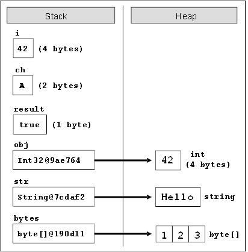
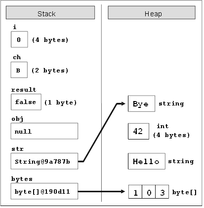

# Chapter 2. Primitive Types and Variables

## In This Chapter

In this chapter we will get familiar with **primitive types and variables in C#** – what they are and how to work with them. First we will consider the **data types** – integer types, real types with floating-point, Boolean, character, string and object type. We will continue with the **variables**, with their characteristics, how to declare them, how they are assigned a value and what a variable initialization is. We will get familiar with the two major sets of data types in C# – **value types** and **reference types**. Finally we will examine different types of **literals** and their usage.

## What Is a Variable?

A typical program uses various **values that change during its execution**. For example, we create a program that performs some calculations on the values entered by the user. The values entered by one user will obviously be different from those entered in by another user. This means that when creating the program, the programmer does not know what values will be introduced as input, and that makes it necessary to process all possible values a user may enter.

When a user enters a new value that will be used in the process of calculation, we can preserve it (temporarily) in the random access memory of our computer. The values in this part of memory change (vary) throughout execution and this has led to their name – **variables**.

## Data Types

**Data types** are sets (ranges) of values that have similar characteristics. For instance `byte` type specifies the set of integers in the range of [0 ... 255].

### Characteristics

Data types are characterized by:

- **Name** – for example, `int`;
- **Size** (how much memory they use) – for example, 4 bytes;
- **Default value** – for example 0.

### Types

Basic data types in C# are distributed into the following **types**:

- Integer types – `sbyte`, `byte`, `short`, `ushort`, `int`, `uint`, `long`, `ulong`;
- Real floating-point types – `float`, `double`;
- Real type with decimal precision – `decimal`;
- Boolean type – `bool`;
- Character type – `char`;
- String – `string`;
- Object type – `object`.

These data types are called **primitive (built-in types)**, because they are embedded in C# language at the lowest level. The table below represents the above mentioned data types, their range and their default values:

| Data Types | Default Value | Minimum Value | Maximum Value |
|---|---|---|---|
| **sbyte** | 0 | -128 | 127 |
| **byte** | 0 | 0 | 255 |
| **short** | 0 | -32768 | 32767 |
| **ushort** | 0 | 0 | 65535 |
| **int** | 0 | -2147483648 | 2147483647 |
| **uint** | 0u | 0 | 4294967295 |
| **long** | 0L | -9223372036854775808 | 9223372036854775807 |
| **ulong** | 0u | 0 | 18446744073709551615 |
| **float** | 0.0f | ±1.5?10-45 | ±3.4?1038 |
| **double** | 0.0d | ±5.0?10-324 | ±1.7?10308 |
| **decimal** | 0.0m | ±1.0?10-28 | ±7.9?1028 |
| **bool** | `false` | Two possible values: `true` and `false` | |
| **char** | '\u0000' | '\u0000' | '\uffff' |
| **object** | null | - | - |
| **string** | null | - | - |

### Correspondence between C# and .NET Types

Primitive data types in C# have a direct correspondence with the types of the common type system (CTS) in .NET Framework. For instance, `int` type in C# corresponds to `System.Int32` type in CTS and to `Integer` type in VB.NET language, while long `type` in C# corresponds to `System.Int64` type in CTS and to Long type in VB.NET language. Due to the common types system (CTS) in .NET Framework there is compatibility between different prog¬ramming languages (like for instance, C#, Managed C++, VB.NET and F#). For the same reason `int`, `Int32` and `System.Int32` types in C# are actually different aliases for one and the same data type – signed 32-bit integer.

### Integer Types

**Integer types** represent integer numbers and are `sbyte`, `byte`, `short`, `ushort`, `int`, `uint`, `long`, and `ulong`. Let’s examine them one by one.

The `sbyte` type is an **8-bit signed integer**. This means that the number of possible values for it is 2<sup>8</sup>, i.e. 256 values altogether, and they can be both, positive and negative. The minimum value that can be stored in `sbyte` is `SByte.MinValue` = -128 (-2<sup>7</sup>), and the maximum value is SByte.MaxValue = 127 (2<sup>7</sup>-1). The default value is the number 0.

The `byte` type is an **8-bit unsigned integer** type. It also has 256 different integer values (2<sup>8</sup>) that can only be nonnegative. Its default value is the number 0. The minimal taken value is `Byte.MinValue` = 0, and the maximum is `Byte.MaxValue` = 255 (2<sup>8</sup> -1).

The `short` type is a **16-bit signed integer**. Its minimal value is `Int16.MinValue` = -32768 (-2<sup>15</sup>), and the maximum is `Int16.MaxValue` = 32767 (2<sup>15</sup>-1). The default value for `short` type is the number 0.

The `ushort` type is **16-bit unsigned integer**. The minimum value that it can store is `UInt16.MinValue` = 0, and the minimum value is `UInt16.MaxValue` = 65535 (2<sup>16</sup>-1). Its default value is the number 0.

The next integer type that we will consider is `int`. It is a **32-bit signed integer**. As we can notice, the growth of bits increases the possible values that a type can store. The default value for `int` is 0. Its minimal value is `Int32.MinValue` = -2,147,483,648 (-2<sup>31</sup>), and its maximum value is `Int32.MaxValue` = 2,147,483,647 (2<sup>31</sup>-1).

The `int` type is **the most often used type in programming**. Usually programmers use `int` when they work with integers because this type is natural for the 32-bit microprocessor and is sufficiently "big" for most of the calculations performed in everyday life.

The `uint` type is **32-bit unsigned integer** type. Its default value is the number **0u** or **0U** (the two are equivalent). The '**u**' letter indicates that the number is of type `uint` (otherwise it is understood as `int`). The minimum value that it can take is `UInt32.MinValue` = 0, and the maximum value is `UInt32.MaxValue` = 4,294,967,295 (2<sup>32</sup>-1).

The `long` type is a **64-bit signed type** with a default value of **0l** or **0L** (the two are equivalent but it is preferable to use '**L**' because the letter '**l**' is easily mistaken for the digit one '1'). The '**L**' letter indicates that the number is of type `long` (otherwise it is understood `int`). The minimal value that can be stored in the long type is `Int64.MinValue` = -9,223,372,036,854,775,808
(-2<sup>63</sup>) and its maximum value is `Int64.MaxValue` = 9,223,372,036,854,
775,807 (2<sup>63</sup>-1).

The **biggest integer type** is the `ulong` type. It is a **64-bit unsigned type**, which has as a default value – the number **0u**, or **0U** (the two are equivalent). The suffix '**u**' indicates that the number is of type `ulong` (otherwise it is understood as `long`). The minimum value that can be recorded in the ulong type is `UInt64.MinValue` = 0 and the maximum is `UInt64.MaxValue` = 18,446,744,073,709,551,615 (2<sup>64</sup>-1).

#### Integer Types – Example

Consider an example in which we declare several variables of the integer types we know, we initialize them and print their values to the console:

```cs
// Declare some variables
byte centuries = 20;
ushort years = 2000;
uint days = 730480;
ulong hours = 17531520;
// Print the result on the console
Console.WriteLine(centuries + " centuries are " + years +
    " years, or " + days + " days, or " + hours + " hours.");

// Console output:
// 20 centuries are 2000 years, or 730480 days, or 17531520
// hours.

ulong maxIntValue = UInt64.MaxValue;
Console.WriteLine(maxIntValue); // 18446744073709551615
```

You would be able to see the declaration and initialization of a variable in detail in sections "Declaring Variables" and "Initialization of Variables" below, and it would become clear from the examples.

In the code snippet above, we demonstrate the use of integer types. For small numbers we use `byte` type, and for very large – `ulong`. We use unsigned types because all used values are positive numbers.

### Real Floating-Point Types

Real types in C# are the real numbers we know from mathematics. They are represented by a **floating-point** according to the standard IEEE 754 and are `float` and `double`. Let’s consider in details these two data types and understand what their similarities and differences are.

#### Real Type Float

The first type we will consider is the 32-bit real **floating-point type** `float`. It is also known as a **single precision real number**. Its default value is `0.0f` or `0.0F` (both are equivalent). The character '**f**' when put at the end explicitly indicates that the number is of type `float` (because by default all real numbers are considered `double`). More about this special suffix we can read bellow in the "Real Literals" section. The considered type has accuracy up to seven decimal places (the others are lost). For instance, if the number **0.123456789** is stored as type `float` it will be rounded to **0.1234568**. The range of values, which can be included in a float type (rounded with accuracy of 7 significant decimal digits), range from **±1.5 × 10<sup>-45</sup>** to **±3.4 × 10<sup>38</sup>**.

#### Special Values of the Real Types

The real data types have also several special values that are not real numbers but are mathematical abstractions:

- **Negative infinity** -∞ (`Single.NegativeInfinity`). It is obtained when for instance we are dividing `-1.0f` by` 0.0f`.
- **Positive infinity** +∞ (`Single.PositiveInfinity`). It is obtained when for instance we are dividing `1.0f` by `0.0f`.
- **Uncertainty** (`Single.NaN`) – means that an invalid operation is performed on real numbers. It is obtained when for example we divide `0.0f` by `0.0f`, as well as when calculating square root of a negative number.

#### Real Type Double

The second real **floating-point type** in the C# language is the `double` type. It is also called **double precision real number** and is a 64-bit type with a default value of `0.0d` and `0.0D` (the suffix 'd' is not mandatory because by default all real numbers in C# are of type `double`). This type has precision of 15 to 16 decimal digits. The range of values, which can be recorded in double (rounded with precision of 15-16 significant decimal digits), is from **±5.0 × 10<sup>-324</sup>** to **±1.7 × 10<sup>308</sup>**.

The **smallest real value** of type `double` is the constant `Double.MinValue` = 
-1.79769e+308 and the largest is `Double.MaxValue` = 1.79769e+308. The closest to 0 positive number of type double is `Double.Epsilon` = 4.94066e-324. As with the type `float` the variables of type `double` can take the special values: `Double.PositiveInfinity` (+∞), `Double.NegativeInfinity` (-∞) and `Double.NaN` (invalid number).

#### Real Floating-Point Types – Example

Here is an example in which we declare variables of real number types, assign values to them and print them:

```cs
float floatPI = 3.14f;
Console.WriteLine(floatPI); // 3.14
double doublePI = 3.14;
Console.WriteLine(doublePI); // 3.14
double nan = Double.NaN;
Console.WriteLine(nan); // NaN
double infinity = Double.PositiveInfinity;
Console.WriteLine(infinity); // Infinity
```

#### Precision of the Real Types

In mathematics the real numbers in a given range are countless (as opposed to the integers in that range) as between any two real numbers **a** and *b* there are countless other real numbers **c** where **a < c < b**. This requires real numbers to be stored in computer memory with a limited accuracy.

Since mathematics and physics mostly work with **extremely large numbers** (positive and negative) and with **extremely small numbers** (very close to zero), real types in computing and electronic devices must be stored and processed appropriately. For example, according to the physics the mass of electron is approximately 9.109389×10<sup>-31</sup> kilograms and in 1 mole of substance there are approximately 6.02×10<sup>23</sup> atoms. Both these values can be stored easily in `float` and `double` types.

Due to its flexibility, the modern **floating-point representation of real numbers** allows us to work with a maximum number of significant digits for very large numbers (for example, positive and negative numbers with hundreds of digits) and with numbers very close to zero (for example, positive and negative numbers with hundreds of zeros after the decimal point before the first significant digit).

#### Accuracy of Real Types – Example

The real types in C# we went over – `float` and `double` – differ not only by the range of possible values they can take, but also by their **precision** (the number of decimal digits, which they can preserve). The first type has a precision of 7 digits, the second – 15-16 digits.

Consider an example in which we declare several variables of the known real types, initialize them and print their values on the console. The purpose of the example is to illustrate the difference in their accuracy:

```cs
// Declare some variables
float floatPI = 3.141592653589793238f;
double doublePI = 3.141592653589793238;

// Print the results on the console
Console.WriteLine("Float PI is: " + floatPI);
Console.WriteLine("Double PI is: " + doublePI);

// Console output:
// Float PI is: 3.141593
// Double PI is: 3.14159265358979
```

We see that the number **π** which we declared as `float`, is rounded to the 7-th digit, and the one we declared `double` – to 15-th digit. We can conclude that the real type `double` retains much greater precision than `float`, thus if we need a greater precision after the decimal point, we will use it.

#### About the Presentation of the Real Types

Real floating-point numbers in C# consist of three components (according to the standard IEEE 754): **sign** (1 or -1), **mantissa** and **order (exponent)**, and their values are calculated by a complex formula. More detailed information about the representation of the real numbers is provided in the chapter "Numeral Systems" where we will take an in-depth look at the representation of numbers and other data types in computing.

#### Errors in Calculations with Real Types

In calculations with real floating-point data types it is possible to observe **strange behavior**, because during the representation of a given real number it often happens to **lose accuracy**. The reason for this is the inability of some real numbers to be represented exactly as a sum of negative powers of the number 2. Examples of numbers that do not have an accurate representation in `float` and `double` types are for instance 0.1, 1/3, 2/7 and other. Here is a sample C# code, which demonstrates errors in calculations with floating-point numbers in C#:

```cs
float f = 0.1f;
Console.WriteLine(f); // 0.1 (correct due to rounding)
double d = 0.1f;
Console.WriteLine(d); // 0.100000001490116 (incorrect)

float ff = 1.0f / 3;
Console.WriteLine(ff); // 0.3333333 (correct due to rounding)
double dd = ff;
Console.WriteLine(dd); // 0.333333343267441 (incorrect)
```

The reason for the unexpected result in the first example is the fact that the number 0.1 (i.e. 1/10) **has no accurate representation** in the real floating-point number format IEEE 754 and its approximate value is recorded. When printed directly the result looks correct because of the rounding. The rounding is done during the conversion of the number to string in order to be printed on the console. When switching from `float` to `double` the approximate representation of the number in the IEEE 754 format is more noticeable. Therefore, the rounding does no longer hide the incorrect representation and we can observe the errors in it after the eighth digit.

In the second case the number **1/3 has no accurate representation** and is rounded to a number very close to 0.3333333. The value of this number is clearly visible when it is written in `double` type, which preserves more significant digits.

Both examples show that **floating-point number arithmetic can produce mistakes**, and is therefore not appropriate for precise financial calculations. Fortunately, C# supports decimal precision arithmetic where numbers like 0.1 are presented in the memory without rounding.

| :warning: | Not all real numbers have accurate representation in float and double types. For example, the number 0.1 is represented rounded in float type as 0.099999994. |
|---|---|

### Real Types with Decimal Precision

C# supports the so-called **decimal floating-point arithmetic**, where numbers are represented via the decimal numeral system rather than the binary one. Thus, the decimal floating point-arithmetic type in C# **does not lose accuracy** when storing and processing floating-point numbers.

The type of data for real numbers with **decimal precision** in C# is the 128-bit type `decimal`. It has a precision from 28 to 29 decimal places. Its minimal value is -7.9×10<sup>28</sup> and its maximum value is +7.9×10<sup>28</sup>. The default value is `0.0m` or` 0.0M`. The '`m`' character at the end indicates explicitly that the number is of type `decimal` (because by default all real numbers are of type `double`). The closest to **0** numbers, which can be recorded in decimal, are **±1.0 × 10<sup>-28</sup>**. It is obvious that `decimal` can store neither very big positive or negative numbers (for example, with hundreds of digits), nor values very close to **0**. However, this type is almost perfect for financial calculations because it represents the numbers as a sum of powers of 10 and losses from rounding are much smaller than when using binary representation. The real numbers of type `decimal` are **extremely convenient for financial calculations** – calculation of revenues, duties, taxes, interests, payments, etc.

Here is an example in which we declare a variable of type `decimal` and assign its value:

```cs
decimal decimalPI = 3.14159265358979323846m;
Console.WriteLine(decimalPI); // 3.14159265358979323846
```

The number `decimalPI`, which we declared of type `decimal`, is not rounded even with a single position because we use it with **precision of 21 digits**, which fits in the type `decimal` without being rounded.

Because of the high precision and the **absence of anomalies** during calculations (which exist for `float` and `double`), the `decimal` type is extremely suitable for financial calculations where accuracy is critical.

| :warning: | Despite its smaller range, the decimal type retains precision for all decimal numbers it can store! This makes it much more suitable for precise calculations, and very appropriate for financial ones. |
|---|---|

The main difference between **real floating-point numbers** and **real numbers with decimal precision** is the accuracy of calculations and the extent to which they round up the stored values. The `double` type allows us to work with very large values and values very close to zero but at the expense of accuracy and some unpleasant rounding errors. The `decimal` type has smaller range but ensures **greater accuracy** in computation, as well as absence of anomalies with the decimal numbers.

| :warning: |If you perform calculations with money use the decimal type instead of float or double. Otherwise, you may encounter unpleasant anomalies while calculating and errors as a result! |
|---|---|

As all calculations with data of type `decimal` are done completely by software, rather than directly at a low microprocessor level, the calculations of this type are from **several tens to hundreds of times slower** than the same calculations with `double`, so use this type only when it is really necessary.

### Boolean Type

Boolean type is declared with the keyword `bool`. It has two possible values: `true` and `false`. Its default value is `false`. It is used most often to store the calculation **result of logical expressions**.

#### Boolean Type – Example

Consider an example in which we declare several variables from the already known types, initialize them, compare them and print the result on the console:

```cs
// Declare some variables
int a = 1;
int b = 2;
// Which one is greater?
bool greaterAB = (a > b);
// Is 'a' equal to 1?
bool equalA1 = (a == 1);
// Print the results on the console
if (greaterAB)
{
    Console.WriteLine("A > B");
}
else
{
    Console.WriteLine("A <= B");
}

Console.WriteLine("greaterAB = " + greaterAB);
Console.WriteLine("equalA1 = " + equalA1);

// Console output:
// A <= B
// greaterAB = False
// equalA1 = True
```

In the example above, we declare two variables of type `int`, compare them and assign the result to the `bool` variable `greaterAB`. Similarly, we do the same for the variable `equalA1`. If the variable `greaterAB` is `true`, then `A > B` is printed on the console, otherwise `A <= B` is printed.

### Character Type

Character type is a **single character** (16-bit number of a Unicode table character). It is declared in C# with the keyword char. **The Unicode table** is a technological standard that represents any character (letter, punctuation, etc.) from all human languages as writing systems (all languages and alphabets) with an integer or a sequence of integers. More about the **Unicode** table can be found in the chapter "Strings and Text Processing". The smallest possible value of a `char` variable is 0, and the largest one is 65535. The values of type `char` are letters or other characters, and are enclosed in apostrophes.

#### Character Type – Example

Consider an example in which we declare one variable of type `char`, initialize it with value '`a`', then '`b`', then '`A`' and print the Unicode values of these letters to the console:

```cs
// Declare a variable
char ch = 'a';
// Print the results on the console
Console.WriteLine(
    "The code of '" + ch + "' is: " + (int)ch);
ch = 'b';
Console.WriteLine(
    "The code of '" + ch + "' is: " + (int)ch);
ch = 'A';
Console.WriteLine(
    "The code of '" + ch + "' is: " + (int)ch);

// Console output:
// The code of 'a' is: 97
// The code of 'b' is: 98
// The code of 'A' is: 65
```

### Strings

**Strings are sequences of characters**. In C# they are declared by the keyword `string`. Their default value is `null`. Strings are enclosed in quotation marks. Various text-processing operations can be performed using strings: concatenation (joining one string with another), splitting by a given separator, searching, replacement of characters and others. More information about text processing can be found in the chapter "Strings and Text Processing", where you will find detailed explanation on what a string is, what its applications are and how we can use it.

#### Strings – Example

Consider an example in which we declare several variables of type `string`, initialize them and print their values on the console:

```cs
// Declare some variables
string firstName = "John";
string lastName = "Smith";
string fullName = firstName + " " + lastName;
// Print the results on the console
Console.WriteLine("Hello, " + firstName + "!");
Console.WriteLine("Your full name is " + fullName + ".");

// Console output:
// Hello, John!
// Your full name is John Smith.
```

### Object Type

Object type is a special type, which is the parent of all other types in the .NET Framework. Declared with the keyword `object`, it can take values from **any other type**. It is a reference type, i.e. an index (address) of a memory area which stores the actual value.

#### Using Objects – Example

Consider an example in which we declare several variables of type object, initialize them and print their values on the console:

```cs
// Declare some variables
object container1 = 5;
object container2 = "Five";

// Print the results on the console
Console.WriteLine("The value of container1 is: " + container1);
Console.WriteLine("The value of container2 is: " + container2);

// Console output:
// The value of container1 is: 5
// The value of container2 is: Five.
```

As you can see from the example, we can store the value of any other type in an `object` type variable. This makes the `object` type a universal data container.

### Nullable Types

**Nullable types** are specific **wrappers** around the value types (as `int`, `double` and `bool`) that allow storing data with a `null` value. This provides opportunity for types that generally do not allow lack of value (i.e. value `null`) to be used as reference types and to accept both normal values and the special one `null`. Thus nullable types **hold an optional value**.

Wrapping a given type as nullable can be done in two ways:

```cs
Nullable<int> i1 = null;
int? i2 = i1;
```

Both declarations are equivalent. The easiest way to perform this operation is to add a question mark (`?`) after the type, for example `int?`, the more difficult is to use the `Nullable<...>` syntax.

Nullable types are **reference types** i.e. they are reference to an object in the dynamic memory, which contains their actual value. They may or may not have a value and can be used as normal primitive data types, but with some specifics, which are illustrated in the following example:

```cs
int i = 5;
int? ni = i;
Console.WriteLine(ni); // 5

// i = ni; // this will fail to compile
Console.WriteLine(ni.HasValue); // True
i = ni.Value;
Console.WriteLine(i); // 5

ni = null;
Console.WriteLine(ni.HasValue); // False
//i = ni.Value; // System.InvalidOperationException
i = ni.GetValueOrDefault();
Console.WriteLine(i); // 0
```

The example above shows how a **nullable variable** (`int?`) can have a value directly added even if the value is non-nullable (`int`). The opposite is not directly possible. For this purpose, the nullable types’ property `Value` can be used. It returns the value stored in the nullable type variable, or produces an error (`InvalidOperationException`) during program execution if the value is missing (`null`). In order to check whether a variable of nullable type has a value assigned, we can use the Boolean property `HasValue`. Another useful method is `GetValueOrDefault()`. If the nullable type variable has a value, this method will return its value, else it will return the default value for the nullable type (most commonly `0`).

Nullable types are used for storing information, which is **not mandatory**. For example, if we want to store data for a student such as the first name and last name as mandatory and age as not required, we can use type `int?` for the age variable:

```cs
string firstName = "John";
string lastName = "Smith";
int? age = null;
```

## Variables

After reviewing the main data types in C# let’s see how we can use them. In order to work with data we should use **variables**. We have already seen their usage in the examples, but now let’s look at them in more detail.

A **variable** is a **container of information**, which can change its value. It provides means for:

- storing information;
- retrieving the stored information;
- modifying the stored information.

In C# programming, you will use variables to store and process information all the time.

### Characteristics of Variables

Variables are characterized by:

- **name** (identifier), for example `age`;
- **type** (of the information preserved in them), for example `int`;
- **value** (stored information), for example `25`.

A **variable is a named area of memory**, which stores a value from a particular data type, and that area of memory is accessible in the program by its name. Variables can be stored directly in the operational memory of the program (in the stack) or in the dynamic memory in which larger objects are stored (such as character strings and arrays).

**Primitive data types** (numbers, `char`, `bool`) are called value types because they store their value directly in the program stack.

**Reference data types** (such as strings, objects and arrays) are an address, pointing to the dynamic memory where their value is stored. They can be dynamically allocated and released i.e. their size is not fixed in advance contrary to the case of value types.

More information about the value and reference data types is provided in the section "Value and Reference Types".

### Naming Variables – Rules

When we want the compiler to allocate a memory area for some information which is used in our program we must provide a **name** for it. It works like an identifier and allows referring to the relevant memory area.

The name of the variable can be any of our choice but must follow certain rules defined in the C# language specification:

- Variable names can contain the letters **a-z**, **A-Z**, the digits **0-9** as well as the character '**_**'.
- Variable names cannot start with a digit.
- Variable names cannot coincide with a **keyword** of the C# language. For example, `base`, `char`, `default`, `int`, `object`, `this`, `null` and many others cannot be used as variable names.

A list of the C# keywords can be found in the section "Keywords" in chapter "Introduction to Programming". If we want to name a variable like a keyword, we can add a prefix to the name – "`@`". For example, `@char` and `@null` are valid variable names while `char` and `null` are invalid.

#### Naming Variables – Examples

Proper names:

- `name`
- `first_Name`
- `_name1`

Improper names (will lead to compilation error):

- `1` (digit)
- `if` (keyword)
- `1name` (starts with a digit)

#### Naming Variables – Recommendations

We will provide some recommendations how to name your variables, since not all names, allowed by the compiler, are appropriate for the variables.

- The names should be descriptive and explain what the variable is used for. For example, an appropriate name for a variable storing a person’s name is `personName` and inappropriate name is `a37`.
- Only **Latin characters** should be used. Although Cyrillic is allowed by the compiler, it is not a good practice to use it in variable names or in the rest of the identifiers within the program.
- In C# it is generally accepted that variable names should **start with a small letter** and include small letters, every new word, however, starts with a capital letter. For instance, the name `firstName` is correct and better to use than `firstname` or `first_name`. Usage of the character `_` in the variable names is considered a bad naming style.
- Variable names should be **neither too long nor too short** – they just need to clarify the purpose of the variable within its context.
- Uppercase and lowercase letters should be used carefully as C# distinguishes them. For instance, `age` and `Age` are different variables.

Here are some examples of well-named variables:

- `firstName`
- `age`
- `startIndex`
- `lastNegativeNumberIndex`

And here are some examples for poorly named variables (although the names are correct from the C# compiler’s perspective):

- `_firstName` (starts with _)
- `last_name` (contains _)
- `AGE` (is written with capital letters)
- `Start_Index` (starts with capital letter and contains _)
- `lastNegativeNumber_Index` (contains _)
- `a37` (the name is not descriptive and does not clearly provide the purpose of the variable)
- `fullName23`, `fullName24`, etc. (it is not appropriate for a variable name to contain digits unless this improves the clarity of the variable used; if you need to have multiple variables with similar names ending in a different number, storing the same or similar type of data, it may be more appropriate to create a single collection or array variable and name it `fullNamesList`, for example).

Variables should have names, which **briefly explain their purpose**. When a variable is named with an inappropriate name, it makes the program very difficult to read and modify later (after a while, when we have forgotten how it works). For further explanation on the proper naming of variables refer to chapter "High-Quality Programming Code".

| :warning: |Always try to use short and precise names when naming the variables. Follow the rule that the variable name should state what it is used for, e.g. the name should answer the question "what value is stored in this variable". When this condition is not fulfilled then try to find a better name. Digits are not appropriate to be used in variable names. |
|---|---|

### Declaring Variables

When you declare a variable, you perform the following steps:

- specify its **type** (such as `int`);
- specify its **name** (identifier, such as `age`);
- optionally specify **initial value** (such as `25`) but this is not obligatory.

The syntax for declaring variables in C# is as follows:

```
<data type> <identifier> [= <initialization>];
```

Here is an example of declaring variables:

```cs
string name;
int age;
```

#### Assigning a Value

Assigning a value to a variable is the act of providing a value that must be stored in the variable. This operation is performed by the assignment operator "=". On the left side of the operator we put the variable name and on the right side – its new value.

Here is an example of assigning values to variables:

```cs
name = "John Smith";
age = 25;
```

#### Initialization of Variables

The word **initialization** in programming means specifying an initial value. When setting value to variables at the time of their declaration we actually initialize them.

#### Default Variable Values

Each data type in C# has a **default value** (default initialization) which is used when there is no explicitly set value for a given variable. We can use the following table to see the default values of the types, which we already got familiar with:

Data Type|Default Value||Data Type|Default Value
|---|---|---|---|---|
sbyte|0||float|0.0f
byte|0||double|0.0d
short|0||decimal|0.0m
ushort|0||bool|false
int|0||char|'\u0000'
uint|0u||string|null
long|0L||object|null
ulong|0u|||

Let’s summarize how to declare variables, initialize them and assign values to them with the following example:

```cs
// Declare and initialize some variables
byte centuries = 20;
ushort years = 2000;
decimal decimalPI = 3.141592653589793238m;
bool isEmpty = true;
char ch = 'a';
string firstName = "John";

ch = (char)5;
char secondChar;

// Here we use an already initialized variable and reassign it
secondChar = ch;
```

## Value and Reference Types

Data types in C# are two types: **value** and **reference**.

**Value types** are stored in the program execution stack and directly contain their value. Value types are the primitive numeric types, the character type and the Boolean type: `sbyte`, `byte`, `short`, `ushort`, `int`, `long`, `ulong`, `float`, `double`, `decimal`, `char`, `bool`. The memory allocated for them is released when the program exits their range, i.e. when the block of code in which they are defined completes its execution. For example, a variable declared in the method `Main()` of the program is stored in the stack until the program completes execution of this method, i.e. until it finishes (C# programs terminate after fully executing the `Main()` method).

**Reference types** keep a **reference** (**address**), in the program execution stack, and that reference points to the **dynamic memory** (**heap**), where their value is stored. The reference is a **pointer** (address of the memory cell) indicating the actual location of the value in the heap. An example of a value at address in the stack for execution is `0x00AD4934`. The reference has a type. The reference can only point to objects of the same type, i.e. it is a strongly typed pointer. All reference types can hold a `null` value. This is a special service value, which means that there is no value.

**Reference types** allocate **dynamic memory** for their creation. They also release some dynamic memory for a **memory cleaning (garbage collector)**, when it is no longer used by the program. It is unknown exactly when a given reference variable will be released of the garbage collector as this depends on the memory load and other factors. Since the allocation and release of memory is a slow operation, it can be said that the reference types are slower than the value ones.

As **reference data types** are **allocated and released dynamically** during program execution, their size might not be known in advance. For example, a variable of type `string` can contain text data which varies in length. Actually the `string` text value is stored in the dynamic memory and can occupy a different volume (count of bytes) while the `string` variable stores the address of the text value.

Reference types are all **classes**, **arrays** and **interfaces** such as the types: `object`, `string`, `byte[]`. We will learn about classes, objects, strings, arrays and interfaces in the next chapters of this book. For now, it is enough to know that all types, which are not value, are reference and their values are stored in the **heap** (the dynamically allocated memory).

### Value and Reference Types and the Memory

In this example we will illustrate how value and reference types are **represented in memory**. Consider the execution of the following programming code:

```cs
int i = 42;
char ch = 'A';
bool result = true;
object obj = 42;
string str = "Hello";
byte[] bytes = { 1, 2, 3 };
```

At this point the variables are located in the memory as follows:



If we now execute the following code, which changes the values of the variables, we will see what **happens to the memory** when changing the value and reference types:

```cs
i = 0;
ch = 'B';
result = false;
obj = null;
str = "Bye";
bytes[1] = 0;
```

After these changes the variables and their values are **located in the memory** as follows:



As you can see from the figure, a change in a value type (`i = 0`) changes its value **directly into the stack**. When changing a reference type, things are different: the value is **changed in the heap** (`bytes[1] = 0`). The variable that keeps the array reference remains unchanged (`0x00190D11`). When assigning a `null` value in a reference type, that reference is disconnected from its value and the variable remains with no value (`obj = null`).

When assigning new value to an object (a reference type variable) the new object is allocated in the heap (the dynamic memory) while the old object remains free (unreferenced). The reference is redirected to the new object (`str = "Bye"`) while the old objects (`"Hello"`) will be cleaned at some moment by the **garbage collector** (the .NET Framework’s internal system for automatic memory cleaning) as they are not in use anymore.

## Literals

Primitive types, which we already met, are special data types built into the C# language. Their values specified in the source code of the program are called **literals**. One example will make this clearer:

```cs
bool result = true;
char capitalC = 'C';
byte b = 100;
short s = 20000;
int i = 300000;
```

In the above example, literals are `true`, '`C`', `100`, `20000` and `300000`. They are variable values set directly in the source code of the program.

### Types of Literals

In C# language, there are several types of literals:

- Boolean
- Integer
- Real
- Character
- String
- Object literal null

#### Boolean Literals

Boolean literals are:

- true
- false

When we assign a value to a variable of type `bool` we can use only one of these two values or a Boolean expression (which is calculated to `true` or `false`).

##### Boolean Literals – Example

Here is an example of a declaration of a variable of type `bool` and assigning a value, which represents the Boolean literal true:

```cs
bool result = true;
```

#### Integer Literals

Integer literals are **sequences of digits**, a sign (+, -), suffixes and prefixes. Using prefixes we can present integers in the program source in decimal or hexadecimal format. More information about the different numeral systems we can find in the chapter "Numeral Systems". In the integer literals the following prefixes and suffixes may take part:

- "`0x`" and "`0X`" as prefix indicates hexadecimal values, for example `0xA8F1`;
- '`l`' and '`L`' as suffix indicates long type data, for example `357L`.
- '`u`' and '`U`' as suffix indicates uint or ulong data type, for example `112u`.

By default (if no suffix is used) the integer literals are of type `int`.

##### Integer Literals – Examples

Here are some examples of using integer literals:

```cs
// The following variables are initialized with the same value
int numberInDec = 16;
int numberInHex = 0x10;

// This will cause an error, because the value 234L is not int
int longInt = 234L;
```

#### Real Literals

Real literals are a **sequence of digits**, a sign (+, -), suffixes and the decimal point character. We use them for values of type `float`, `double` and `decimal`. Real literals can be represented in exponential format. They also use the following indications:

- '`f`' and '`F`' as suffixes mean data of type `float`;
- '`d`' and '`D`' as suffixes mean data of type `double`;
- '`m`' and '`M`' as suffixes mean data of type `decimal`;
- '`e`' is an exponent, for example, "`e-5`" means the integer part multiplied by 10<sup>-5</sup>.

By default (if there is no suffix), the real numbers are of type `double`.

##### Real Literals – Examples

Here are some examples of real literals' usage:

```cs
// The following is the correct way of assigning a value:
float realNumber = 12.5f;

// This is the same value in exponential format:
realNumber = 1.25e+1f;

// The following causes an error, because 12.5 is double
float realNumber = 12.5;
```

#### Character Literals

Character literals are **single characters enclosed in apostrophes** (single quotes). We use them to set the values of type char. The value of a character literal can be:

- a character, for example '`A`';
- a character code, for example '`\u0065`';
- an escaping sequence;

##### Escaping Sequences

Sometimes it is necessary to work with characters that are not displayed on the keyboard or with characters that have special meanings, such as the "**new line**" character. They **cannot be represented directly** in the source code of the program and in order to use them we need special techniques, which we will discuss now.

**Escaping sequences** are literals. They are a sequence of special characters, which describe a character that cannot be written directly in the source code. This is, for instance, the "**new line**" character.

There are many examples of characters that cannot be represented directly in the source code: a double quotation mark, tab, new line, backslash and others. Here are some of **the most frequently used escaping sequences**:

- `\'` – single quote
- `\"` – double quotes
- `\\` – backslash
- `\n` – new line
- `\t` – offset (tab)
- `\uXXXX` – char specified by its Unicode number, for example `\u03A7`.

The character `\` (backslash) is also called an **escaping character** because it allows the display on screen (or other output device) of characters that have special meaning or effect and cannot be represented directly in the source code.

##### Escaping Sequences – Examples

Here are some examples of character literals:

```cs
// An ordinary character
char character = 'a';
Console.WriteLine(character);

// Unicode character code in a hexadecimal format
character = '\u003A';
Console.WriteLine(character);

// Assigning the single quotiation character (escaped as \')
character = '\'';
Console.WriteLine(character);

// Assigning the backslash character (escaped as \\)
character = '\\';
Console.WriteLine(character);

// Console output:
// a
// :
// '
// \
```

#### String Literals

String literals are used for data of type `string`. They are a sequence of characters enclosed in double quotation marks.

All the escaping rules for the char type discussed above are also valid for string literals.

Strings can be preceded by the @ character that specifies a **quoted string** (**verbatim string**). In quoted strings the rules for escaping are not valid, i.e. the character `\` means `\` and is not an escaping character. Only one character needs to be escaped in the quoted strings – the character `"` (double-quotes) and it is escaped in the following way – by repeating it `""` (double double-quotes). All other characters are treated literally, even the new line. Quoted strings are often used for the file system paths naming.

##### String Literals – Examples

Here are few examples for string literals usage:

```cs
string quotation = "\"Hello, Jude\", he said.";
Console.WriteLine(quotation);
string path = "C:\\Windows\\Notepad.exe";
Console.WriteLine(path);
string verbatim = @"The \ is not escaped as \\.
I am at a new line.";
Console.WriteLine(verbatim);
// Console output:
// "Hello, Jude", he said.
// C:\Windows\Notepad.exe
// The \ is not escaped as \\.
// I am at a new line.
```

More about strings we will find in the chapter "Strings and Text Processing".
