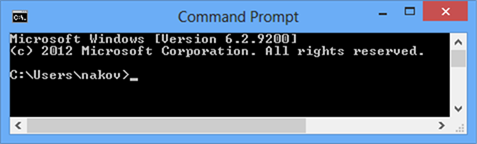
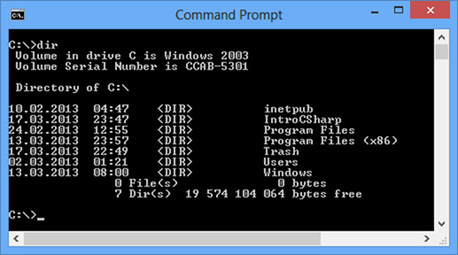
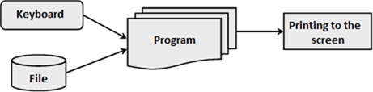

# Chapter 4. Console Input and Output

## In This Chapter

In this chapter we will get familiar with the **console** as a tool for **data input and output**. We will explain what it is, when and how to use it, and how most programming languages access the console. We will get familiar with some of the features in C# for user interaction: reading text and numbers from the console and printing text and numbers. We will also examine the main streams for input-output operations `Console.In`, `Console.Out` and `Console.Error`, the `Console` and the usage of **format strings** for printing data in various formats.

## What Is the Console?

The **Console** is a window of the operating system through which users can interact with system programs of the operating system or with other console applications. The interaction consists of text input from the **standard input** (usually keyboard) or text display on the **standard output** (usually on the computer screen). These actions are also known as **input-output operations.** The text written on the console brings some information and is a sequence of characters sent by one or more programs.

For each console application the operating system connects input and output devices. By default these are the keyboard and the screen but they can be redirected to a file or other devices.

### Communication between the User and the Program

A lot of programs communicate in some way with the user. This is necessary for the user in order to give instructions to them. Modern communication methods are many and various: they can be through **graphical** or **web-based interface,** **console** or others. As we mentioned one of the tools for communication between programs and users is the console, which is becoming less and less used. This is because the modern user interface concepts are more convenient and intuitive to work with, from a user’s perspective.

### When to Use the Console?

In some cases the console remains an irreplaceable tool for communication with the user. One of these cases is when writing **small and simple programs** where it is necessary to focus the attention on the specific problem to be solved, rather than the elegant representation of the result to the user. Then a simple solution is used for entering or printing a result, such as input-output console. Another use case is when we want to test a small piece of code for a larger application. Due to simplicity of the operation of the console application we can isolate this part of the code easily and comfortably without having to go through a complex user interface and a number of screens to get to the desired code for testing.

### How to Launch the Console?
<!-- Convert to using Windows Terminal -->
Each operating system has its own way to launch the console. On Windows for example, it can be done in the following way:

```console
Start -> (All) Programs -> Accessories -> Command Prompt
```

After starting the console a black screen (this color can be changed) like the following should appear:


 
When starting the console the home directory of the current user (in this case the username is `nakov`) is used as a current directory and this is displayed as a guide for the user.

| :warning: | Console can be launched through pressing the Start button and typing "`cmd`" in the search box and pressing [Enter] (on Windows Vista, Windows 7 and later). For Windows XP, go through the sequence Start -> Run... ->, type in "cmd" and press [Enter]. |
|---|:---|

For simplified visualization of the results from now on in this chapter instead of a console screenshot we will use the form:

```console
Results from console
```

### More about Consoles

The system console is **the black window** shown above **which displays text information.** It can display text strings and has a cursor, which moves to the right after each character is printed. After the cursor passes through the last column of the console (usually it has 80 columns), it moves to the beginning of the next line. If the cursor passes through the last line, the console scrolls its content upwards and shows a new empty line below the last line.

Programs in Windows can be console-based, desktop-based, Web-based and other. The **console-based programs** use the console for their input and output. The desktop-based programs use graphical user interface (GUI). The Web-based programs have Web-based user interface. In this book we will write console-based programs almost all the time, so their input will be read from the keyboard and their output will be printed in the console.

Some console-based programs expect the users to enter text, numbers and other data, and this is usually done through the keyboard.

The console in Windows is often associated with the system **command interpreter,** also called the **"Command Prompt"** or **"shell"** or which is a console-based program in the operating system, which provides access to system commands as well as a wide range of programs, which are part of the operating system or are additionally installed to it.

The word **"shell"** means "wrap" and has a meaning of a wrapper between the user and the inside of the operating system.

The so called operating system "shells" can be split into two main categories according to the type of interface they can provide to the operating system:

- CLI – Command Line Interface – is a console for commands (such as `cmd.exe` in Windows and `bash` in Linux).
- GUI – Graphical User Interface – is a graphical work environment (such as Windows Explorer).

For both types the main purpose of the shell is **to run other programs** with which the user works although most of the interpreters also support some advanced features such as the opportunity to examine the content of directories with files.

| :warning: | Each operating system has its own command interpreter that has its own commands. |
|---|:---|

For example, when starting Windows console, we run the so-called Windows **command interpreter** in it (`cmd.exe`) that executes system programs and commands in interactive mode. For example, the command `dir` shows the files in the current directory:



### Basic Console Commands

We will take a look at some basic commands in the Windows standard **command prompt,** which is useful for finding and launching programs.

#### Windows Console Commands

The command interpreter running in the console is also called "`Command Prompt`" or "`MS-DOS Prompt`" (in older versions of Windows). We will take a look at some basic commands for this interpreter:

Command | Description
--------|------------
`dir` | Displays the content of the current directory.
`cd <directory name>` | Changes the current directory.
`mkdir <directory name>` | Creates a new directory in the current one.
`rmdir <directory name>` | Deletes an existing directory.
`type <file name>` | Prints file content.
`copy <src file> <destination file>` | Copies one file into another.

Here is an example of multiple commands executed in the Windows command shell. The result of the commands’ execution is displayed on the console:

```console
C:\Documents and Settings\User1>cd "D:\Project2009\C# Book"

C:\Documents and Settings\User1>D:

D:\Project2008\C# Book>dir
 Volume in drive D has no label.
 Volume Serial Number is B43A-B0D6

 Directory of D:\Project2009\C# Book

26.12.2009   12:24    <DIR>          .
26.12.2009   12:24    <DIR>          ..
26.12.2009   12:23           537 600 Chapter-4-Console-Input-Output.doc
26.12.2009   12:23    <DIR>          Test Folder
26.12.2009   12:24                 0 Test.txt
             2 File(s)        537 600 bytes
             3 Dir(s)  24 154 062 848 bytes free

D:\Project2009\C# Book>
```

### Standard Input-Output

The standard input-output also known as **"Standard I/O"** is a system input-output mechanism created since the UNIX operating systems was developed many years ago. Special peripheral devices for input and output are used, through which data can be input and output.

When the program is in mode of accepting information and expects action by the user, there is a blinking cursor on the console showing that the system is waiting for command entering.

Later we will see how we can write C# programs that expect input data to be entered from the console.

## Printing to the Console

In most programming languages printing and reading the information from the console is implemented in similar ways and the most of the solutions are based on the concept of "**standard input**" and "**standard output**".

### Standard Input and Standard Output

The operating system is required to define **standard input-output mechanisms** for user interaction. When starting a given console program, system code running at the initialization of the program is responsible for opening (closing) of streams to the allocated by the operating system mechanisms for input-output. This system code initializes the program abstraction for user interaction embedded in the respective programming language. In this way, the application started can automatically read the user input from the **standard input stream** (in C# this is `Console.In`), print information on the **standard output stream** (in C# this is `Console.Out`) and can signal for problem situations in the **standard error stream** (in C# this is `Console.Error`).

The concept of the streams will be later examined in details. For now we will focus on the theoretical basis related to the program input and output in C#.

### Devices for Console Input and Output

Besides the keyboard an application **input** can come from many other places, such as file, microphone, barcode reader and others. The **output** of a program may be on the console (on the screen), as well as in a file or another output device, such as a printer:



We will show a basic example that illustrates text printing to the console through the abstraction for accessing the standard input and standard output provided to us by C#:

```cs
Console.Out.WriteLine("Hello World");
```

The result of the above code execution would be the following:

```console
Hello World
```

### Console.Out Stream

`System.Console` class has different properties and methods (classes are considered in details in the chapter "Creating and Using Objects") which are used to read and display text on the console as well as its formatting. Among them there are three properties that make impression and they are related to data entering and displaying, namely the `Console.Out`, `Console.In` and `Console.Error`. They provide access to the standard streams for printing on the console, for reading from the console and to the error messages reporting stream accordingly. Although we could use them directly, the other methods of `System.Console` give us the convenience for working with input-output console operations and actually most often these properties are ignored. However it is good to remember that this part of the console functionality is working on these streams. If needed, we can replace the default input / output / error streams at runtime by using the methods `Console.SetOut(...)`, `Console.SetIn(...)` and `Console.SetError(...)` respectively.

Now we will examine the most commonly used methods for text printing on the console.

#### Using `Console.Write(...)` and `Console.WriteLine(...)`

Work with these methods is easy because they can print all the basic types (string, numeric and primitive types).
Here are some examples of printing various types of data:

```cs
// Print String
Console.WriteLine("Hello World");

// Print int
Console.WriteLine(5);

// Print double
Console.WriteLine(3.14159265358979);
```

The result of this code execution looks like this:

```console
Hello World
5
3.14159265358979
```

As we see by using `Console.WriteLine(...)` it is possible to print various data types because for each type there is a predefined version of the method `WriteLine(...)` in the `Console` class.
The difference between `Write(...)` and `WriteLine(...)` is that the `Write(...)` method prints on the console what it is provided between the parentheses but does nothing in addition while the method `WriteLine(...)` means directly "write line". This method does what the `Write(...)` one does but in addition goes to a new line. In fact the method does not print a new line but simply puts a **"command" for moving** cursor to the position where the new line starts (this command consists of the character `\r` followed by `\n`).

Here is an example, which illustrates the difference between `Write(...)` and `WriteLine(...)`:

```cs
Console.WriteLine("I love");
Console.Write("this ");
Console.Write("Book!");
```

The output of this example is:

```console
I love
this Book!
```

We notice that the output of this example is printed on two lines, even though the code is on three. This happens because on the first line of code we use `WriteLine(...)` which prints "I love" and then goes to a new line. In the next two lines of the code uses the `Write(...)` method, which prints without going on a new line and thus the words "`this`" and "`Book!`" remain on the same line.

#### Concatenation of Strings

In general C# does not allow the use of operators over string objects. The only exception to this rule is the addition operation (`+`) which **concatenates (joins) two strings** and returns as result a new string. This allows chaining of concatenate (`+`) operations one after another in a sequence. The next example represents concatenation of three strings.

```cs
string age = "twenty six";
string text = "He is " + age + " years old.";
Console.WriteLine(text);
```

The result of this code execution is again a string:

```console
He is twenty six years old.
```

#### Concatenation of Mixed Types

What happens when we want to print larger and more complex text, which consists of different types? Until now we used versions of the method `WriteLine(...)` for a specific type. Is it necessary when we want to print different types at once to use different versions of the method `WriteLine(...)` for each of these types? The answer to this question is "no" because in C# we can unite text and other data (for instance, numeric) by using the "`+`" operator. The following example is like the previous but in it the years (`age`) are from integer type:

```cs
int age = 26;
string text = "He is " + age + " years old.";
Console.WriteLine(text);
```

In the example is concatenation and printing on the screen performed. The result of the example is the following:

```console
He is 26 years old.
```

On the second line of the example code we see that a concatenation of the string "`He is`" and the integer type "`age`" is performed. We are trying to **combine two different types.** This is possible because of the presence of the following important rule.

| :warning: | When a string is involved in concatenation with any other type the result is always a string. |
|---|:---|

From the rule it is clear that the result of `"He is " + age` is again a string and then the result is added to the last part of the expression `" years old."`. So after calling a chain of `+` operators ultimately the result is a string and thus the string version of the method` WriteLine(...)` is invoked.

For short the above example can be written as follows:

```cs
int age = 26;
Console.WriteLine("He is " + age + " years old.");
```

#### Some Features of String Concatenation

There are some interesting situations with concatenation (addition) of strings that you need to know and be careful about because they lead to errors. The following example represents a surprising behavior of the code:

```cs
string s = "Four: " + 2 + 2;
Console.WriteLine(s);
// Four: 22

string s1 = "Four: " + (2 + 2);
Console.WriteLine(s1);
// Four: 4
```

As seen from the example the operators’ execution order (see chapter "Operator and Expressions") is of great importance! In our example first the concatenation of `"Four: "` to `"2"` is performed and **the result of the operation is string.** After that, another concatenation with the second number is performed and the obtained unexpected result is `"Four: 22"` instead of the expected `"Four: 4"`. This is because the operations are performed from left to right and in this scenario a string participates in each of them.

In order to avoid this **unpleasant situation** we can use parentheses that will change the order of operators’ execution can be used to achieve the desired result. Parentheses are operators with highest priority and make the execution of the operation "addition" of the two numbers happen before the concatenation with the string on the left. Thus first the addition of the two numbers is done and then they are concatenated with the string.

This mistake is very common for beginner programmers because they do not consider that string concatenation is performed from left to right because the addition of numbers is of the same priority than as concatenation.

| :warning: | When you concatenate strings and also sum numbers, use parentheses to specify the correct order of operations. Otherwise they are executed from left to right. |
|---|:---|

### Formatted Output with `Write(...)` and `WriteLine(...)`

For printing long and elaborate series of elements, special options (also known as overloads) of the methods `Write(...)` and `WriteLine(...)` have been introduced. These options have a completely different concept than the standard methods for printing in C#. Their main idea is to adopt a special string, formatted with special formatting characters and list of values, which should be substituted in place of "the format specifiers". Here is how `Write(...)` is defined in the standard C# libraries:

```cs
public static void Write(string format, object arg0,
	object arg1, object arg2, object arg3, ...);
```

#### Formatted Output – Examples

The following example prints twice the same thing but in different ways:

```cs
string str = "Hello World!";

// Print (the normal way)
Console.Write(str);

// Print (through formatting string)
Console.Write("{0}", str);
```

The result of this example execution is:

```console
Hello World!Hello World!
```

We see as a result `"Hello, World!"` twice on one line. This is because there is no printing of a new line in the program.

First we print the string in a well-known way in order to see the difference with the other approach. The second printing is the formatting `Write(...)` and the first argument is the format string. In this case `{0}` means to put the first argument after the formatting string in the place of `{0}`. The expression `{0}` is called a **placeholder,** i.e. a place that will be replaced by a specific value while printing.

The next example will further explain this concept:

```cs
string name = "John";
int age = 18;
string town = "Seattle";
Console.Write(
	"{0} is {1} years old from {2}!\n", name, age, town);
```

The result of this example execution is as follows:

```console
John is 18 years old from Seattle!
```

From the signature of this `Write(...)` version we saw that the first argument is the format string. Following is a series of arguments, which are placed where we have a number enclosed in curly brackets. The expression `{0}` means to put in its place the **first** of the arguments submitted after the format string (in this case `name`). Next is `{1}` which means to replace with the **second** of the arguments (`age`). The last placeholder is `{2}`, which means to replace with the next parameter (`town`). Last is `\n`, which is a special character that indicates moving to a new line.

It is appropriate to mention that actually the new line command on **Windows** is `\r\n`, and on **Unix-based operating systems** – `\n`. When working with the console it does not matter that we use only `\n` because the standard input stream considers `\n` as `\r\n` but if we write into a file, for example, using only `\n` is wrong (on Windows).

### Composite Formatting

The methods for formatted output of the `Console` class use the so-called **composite formatting feature.** The composite formatting is used for console printing as well as in certain operations with strings. We examined the composite formatting in the simplest of its kind in the previous example but it has significantly bigger potential than what we have seen so far. Basically the composite formatting uses two things: **composite formatting string** and **series of arguments,** which are replaced in certain places in the string.

### Composite Formatting String

The composite formatting string is a mixture of normal text and **formatting items.** In formatting the normal text remains the same as in the string and the places of formatting items are replaced by the values of the respective arguments printed according to certain rules. These rules are specified using the syntax of formatting items.

### Formatting Items

The formatting items provide the possibility for powerful control over the displayed value and therefore can obtain very complicated form. The following formation scheme represents the general syntax of **formatting items**:

```console
{index[,alignment][:formatString]}
```

As we notice the formatting item begins with an opening curly bracket `{` and ends with a closing curly bracket `}`. The content between the brackets is divided into three components of which only the `index` component is mandatory. Now we will examine each of them separately.

#### Index Component

The `index` component is an integer and indicates **the position** of the argument from the argument list. The first argument is indicated by "`0`", the second by "`1`", etc. The **composite formatting string** allows having multiple formatting items that relate to one and same argument. In this case index component of these items is one and the same number. There is no restriction on the sequence of arguments’ calling. For example, we could use the following formatting string:

```cs
Console.Write(
	"{1} is {0} years old from {3}!", 18, "John", 0, "Seattle");
```

In cases where some of the arguments are not referenced by any of the formatting items, those arguments are simply **ignored** and do not play a role. However it is good to remove such arguments from the list of arguments because they introduce unnecessary complexity and may lead to confusion.

In the opposite case, when a formatting item refers an argument that does not exist in the list of arguments, an **exception is thrown.** This may occur, for example, if we have formatting placeholder `{4}` and we submitted a list of only two arguments.

#### Alignment Component

The `alignment` component is optional and indicates **the string alignment.** It is a **positive or negative integer** and the positive values indicate alignment to the right and the negative – alignment to the left. The value of the number indicates the number of positions in which to align the number. If the string we want to represent has a length greater than or equal to the value of the number, then this number is ignored. If it is less, however, the unfilled positions are filled in with spaces.

For example, let’s try the following formatting:

```cs
Console.WriteLine("{0,6}", 123);
Console.WriteLine("{0,6}", 1234);
Console.WriteLine("{0,6}", 12);
Console.Write("{0,-6}", 123);
Console.WriteLine("--end");
```

It will output the following result:
```console
   123
  1234
    12
123   --end
```

If we decide to use the alignment component, we must separate it from the `index` component by a comma as it is done in the example above.

#### The "formatString" Component

This component specifies the specific formatting of the string. It varies depending on the type of argument. There are three main types of `formatString` components:

- for numerical types of arguments
- for arguments of type date (`DateTime`)
- for arguments of type enumeration (listed types)

### Format String Components for Numbers

This type `formatString` component has two subtypes: standard-defined formats and user-defined formats (custom format strings).

#### Standard Formats for Numbers

These formats are defined by one of several **format specifiers,** which are letters with particular importance. After the format specifier there can be a positive integer called **precision,** which has a different meaning for the different specifiers. When it affects the number of decimal places after the decimal point, the result is rounded. The following table describes specifiers and their **precision** meaning:

Specifier | Description
----------|------------
"C" or "c" | Indicates the **currency** and the result will be displayed along with the currency sign for the current "culture" (for example, English). The precision indicates the number of decimal places after the decimal point.
"D" or "d" | An **integer number.** The precision indicates the minimum number of characters for representing the string and, if necessary, zeroes are supplemented in the beginning.
"E" or "e" | **Exponential notation.** The precision indicates the number of places after the decimal point.
"F" or "f" | **Integer or decimal number.** The precision indicates the number of signs after the decimal point.
"N" or "n" | Equivalent to "F" but represents also the corresponding separator for thousands, millions, etc. (for example, in the English language often the number "`1000`" is represented as "`1,000`" – with comma between the number 1 and the zeroes).
"P" or "p" | Percentage: it will multiply the number by 100 and will display the **percent** character upfront. The precision indicates the number of signs after the decimal point.
"X" or "x" | Displays the number in **hexadecimal** numeral system. It works only for integer numbers. The precision indicates minimum numbers of signs to display the string as the missing ones are supplemented with zeroes at the beginning.

Part of the formatting is determined by **the current "culture" settings,** which are taken by default from the regional settings of the operating system. "The cultures" are set of rules that are valid for a given language or a given country and that indicate which character is to be used as decimal separator, how the currency is displayed, etc. For example, for the Japanese "culture" the currency is displayed by adding "¥" after the amount, while for the American "culture", the character "$" is displayed before the amount. For Bulgarian currency is suffixed by " лв.".

#### Standard Formats for Numbers – Example

Let’s see a few examples of usage of the specifiers represented in the table above. In the code below we assume the regional settings are **Bulgarian** so the currency will be printed in Bulgarian, the decimal separator will be "," and the thousands separator will be space (the regional settings can be changed from Control Panel in Windows):


StandardNumericFormats.cs

```cs
class StandardNumericFormats
{
	static void Main()
	{
		Console.WriteLine("{0:C2}", 123.456);
		//Output: 123,46 лв.
		Console.WriteLine("{0:D6}", -1234);
		//Output: -001234
		Console.WriteLine("{0:E2}", 123);
		//Output: 1,23E+002
		Console.WriteLine("{0:F2}", -123.456);
		//Output: -123,46
		Console.WriteLine("{0:N2}", 1234567.8);
		//Output: 1 234 567,80
		Console.WriteLine("{0:P}", 0.456);
		//Output: 45,60 %
		Console.WriteLine("{0:X}", 254);
		//Output: FE
	}
}
```

If we run the same code with English (United States) culture, the output will be as follows:

```console
$123.46
-001234
1.23E+002
-123.46
1,234,567.80
45.60 %
FE
```

#### Custom Formats for Numbers

All formats that are not standard are assigned to the user (custom) formats. For the **custom formats** are again defined a set of specifiers and the difference with the standard formats is that a number of specifiers can be used (in standard formats only a single specifier is used). The following table lists various specifiers and their meaning:

Specifier | Description
----------|------------
`0` | Indicates a digit. If at this position of the result a digit is missing, a zero is written instead.
`#` | Indicates a digit. Does not print anything if at this position in the result a digit is missing.
`.` | Decimal separator for the respective "culture".
`,` | Thousands separator for the respective "culture".
`%` | Multiplies the result by 100 and prints the character for percent.
`E0` or `E+0` or `E-0` | Indicates an exponential notation. The number of zeroes indicates the number of signs of the exponent. The sign "+" means that we always want to represent also the number’s sign while minus means to display the sign only if the value is negative.

There are many characteristics regarding the use of custom formats for numbers, but they will not be discussed here. You may find more information in MSDN. Here are some simple examples that illustrate how to use custom formatting strings (the output is given for the U.S. culture):


CustomNumericFormats.cs

```cs
class CustomNumericFormats
{
	static void Main()
	{
		Console.WriteLine("{0:0.00}", 1);
		//Output: 1.00
		Console.WriteLine("{0:#.##}", 0.234);
		//Output: .23
		Console.WriteLine("{0:#####}", 12345.67);
		//Output: 12346
		Console.WriteLine("{0:(0#) ### ## ##}", 29342525);
		//Output: (02) 934 25 25
		Console.WriteLine("{0:%##}", 0.234);
		//Output: %23
	}
}
```

### Format String Components for Dates

When formatting dates we again have separation of standard and custom formats.

#### Standard Defined Date Formats

Since the standard defined formats are many we will list only few of them. The rest can be easily checked on MSDN.

Specifier | Format (for English (United States) "culture")
----------|-----------------------------------------------
`d` | 2/27/2012
`D` | February 27, 2012
`t` | 17:30 (hour)
`T` | 17:30:22 (hour)
`Y` or `y` | February 2012 (only month and year)

#### Custom Date Formats

Similar to custom formats for numbers here we have multiple format specifiers and we can combine several of them. Since here are many specifiers we will show only some of them, which we will use to demonstrate how to use **custom formats for dates.** Consider the following table:

Specifiers | Format (for English (United States) "culture")
-----------|-----------------------------------------------
`d` | Day – from 1 to 31
`dd` | Day – from 01 to 31
`M` | Month – from 1 to 12
`MM` | Month – from 01 to 12
`yy` | The last two digits of the year (from 00 to 99)
`yyyy` | Year written in 4 digits (e.g. 2012)
`hh` | Hour – from 00 to 11
`HH` | Hour – from 00 to 23
`m` | Minutes – from 0 to 59
`mm` | Minutes – from 00 to 59
`s` | Seconds – from 0 to 59
`ss` | Seconds – from 00 to 59

When using these specifiers we can insert different separators between the different parts of the date, such as "." or "/". Here are few examples:

```cs
DateTime d = new DateTime(2012, 02, 27, 17, 30, 22);
Console.WriteLine("{0:dd/MM/yyyy HH:mm:ss}", d);
Console.WriteLine("{0:d.MM.yy}", d);
```

Execution of these examples gives the following result for the U.K. culture:

```console
27/02/2012 17:30:22
27.02.12
```

Note that the result can vary depending on the current culture. For example if we run the same code in the Bulgarian culture, the result will be different:

```console
27.02.2012 17:30:22
27.02.12
```

### Format String Enumeration Components

Enumerations (listed types) are data types that can take as value one of several predefined possible values (e.g. the seven days of the week). We will examine them in details in the chapter "Defining Classes".

In enumerations there is very little to be formatted. Four standard format specifiers are defined:

Specifier | Format
----------|-------
`G` or `g` | Represents enumeration as a string.
`D` or `d` | Represents enumeration as a number.
`X` or `x` | Represents enumeration as a number in hexadecimal numeral system and with eight digits.

Here are some examples:

```cs
Console.WriteLine("{0:G}", DayOfWeek.Wednesday);
Console.WriteLine("{0:D}", DayOfWeek.Wednesday);
Console.WriteLine("{0:X}", DayOfWeek.Wednesday);
```

While executing the above code we get the following result:

```console
Wednesday
3
00000003
```

### Formatting Strings and Localization

When using format strings it is possible one and same program to print different values depending on the **localization settings** for the operating system. For example, when printing the month from a given date if the current localization is English it will print in English, for example "August", while if the localization is French it will print in French, for example "Août".

When launching a console application it automatically retrieves the operating system localization (culture settings) and uses it for reading and writing formatted data (like numbers, dates, currency, etc.).

Localization in .NET is also called "culture" and can be changed manually by the class `System.Globalization.CultureInfo`. Here is an example in which we print a number and a date by the **U.S.** and **Bulgarian** localization:

CultureInfoExample.cs 

```cs
using System;
using System.Threading;
using System.Globalization;

class CultureInfoExample
{
	static void Main()
	{
		DateTime d = new DateTime(2012, 02, 27, 17, 30, 22);

		Thread.CurrentThread.CurrentCulture =
			CultureInfo.GetCultureInfo("en-US");
		Console.WriteLine("{0:N}", 1234.56);
		Console.WriteLine("{0:D}", d);

		Thread.CurrentThread.CurrentCulture =
			CultureInfo.GetCultureInfo("bg-BG");
		Console.WriteLine("{0:N}", 1234.56);
		Console.WriteLine("{0:D}", d);
	}
}
```

When starting the example the following result is obtained:

```console
1,234.56
Monday, February 27, 2012
1 234,56
27 Февруари 2012 г.
```

## Console Input

As in the beginning of this chapter we explained, the most suitable for small applications is the console communication because it is easiest to implement. The **standard input device** is the part of the operating system that controls from where the program will receive its input data. By default "the standard input device" reads its input from a driver "attached" to the keyboard. This can be changed and the standard input can be redirected to another location, for example to a file, but this is rarely done.

Each programming language has a mechanism for reading and writing to the console. The object that controls the standard input stream in C#, is `Console.In`.

From the console we can read different data:

- text;
- other types after parsing the text;

Actually for reading the standard input stream `Console.In` is rarely used directly. The class `Console` provides two methods `Console.Read()` and ``Console.ReadLine()`` that run on this stream and usually reading from the console is done by them.

### Reading through `Console.ReadLine()`

The method `Console.ReadLine()` provides great convenience for reading from console. How does it work? When this method is invoked, the program prevents its work and wait for input from the console. The user enters some string on the console and presses the `[Enter]` key. At this moment the console understands that the user has finished entering and reads the string. The method `Console.ReadLine()` returns as result the string entered by the user. Now perhaps it is clear why this method has this name.

The following example demonstrates the operation of `Console.ReadLine()`:

UsingReadLine.cs

```cs
class UsingReadLine
{
	static void Main()
	{
		Console.Write("Please enter your first name: ");
		string firstName = Console.ReadLine();

		Console.Write("Please enter your last name: ");
		string lastName = Console.ReadLine();

		Console.WriteLine("Hello, {0} {1}!", firstName, lastName);
	}
}

// Output:	Please enter your first name: John
//					Please enter your last name: Smith
//					Hello, John Smith!
```

We see how easy it is to read text from the console by using the method `Console.ReadLine()`:

- We print some text in the console, which asks for a user name (this is only for the convenience of the user and is not obligatory).
- We execute reading of an entire line from the console using the method `ReadLine()`. This leads to blocking the program until the user enters some text and presses `[Enter]`.
- Then we repeat these two steps for the last name.
- Once we have gathered the necessary information we print it on the console.

### Reading through `Console.Read()`

The method `Read()` behaves slightly different than `ReadLine()`. As a beginning it reads only one character and not the entire line. The other significant difference is that the method does not return directly the read character but its code. If we want to use the result as a character we must convert it to a character or use the method `Convert.ToChar()` on it. There is one important characteristic: **the character is read only when the `[Enter]` key is pressed.** Then the entire string written on the console is transferred to the buffer of the standard input string and the method `Read()` reads the first character of it. In subsequent invocations of the method if the buffer is not empty (i.e. there are already entered in but still unread characters) then the program execution will not stop and wait, but will directly read the next character from the buffer and thus until the buffer is empty. Only then the program will wait again for a user input if `Read()` is called again. Here is an example:

UsingRead.cs

```cs
class UsingRead
{
	static void Main()
	{
		int codeRead = 0;
		do
		{
			codeRead = Console.Read();
			if (codeRead != 0)
			{
				Console.Write((char)codeRead);
			}
		}
		while (codeRead != 10);
	}
}
```

This program reads one line entered by the user and prints it character by character. This is possible due to a small trick – we are previously aware that the `[Enter]` key actually enters two characters in the buffer. These are the **"carriage return"** code (**Unicode** 13) followed by the **"linefeed"** code (**Unicode** 10). In order to understand that one line is finished we are looking for a character with code 10 in the Unicode table. Thus the program reads only one line and exits the loop.

We should mention that the method `Console.Read()` is rarely used in practice if there is an alternative to use `Console.ReadLine()`. The reason for this is that the possibility of mistaking with `Console.Read()` is much greater than if we choose an alternative approach and the code will most likely be unnecessarily complicated.

### Reading Numbers

Reading numbers from the console in C# **is not done directly.** In order to read a number we should have previously read the input as a string (using `ReadLine()`) and then convert this string to a number. The operation of converting a string into another type is called **parsing.** All primitive types have methods for parsing. We will give a simple example for reading and parsing of numbers:

ReadingNumbers.cs

```cs
class ReadingNumbers
{
	static void Main()
	{
		Console.Write("a = ");
		int a = int.Parse(Console.ReadLine());

		Console.Write("b = ");
		int b = int.Parse(Console.ReadLine());

		Console.WriteLine("{0} + {1} = {2}", a, b, a + b);
		Console.WriteLine("{0} * {1} = {2}", a, b, a * b);

		Console.Write("f = ");
		double f = double.Parse(Console.ReadLine());
		Console.WriteLine("{0} * {1} / {2} = {3}",
			a, b, f, a * b / f);
	}
}
```

The result of program execution might be as follows (provided that we enter 5, 6 and 7.5 as input):

```console
a = 5
b = 6
5 + 6 = 11
5 * 6 = 30
f = 7.5
5 * 6 / 7.5 = 4
```

In this particular example the specific thing is that we use **parsing methods of numerical types** and when wrong a result is passed (such as text) this will cause an error (exception) `System.FormatException`. This is especially true when reading real numbers, because the delimiter used between the whole and fractional part is different in various cultures and depends on regional settings of the operating system.

| :warning: | The separator for floating point numbers depends on the current language settings of the operating system (Regional and Language Options in Windows). In some systems as separator the character comma can be used, in others – point (dot). Entering a point (dot) instead of a comma will cause System.FormatException when the current language settings use comma. |
|---|:---|

The exceptions as a mechanism for reporting errors will be discussed in the chapter "Exception Handling". For now you can consider that when the program provides an error this is associated with the occurrence of an exception that prints detailed information about the error on the console. For example, let’s suppose that the regional settings of the computer are Bulgarian and we execute the following code:

```cs
Console.Write("Enter a floating-point number: ");
string line = Console.ReadLine();
double number = double.Parse(line);
Console.WriteLine("You entered: {0}", number);
```

If we enter the number "3.14" (with a wrong decimal separator for the Bulgarian settings) we will get the following **exception** (error message):

```console
Unhandled Exception: System.FormatException: Input string was not in a correct format.
	at System.Number.StringToNumber(String str, NumberStyles options, NumberBuffer& number, NumberFormatInfo info, Boolean parseDecimal)
	at System.Number.ParseDouble(String value, NumberStyles options, NumberFormatInfo numfmt)
	at System.Double.Parse(String s, NumberStyles style, NumberFormatInfo info)
	at System.Double.Parse(String s)
	at ConsoleApplication.Program.Main() in C:\Projects\IntroCSharpBook\ConsoleExample\Program.cs:line 14
```

### Parsing Numbers Conditionally

When parsing a string to a number using the method `Int32.Parse(string)` or by `Convert.ToInt32(string)` if the submitted string is not a number we get an exception. Sometimes it is necessary to catch the failed parsing and to print an error message or to ask the user to enter in a new value.

Interception of an incorrectly entered number when parsing a sting can be done in two ways:

- by **catching exceptions** (see the chapter "Exception Handling");
- by **conditional parsing** (using the method `TryParse(...)`).

Let’s consider the **conditional parsing of numbers** in .NET Framework. The method `Int32.TryParse(...)` accepts two parameters – a parsing string and a variable to record the result of parsing. If the parsing is successful the method returns value `true`. For greater clarity, let’s consider an example:

```cs
string str = Console.ReadLine();
int intValue;
bool parseSuccess = Int32.TryParse(str, out intValue);
Console.WriteLine(parseSuccess ?
	"The square of the number is " + intValue * intValue + "."
	: "Invalid number!");
```

In the example, conditional parsing of a string entered from the console to the integer type `Int32` is performed. If we enter as input "2", parsing will be successful so the result of `TryParse()` will be `true`, and the parsed number will be recorded in the variable `intValue` and on the console the squared number will be printed:

```console
Result: The square of the number is 4.
```

If we try to parse an invalid number such as "abc", `TryParse()` will return `false` as a result and the user that will be notified that he has entered an invalid number:

```console
Invalid number!
```

Note that the method `TryParse()` as a result of its work **returns simultaneously two values:** the parsed number (as an output parameter) and a Boolean value as a result of the method invocation. Returning multiple values at once is possible because one of the values is returned as an **output parameter** (`out` parameter). The output parameters return value in a predefined for the purpose variable coinciding with their type. When calling a method the output parameters must be preceded by the keyword `out`.

### Reading by `Console.ReadKey()`

The method `Console.ReadKey()` waits for key pressing on the console and reads its character equivalent without the need of pressing `[Enter]`. The result of invoking `ReadKey()` is **information about the pressed key** (or more accurately a **key combination**) as an object of type `ConsoleKeyInfo`. The obtained object contains the character that is entered by the pressed key combination (property `KeyChar`) along with information about the keys `[Shift]`, `[Ctrl]` and `[Alt]` (property `Modifiers`). For example, if we press `[Shift+A]` we will read a capital letter 'A' while in the Modifiers property we will have the `Shift` flag. Here is an example:

```cs
ConsoleKeyInfo key = Console.ReadKey();
Console.WriteLine();
Console.WriteLine("Character entered: " + key.KeyChar);
Console.WriteLine("Special keys: " + key.Modifiers);
```

If we execute the program and press `[Shift+A]`, we will obtain the following result:

```console
A
Character entered: A
Special keys: Shift
```
<!--- TODO: Maybe remove? What is this Nakov stuff?

Simplified Reading of Numbers through Nakov.IO.Cin
There is no standard easy way to read several numbers, located on the same line, separated by a space. In C# and .NET Framework we need to read a string, split it into tokens using the space as separator and parse the obtained tokens to extract the numbers. In other languages and platforms like C++ we can directly read numbers, characters and text from the console without parsing. This is not available in C# but we can use an external library or class.
The standard library Nakov.IO.Cin provides a simplified way to read numbers from the console. You can read about it from the blog of its author Svetlin Nakov: http://www.nakov.com/blog/2011/11/23/cin-class-for-csharp-read-from-console-nakov-io-cin/. Once we have copied the file Cin.cs from Nakov.IO.Cin into our Visual Studio C# project, we could write code like this:
using Nakov.IO;
...
int x = Cin.NextInt();
double y = Cin.NextDouble();
decimal d = Cin.NextDecimal();
Console.WriteLine("Result: {0} {1} {2}", x, y, d);
If we execute the code, we can enter 3 numbers by putting any amount of whitespace separators between them. For example we can enter the first number, two spaces, the second number, a new line + space and the last number + space. The numbers will be read correctly and the output will be as follows:
3   2.5
 3.58
Result: 3 2.5 3.58
--->

### Console Input and Output – Examples

We will consider few more examples of console input and output that will show us some interesting techniques.

### Printing a Letter

Next is a practical example representing console input and formatted text in the form of a letter:

PrintingLetter.cs

```cs
class PrintingLetter
{
	static void Main()
	{
		Console.Write("Enter person name: ");
		string person = Console.ReadLine();

		Console.Write("Enter book name: ");
		string book = Console.ReadLine();

		string from = "Authors Team";

		Console.WriteLine("  Dear {0},", person);
		Console.Write("We are pleased to inform " +
			"you that \"{1}\" is the best Bulgarian book. {2}" +
			"The authors of the book wish you good luck {0}!{2}",
			person, book, Environment.NewLine);

		Console.WriteLine("  Yours,");
		Console.WriteLine("  {0}", from);
	}
}
```

The result of the execution of the above program could be the following:

```console
Enter person name: Readers
Enter book name: Introduction to programming with C#
  Dear Readers,
We are pleased to inform you that "Introduction to programming with C#" is the best Bulgarian book.
The authors of the book wish you good luck Readers!
  Yours,
  Authors Team
```

In this example we have a letter template. The program "asks" a few questions to the user and reads from the console information needed to print the letter by replacing the formatting specifiers with the data filled in by the user.

### Area of a Rectangle or a Triangle

We will consider another example: calculating of an area of a rectangle or a triangle.

CalculatingArea.cs

```cs
class CalculatingArea
{
	static void Main()
	{
		Console.WriteLine("This program calculates " +
		"the area of a rectangle or a triangle");

		Console.WriteLine("Enter a and b (for rectangle) " +
			"or a and h (for triangle): ");

		int a = int.Parse(Console.ReadLine());
		int b = int.Parse(Console.ReadLine());

		Console.WriteLine("Enter 1 for a rectangle or " +
				"2 for a triangle: ");

		int choice = int.Parse(Console.ReadLine());
		double area = (double) (a * b) / choice;
		Console.WriteLine("The area of your figure is " + area);
	}
}
```

The result of the above example’s execution is as follows:

```console
This program calculates the area of a rectangle or a triangle
Enter a and b (for rectangle) or a and h (for triangle):
5
4
Enter 1 for a rectangle or 2 for a triangle:
2
The area of your figure is 10
```
