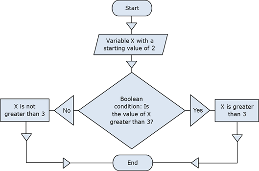

# Chapter 5. Conditional Statements

## In This Chapter

In this chapter we will cover the **conditional statements in C#,** which we can use to execute different actions depending on a given condition. We will explain the syntax of the conditional operators `if` and `if-else` with suitable examples and explain the practical application of the operator for selection `switch-case`.
We will focus on the **best practices** to be followed in order to achieve a better programming style when using nested or other types of conditional statements.

## Comparison Operators and Boolean Expressions

In the following section we will recall the **basic comparison operators** in the C# language. They are important, because we use them to describe conditions in our conditional statements.

### Comparison Operators

There are several comparisons operators in C#, which are used to compare pairs of integers, floating-point numbers, characters, strings and other types:

Operator | Action
---------|-------
`==` | Equal to
`!=` | Not equal to
`>` | Greater than
`>=` | Greater than or equal to
`<` | Less than
`<=` | Less than or equal to

**Comparison operators** can be used to compare expressions such as two numbers, two numerical expressions, or a number and a variable. The result of the comparison is a Boolean value (`true` or `false`).

Let’s look at an example of using comparisons:

```cs
int weight = 700;
Console.WriteLine(weight >= 500); // True

char gender = 'm';
Console.WriteLine(gender <= 'f'); // False

double colorWaveLength = 1.630;
Console.WriteLine(colorWaveLength > 1.621); // True

int a = 5;
int b = 7;
bool condition = (b > a) && (a + b < a * b);
Console.WriteLine(condition); // True

Console.WriteLine('B' == 'A' + 1); // True
```

In the sample code we perform a comparison between numbers and between characters. The numbers are compared by size while characters are compared by their lexicographical order (the operation uses the Unicode numbers for the corresponding characters).

As seen in the example, the type char **behaves like a number** and can be subtracted, added and compared to numbers freely. However, this should be used cautiously as it could make the code difficult to read and understand.
By running the example we will produce the following output:

```console
True
False
True
True
True
```

In C# several types of data that can be compared:

- numbers (`int`, `long`, `float`, `double`, `ushort`, `decimal`, ...)
- characters (`char`)
- Booleans (`bool`)
- References to objects, also known as object pointers (`string`, `object`, arrays and others)

Every comparison can affect two numbers, two `bool` values, or two object references. It is allowed to **compare expressions of different types,** like an integer with a floating-point number for example. However, not every pair of data types can be compared directly. For example, we cannot compare a string with a number.

### Comparison of Integers and Characters

When comparing integers and characters, we directly compare their binary representation in memory i.e. we **compare their values.** For example, if we compare two numbers of type int, we will compare the values of their respective series of 4 bytes. Here is one example for integer and character comparisons:

```cs
Console.WriteLine("char 'a' == 'a'? " + ('a' == 'a'));  // True
Console.WriteLine("char 'a' == 'b'? " + ('a' == 'b'));  // False
Console.WriteLine("5 != 6? " + (5 != 6));               // True
Console.WriteLine("5.0 == 5L? " + (5.0 == 5L));         // True
Console.WriteLine("true == false? " + (true == false)); // False
```

The result of the example is as follows:

```console
char 'a' == 'a'? True
char 'a' == 'b'? False
5 != 6? True
5.0 == 5L? True
true == false? False
```

### Comparison of References to Objects

In .NET Framework there are reference data types that do not contain their value (unlike the value types), but contain the address of the memory in the heap where their value is located. Strings, arrays and classes are such types. They behave like a pointer to some value and can have the value `null`, i.e. no value. When comparing reference type variables, we **compare the addresses** they hold, i.e. we check whether they point to the same location in the memory, i.e. to the same object.

Two object pointers (references) can refer to the same object or to different objects, or one of them can point to nowhere (to have `null` value). In the following example we create two variables that point to the same value (object) in the heap.

```cs
string str = "beer";
string anotherStr = str;
```

After executing the source code above, the two variables `str` and `anotherStr` will point to the same object (`string` with value "beer"), which is located at some address in the heap (managed heap).

We can check whether the **variables point to the same object** with the comparison operator `(==).` For most reference types this operator does not compare the content of the objects but rather checks if they point at the same location in memory, i.e. if they are one and the same object. The size comparisons (`<`, `>`, `<=`, and `>=`) are not applicable for object type variables.

The following example illustrates the comparison of references to objects:

```cs
string str = "beer";
string anotherStr = str;
string thirdStr = "be" + 'e' + 'r';
Console.WriteLine("str = {0}", str);
Console.WriteLine("anotherStr = {0}", anotherStr);
Console.WriteLine("thirdStr = {0}", thirdStr);
Console.WriteLine(str == anotherStr); // True - same object
Console.WriteLine(str == thirdStr); // True - equal objects
Console.WriteLine((object)str == (object)anotherStr); // True
Console.WriteLine((object)str == (object)thirdStr); // False
```

If we execute the sample code, we will get the following result:

```console
str = beer
anotherStr = beer
thirdStr = beer
True
True
True
False
```

Because the strings used in the example (instances of the class `System.String`, defined by the keyword `string` in C#) are of reference type, their values are set as objects in the heap. The two objects `str` and `thirdStr` have equal values, but are different objects, located at separate addresses in the memory. The variable `anotherStr` is also reference type and gets the address (the reference) of str, i.e. points to the existing object `str`. So by the comparison of the variables `str` and `anotherStr`, it appears that they are one and the same object and are equal. The result of the comparison between `str` and `thirdStr` is also equality, because the operator `==` compares the strings by value and not by address (a very useful exception to the rule for comparison by address). However, if we convert the three variables to objects and then compare them, we will get a comparison of the addresses in the heap where their values are located and the result will be different.

This above example shows that the operator `==` **has a special behavior when comparing strings,** but for the rest of the reference types (like arrays or classes) it applies comparison by address.

You will learn more about the class `String` and the comparison of strings in the chapter about "Strings".

### Logical Operators

Let’s recall the logical operators in C#. They are often used to construct logical (Boolean) expressions. The logical operators are: `&&`, `||`, `!` and `^`.

### Logical Operators `&&` and `||`

The logical operators `&&` (logical AND) and `||` (logical OR) are only used on Boolean expressions (values of type `bool`). In order for the result – of comparing two expressions with the operator `&&` – to be `true` (true), both operands must have the value `true`. For instance:

```cs
bool result = (2 < 3) && (3 < 4);
```

This expression is "true", because both the operands: (2 < 3) and (3 < 4) are "true". The logical operator `&&` is also called **short-circuit,** because it does not lose time in additional unnecessary calculations. It evaluates the left part of the expression (the first operand) and if the result is `false`, it does not lose time for evaluating the second operand – it’s not possible the end result to be "true" when the first operand is not "true". For this reason it is also called **short-circuit logical operator "and".**

Similarly, the operator `||` returns true if at least one of the two operands has the value "true". Example:

```cs
bool result = (2 < 3) || (1 == 2);
```

This example is "true", because its first operand is "true". Just like the `&&` operator, the calculation is done fast – if the first operand is `true`, the second is not calculated at all, as the result is already known. It is also called **short-circuit logical operator "or".**

### Logical Operators `&` and `|`

The operators for comparison `&` and `|` are similar to `&&` and `||`, respectively. The difference lies in the fact that both operands are calculated one after the other, although the final result is known in advance. That’s why these comparison operators are also known as **full-circuit logical operators** and are used very rarely.

For instance, when two operands are compared with `&` and the first one is evaluated "false", the calculation of the second operand is still executed. The result is clearly "false". Likewise, when two operands are compared with `|` and the first one is "true", we still evaluate the second operand and the final result is nevertheless "true".

We must not confuse the Boolean operators `&` and `|` with the bitwise operators `&` and `|`. Although they are written in the same way, they take different arguments (Boolean or integer expressions) and return different result (`bool` or integer) and their actions are not identical.

### Logical Operators ^ and !

The `^` operator, also known as **exclusive OR (XOR),** belongs to the full-circuit operators, because both operands are calculated one after the other. The result of applying the operator is `true` **if exactly one of the operands is true, but not both simultaneously.** Otherwise the result is `false`. Here is an example:

```cs
Console.WriteLine("Exclusive OR: "+ ((2 < 3) ^ (4 > 3)));
```

The result is as follows:

```console
Exclusive OR: False
```

The previous expression is evaluated as false, because both operands: (2 <3) and (4 > 3) are true.

The operator `!` returns the reversed value of the Boolean expression to which it is attached. Example:

```cs
bool value = !(7 == 5); // True
Console.WriteLine(value);
```

The above expression can be read as "the opposite of the truth of the phrase `"7 == 5"`. The result of this pattern is `True` (the opposite of `False`). Note that when we print the value `true` it is displayed on the console as "`True`" (with capital letter). This "defect" comes from the VB.NET language that also runs in .NET Framework.

## Conditional Statements "if" and "if-else"

After reviewing how to compare expressions, we will continue with conditional statements, which will allow us to implement programming logic.

**Conditional statements** `if` and `if-else` are conditional control statements. Because of them the program can behave differently based on a defined condition checked during the execution of the statement.

### Conditional Statement "if"

The main format of the conditional statements if is as follows:

```cs
if (Boolean expression)
{
    Body of the conditional statement;
}
```

It includes: if-clause, Boolean expression and body of the conditional statement.

The **Boolean expression** can be a Boolean variable or Boolean logical expression. Boolean expressions cannot be integer (unlike other programming languages like C and C++).

The **body of the statement** is the part locked between the curly brackets: `{}`. It may consist of one or more operations (statements). When there are several operations, we have a complex block operator, i.e. series of commands that follow one after the other, enclosed in curly brackets.

The expression in the brackets which follows the keyword `if` must return the Boolean value `true` or `false`. If the expression is calculated to the value `true`, then the body of a conditional statement is executed. If the result is `false`, then the operators in the body will be skipped.

#### Conditional Statement "if" – Example

Let’s take a look at an example of using a conditional statement if:

```cs
static void Main()
{
    Console.WriteLine("Enter two numbers.");
    Console.Write("Enter first number: ");
    int firstNumber = int.Parse(Console.ReadLine());
    Console.Write("Enter second number: ");
    int secondNumber = int.Parse(Console.ReadLine());
    int biggerNumber = firstNumber;
    if (secondNumber > firstNumber)
    {
        biggerNumber = secondNumber;
    }
    Console.WriteLine("The bigger number is: {0}", biggerNumber);
}
```

If we start the example and enter the numbers 4 and 5 we will get the following result:

```console
Enter two numbers.
Enter first number: 4
Enter second number: 5
The bigger number is: 5
```

### Conditional Statement "if" and Curly Brackets

If we have only one operator in the body of the `if`-statement, the curly brackets denoting the body of the conditional operator may be omitted, as shown below. However, it is a good practice to use them even if we have only one operator. This will make the code is more readable.

Here is an example of omitting the curly brackets which leading to confusion:

```cs
int a = 6;
if (a > 5)
    Console.WriteLine("The variable is greater than 5.");
    Console.WriteLine("This code will always execute!");
// Bad practice: misleading code
```

In this example the code is misleadingly formatted and creates the impression that both printing statements are part of the body of the `if`-block. In fact, this is true only for the first one.

| :warning: | Always put curly brackets { } for the body of "if" blocks even if they consist of only one operator! |
|---|:--|

### Conditional Statement "if-else"

In C#, as in most of the programming languages there is a conditional statement with `else` clause: the `if-else` statement. Its format is the following:

```cs
if (Boolean expression)
{
    Body of the conditional statement;
}
else
{
    Body of the else statement;
}
```

The format of the `if-else` structure consists of the reserved word `if`, Boolean expression, body of a conditional statement, reserved word `else` and `else`-body statement. The body of `else`-structure may consist of one or more operators, enclosed in curly brackets, same as the body of a conditional statement.

This statement works as follows: the **expression in the brackets** (a Boolean expression) is calculated. The calculation result must be Boolean – `true` or `false`. Depending on the result there are two possible outcomes. If the Boolean expression is calculated to true, the **body of the conditional statement** is executed and the else-statement is omitted and its operators do not execute. Otherwise, if the Boolean expression is calculated to `false`, **the `else`-body is executed,** the main body of the conditional statement is omitted and the operators in it are not executed.

#### Conditional Statement "if-else" – Example

Let’s take a look at the next example and illustrate how the if-else statement works:

```cs
static void Main()
{
    int x = 2;
    if (x > 3)
    {
        Console.WriteLine("x is greater than 3");
    }
    else
    {
        Console.WriteLine("x is not greater than 3");
    }
}
```

The program code can be interpreted as follows: if x>3, the result at the end is: **"x is greater than 3",** otherwise (`else`) the result is: **"x is not greater than 3".** In this case, since x=2, after the calculation of the Boolean expression the operator of the else structure will be executed. The result of the example is:

```console
x is not greater than 3
```

The following scheme illustrates the process flow of this example:



### Nested "`if`" Statements

Sometimes the programming logic in a program or an application needs to be represented by multiple if-structures contained in each other. We call them **nested `if`** or **nested `if-else` structures.**

We call nesting the placement of an `if` or `if-else` structure in the body of another `if` or `else` structure. In such situations every `else` clause corresponds to the closest previous `if` clause. This is how we understand which else clause relates to which `if` clause.

It’s not a good practice to exceed three nested levels, i.e. we should not nest more than three conditional statements into one another. If for some reason we need to nest more than three structures, we should export a part of the code in a separate method (see chapter Methods).

#### Nested "if" Statements – Example

Here is an example of using nested if structures:

```cs
int first = 5;
int second = 3;

if (first == second)
{
    Console.WriteLine("These two numbers are equal.");
}
else
{
    if (first > second)
    {
        Console.WriteLine("The first number is greater.");
    }
    else
    {
        Console.WriteLine("The second number is greater.");
    }
}
```

In the example above we have two numbers and compare them in two steps: first we compare whether they are equal and if not, we compare again, to determine which one is the greater. Here is the result of the execution of the code above:

```console
The first number is greater.
```

### Sequences of "if-else-if-else-..."

Sometimes we need to use a **sequence of `if` structures,** where the `else` clause is a new `if` structure. If we use nested `if` structures, the code would be pushed too far to the right. That’s why in such situations it is allowed to use a new `if` right after the `else`. It’s even considered a good practice. Here is an example:

```cs
char ch = 'X';
if (ch == 'A' || ch == 'a')
{
    Console.WriteLine("Vowel [ei]");
}
else if (ch == 'E' || ch == 'e')
{
    Console.WriteLine("Vowel [i:]");
}
else if (ch == 'I' || ch == 'i')
{
    Console.WriteLine("Vowel [ai]");
}
else if (ch == 'O' || ch == 'o')
{
    Console.WriteLine("Vowel [ou]");
}
else if (ch == 'U' || ch == 'u')
{
    Console.WriteLine("Vowel [ju:]");
}
else
{
    Console.WriteLine("Consonant");
}
```

The program in the example makes a series of comparisons of a variable to check if it is one of the **vowels from the English alphabet.** Every following comparison is done only in case that the previous comparison was not true. In the end, if none of the `if`-conditions is not fulfilled, the last `else` clause is executed. Thus, the result of the example is as follows:

```console
Consonant
```

### Conditional "if" Statements – Good Practices

Here are some guidelines, which we recommend for writing if, structures:

- Use blocks, surrounded by curly brackets `{}` after `if` and `else` in order to avoid ambiguity
- Always format the code correctly by offsetting it with one tab inwards after `if` and `else`, for readability and avoiding ambiguity.
- Prefer `switch-case` structure to of a series of `if-else-if-else-...` structures or nested `if-else` statement, if possible. The construct `switch-case` we will cover in the next section.

## Conditional Statement "`switch-case`"

In the following section we will cover the conditional statement switch. It is used for choosing among a list of possibilities.

### How Does the "`switch-case`" Statement Work?

The structure `switch-case` chooses which part of the programming code to execute based on the calculated value of a certain expression (most often of integer type). The format of the structure for choosing an option is as follows:

```cs
switch (integer_selector)
{
    case integer_value_1: 
        statements;
        break;
    case integer_value_2:
        statements;
        break;
    // ...
    default:
        statements;
        break;
}
```

The **selector** is an expression returning a resulting value that can be compared, like a number or `string`. The `switch` operator compares the result of the selector to every value listed in the `case` **labels** in the body of the switch structure. If a match is found in a case label, the corresponding structure is executed (simple or complex). If no match is found, the `default` statement is executed (when such exists). The value of the selector must be calculated before comparing it to the values inside the `switch` structure. The labels should not have repeating values, they must be unique.

As it can be seen from the definition above, every case ends with the operator `break`, which ends the body of the `switch` structure. The C# compiler requires the word `break` at the end of each `case`-section containing code. If no code is found after a `case`-statement, the `break` can be omitted and the execution passes to the next `case`-statement and continues until it finds a `break` operator. After the `default` structure `break` is obligatory.

It is not necessary for the `default` clause to be last, but it’s recommended to put it at the end, and not in the middle of the `switch` structure.

### Rules for Expressions in Switch

The `switch` statement is a clear way to implement selection among many options (namely, a choice among a few alternative ways for executing the code). It requires a selector, which is calculated to a certain value. The selector type could be an integer number, `char`, `string` or `enum`. If we want to use for example an array or a float as a selector, it will not work. For non-integer data types, we should use a series of `if` statements.

### Using Multiple Labels

Using multiple labels is appropriate, when we want to execute the same structure in more than one case. Let’s look at the following example:

```cs
int number = 6;
switch (number)
{
    case 1:
    case 4:
    case 6:
    case 8:
    case 10:
        Console.WriteLine("The number is not prime!"); 
        break;
    case 2:
    case 3:
    case 5:
    case 7:
        Console.WriteLine("The number is prime!"); 
        break;
    default:
        Console.WriteLine("Unknown number!"); 
        break;
}
```

In the above example, we implement multiple labels by using `case` statements without `break` after them. In this case, first the integer value of the selector is calculated – that is **6,** and then this value is compared to every integer value in the `case` statements. When a match is found, the code block after it is executed. If no match is found, the `default` block is executed. The result of the example above is as follows:

```console
The number is not prime!
```

### Good Practices When Using "`switch-case`"

- A good practice when using the switch statement is to put the **`default` statement at the end,** in order to have easier to read code.
- It’s good to place first the `cases`, which handle **the most common situations.** `Case` statements, which handle situations occurring rarely, can be placed at the end of the structure.
- If the values in the `case` labels are integer, it’s recommended that they be arranged in **ascending order.**
- If the values in the case labels are of character type, it’s recommended that the `case` labels are **sorted alphabetically.**
- It’s advisable to always use a `default` block to handle situations that cannot be processed in the normal operation of the program. If in the normal operation of the program the `default` block should not be reachable, you could put in it a **code reporting an error.**