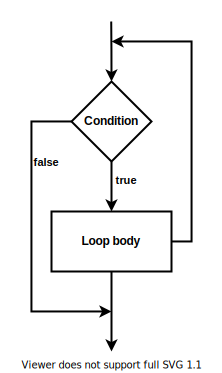
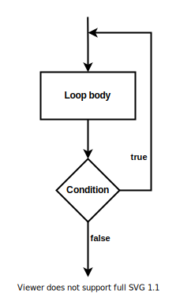
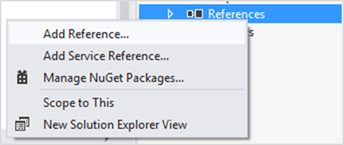
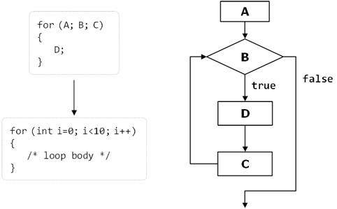

# Chapter 6. Loops

## In This Chapter

In this chapter we will examine the **loop programming constructs** through which we can execute a code snippet repeatedly. We will discuss how to implement conditional repetitions **(`while` and `do-while` loops)** and how to work with **`for`-loops.** We will give examples of different possibilities to define loops, how to construct them and some of their key usages. Finally, we will discuss the **`foreach`-loop** construct and how we can use multiple loops placed inside each other **(nested loops).**

## What Is a "Loop"?

In programming often requires repeated execution of a sequence of operations. A **loop** is a basic programming construct that allows **repeated execution of a fragment** of source code. Depending on the type of the loop, the code in it is repeated a fixed number of times or repeats until a given condition is true (exists).

Loops that never end are called **infinite loops.** Using an infinite loop is rarely needed except in cases where somewhere in the body of the loop a `break` operator is used to terminate its execution prematurely. We will cover this later but now let’s look how to create a loop in the C# language.

## While Loops

One of the simplest and most commonly used loops is while.

```cs
while (condition)
{
    loop body;
}
```

In the code above example, **`condition` is any expression that returns a Boolean result** – `true` or `false`. It determines how long the loop body will be repeated and is called the `loop condition`. In this example the `loop body` is the programming code executed at each iteration of the loop, i.e. whenever the input condition is true. The behavior of `while` loops can be represented by the following scheme:


 
In the `while` loop, first of all the Boolean expression is calculated and if it is `true` the sequence of operations in the body of the loop is executed. Then again the input condition is checked and if it is true again the body of the loop is executed. All this is repeated again and again **until at some point the conditional expression returns value `false`.** At this point the loop stops and the program continues to the next line, immediately after the body of the loop.

The body of the `while` loop may not be executed even once if in the beginning the condition of the cycle returns `false`. If the condition of the cycle is never broken the loop will be executed indefinitely.

### Usage of While Loops

Let’s consider a very simple example of using the **`while` loop.** The purpose of the loop is to print on the console the numbers in the range from 0 to 9 in ascending order:

```cs
// Initialize the counter
int counter = 0;
// Execute the loop body while the loop condition holds
while (counter <= 9)
{
    // Print the counter value
    Console.WriteLine("Number : " + counter);
    // Increment the counter
    counter++;
}
```

When executing the sample code we obtain the following result:

```console
Number : 0
Number : 1
Number : 2
Number : 3
Number : 4
Number : 5
Number : 6
Number : 7
Number : 8
Number : 9
```

Let’s give some more examples in order to illustrate the usefulness of loops and to show some problems that can be solved by using loops.

### Summing the Numbers from 1 to N

In this example we will examine how by using the **`while` loop** we can find the sum of the numbers from **1** to **n**. The number n is read from the console:

```cs
Console.Write("n = ");
int n = int.Parse(Console.ReadLine());
int num = 1;
int sum = 1;
Console.Write("The sum 1");
while (num < n)
{
    num++;
    sum += num;
    Console.Write(" + " + num);
}
Console.WriteLine(" = " + sum);
```

First we initialize the variables `num` and `sum` with the value of `1`. In `num` we keep the current number, which we add to the sum of the preceding numbers. Trough each loop we increase `num` with 1 to get the next number, then in the condition of the loop we check whether it is in the range from `1` to `n`. The `sum` variable contains the sum of the numbers from `1` to `num` at any time. Upon entering the loop we add to sum the next number stored in `num`. We print on the console all `num` numbers from 1 to n with a separator "+" and the final result of the summing after the loop’s ending. The result of the program’s execution is as follows (we enter n = 17):

```console
N = 17
The sum 1 + 2 + 3 + 4 + 5 + 6 + 7 + 8 + 9 + 10 + 11 + 12 + 13 + 14 + 15 + 16 + 17 = 153
```

Let’s give another example of using the `while` loop, before moving on to other structures for organizing loops.

### Check If a Number Is Prime – Example

We will write a **program to check whether a given number is prime or not.** We will read the number to check from the console. As we know from the mathematics, a prime number is any positive integer number, which, is not divisible by any other numbers except 1 and itself. We can check if the number `num` is prime when in a loop we check if it divides by numbers from 2 to `√num`:

```cs
Console.Write("Enter a positive number: ");
int num = int.Parse(Console.ReadLine());
int divider = 2;
int maxDivider = (int)Math.Sqrt(num);
bool prime = true;
while (prime && (divider <= maxDivider))
{
    if (num % divider == 0)
    {
        prime = false;
    }
    divider++;
}
Console.WriteLine("Prime? " + prime);
```

We use the variable `divider` to store the value of a potential divisor of the number. First we initialize it with 2 (the smallest possible divider). The variable `maxDivider` is the maximum possible divisor, which is equal to the square root of the number. If we have a divisor bigger than `√num`, then `num` should also have another divisor smaller than `√num` and that’s why it’s useless to check the numbers bigger than `√num`. This way we reduce the number of loop iterations.

For the result we use a Boolean variable called `prime`. Initially, its value is `true`. While passing through the loop, if it turns out that the number has a divisor, the value of `prime` will become `false`.

The condition of the `while` loop consists of two other sub-conditions which are related to the logical operator (logical **and**). In order to execute the loop, these two sub-conditions must be true simultaneously. If at some point we find a divisor of the number `num`, the variable prime becomes `false` and the condition of the loop is no longer satisfied. This means that the loop is executed until it finds the first divisor of the number or until it proves the fact that num is not divisible by any of the numbers in the range from 2 to `√num`.

Here is how the result of the above example’s execution looks like if the input values are respectively the numbers 37 and 34:

```console
Enter a positive number: 37
Prime? True
Enter a positive number: 34
Prime? False
```

### Operator "`break`"

The `break` operator is used for prematurely **exiting the loop,** before it has completed its execution in a natural way. When the loop reaches the `break` operator it is terminated and the program’s execution continues from the line immediately after the loop’s body. A loop’s termination with the `break` operator can only be done from its body, during an iteration of the loop. When `break` is executed the code in the loop’s body after it is skipped and not executed. We will demonstrate exiting from loop with `break` with an example.

#### Calculating Factorial – Example

In this example we will calculate the factorial of a number entered from the console. The calculation is performed by using an **infinite `while` loop** and the **operator `break`.** Let’s remember from the mathematics what is factorial and how it is calculated. The factorial of an integer n is a function that is calculated as a product of all integers less than or equal to n or equal to it. It is written down as n! and by definition the following formulas are valid for it:

- N! = 1 * 2 * 3 ... (n-1) * n, for n > 1;
- 2! = 1 * 2;
- 1! = 1;
- 0! = 1.

 The product n! can be expressed by a factorial of integers less than n:

- N! = (N-1)! * N, by using the initial value of 0! = 1.

In order to calculate the factorial of n we will directly use the definition:

```cs
int n = int.Parse(Console.ReadLine());
// "decimal" is the biggest C# type that can hold integer values
decimal factorial = 1;
// Perform an "infinite loop"
while (true)
{
    if (n <= 1)
    {
        break;
    }
    factorial *= n;
    n--;
}
Console.WriteLine("n! = " + factorial);
```

First we initialize the variable `factorial` with 1 and read n from the console. We construct an endless `while` loop by using `true` as a condition of the loop. We use the `break` operator, in order to terminate the loop, when n reaches a value less than or equal to 1. Otherwise, we multiply the current result by n and we reduce n with one unit. Practically in the first iteration of the loop the variable `factorial` has a value n, in the second – n*(n-1) and so on. In the last iteration of the loop the value of `factorial` is the product n*(n-1)*(n-2)*...*3*2, which is the desired value of n!.

If we execute the sample program and enter 10 as input, we obtain the following result:

```console
10
n! = 3628800
```

## Do-While Loops

The `do-while` loop is similar to the `while` loop, but it checks the condition after each execution of its loop body. This type of loops is called loops with condition at the end (post-test loop). A `do-while` loop looks like this:

```cs
do
{
    executable code;
} while (condition);
```

By design do-while loops are executed according to the following scheme:



Initially the **loop body** is executed. Then its **condition is checked.** If it is true, the loop’s body is repeated, otherwise the loop ends. This logic is repeated until **the condition of the loop is broken.** The body of the loop is executed at least once. If the loop’s condition is constantly true, the loop never ends.

### Usage of Do-While Loops

The `do-while` loop is used when we want to guarantee that the sequence of operations in it will be executed repeatedly and at least once in the beginning of the loop.

#### Calculating Factorial – Example

In this example we will again calculate the factorial of a given number n, but this time instead of an infinite while loop we will use a do-while. The logic is similar to that in the previous example:

```cs
Console.Write("n = ");
int n = int.Parse(Console.ReadLine());
decimal factorial = 1;
do
{
    factorial *= n;
    n--;
} while (n > 0);
Console.WriteLine("n! = " + factorial);
```

At the beginning we start with a result of 1 and multiply consecutively the result at each iteration by n, and reduce n by one unit, until n reaches 0. This gives us the product n*(n-1)*...*1. Finally, we print the result on the console. This algorithm always performs at least one multiplication and that’s why it will not work properly when n ≤ 0.

Here is the result of the above example’s execution for n=7:

```cs
n = 7
n! = 5040
```

#### Factorial of a Large Number – Example

You might be wondering what will happen if we set a large value for the number n in the previous example, say n=100. Then when, calculating the n! we will overflow the `decimal` type and the result will be an exception of type `System.OverflowException`:

```cs
n = 100
Unhandled Exception: System.OverflowException: Value was either too large or too small for a Decimal.
    at System.Decimal.FCallMultiply(Decimal& result, Decimal d1, Decimal d2)
    at System.Decimal.op_Multiply(Decimal d1, Decimal d2)
    at TestProject.Program.Main() in C:\Projects\TestProject\Program.cs:line 17
```

If we want to calculate 100! we can use data type `BigInteger` (which is new as of .NET Framework 4.0 and is missing in the older .NET versions). This type represents an integer, which can be **very large** (for example 100,000 digits). There is no limit on the size of the numbers recorded in the class `BigInteger` (as long as you have enough RAM).

In order to use `BigInteger`, we must first **add a reference** from our project to the assembly `System.Numerics.dll` (this is a standard .NET library for working with very large integers, which is not referenced by default by our VS projects). **Adding a reference** to it is done by right-clicking on the current project references in the Solution Explorer window of Visual Studio:


 
We search and choose the assembly System.Numerics.dll from the list:


 
If the assembly is missing from the list, that means that the Visual Studio project probably does not target **.NET Framework 4.0** or above and you must either create a new project or change the version of the current one.
 
Then we need to add "`using System.Numerics;`" before the beginning of the class of our program and replace `decimal` with `BigInteger`. The program obtains the following form:

```cs
using System;
using System.Numerics;

class Factorial
{
    static void Main()
    {
        Console.Write("n = ");
        int n = int.Parse(Console.ReadLine());
        BigInteger factorial = 1;
        do
        {
            factorial *= n;
            n--;
        } while (n > 0);
        Console.WriteLine("n! = " + factorial);
    }
}
```

If we now run the program for n=100, we will get the value of 100 factorial, which is a 158-digit number:

```console
n = 100
n! = 93326215443944152681699238856266700490715968264381621468592963895217599993229915608941463976156518286253697920827223758251185210916864000000000000000000000000
```

By `BigInteger` you can calculate 1000!, 10000! and even 100000! It will take some time, but `OverflowException` will not occur. The `BigInteger` class is very powerful but it works many times slower than `int` and `long`. For our unpleasant surprise there is no class "big decimal" in .NET Framework, only "big integer".

### Product in the Range [N...M] – Example

Let’s give another, more interesting example of working with `do-while` loops. The goal is to find the product of all numbers in the range [n...m]. Here is an example solution to this problem:

```cs
Console.Write("n = ");
int n = int.Parse(Console.ReadLine());

Console.Write("m = ");
int m = int.Parse(Console.ReadLine());

int num = n;
long product = 1;
do
{
    product *= num;
    num++;
} while (num <= m);

Console.WriteLine("product[n...m] = " + product);
```

In the example code we consecutively assign to `num` at each iteration the values n, n+1, ..., m and in the variable `product` we accumulate the product of these values. We require the user to enter n, which should be less than m. Otherwise we will receive as a result the number n.

If we run the program for n=2 and m=6 we will obtain the following result:

```console
n = 2
m = 6
product[n...m] = 720
```

Be careful: the product grows very fast, so you may need to use `BigInteger` instead of `long` for the calculated result. Also beware of hidden integer overflow. Unchecked code will silently overflow and the code above will produce incorrect output instead of showing an error. To overcome this, you may surround the line holding the multiplication by the `checked` keyword.

## For Loops

`For`-loops are a slightly more complicated than `while` and `do-while` loops but on the other hand they can solve more complicated tasks with less code. Here is the scheme describing `for`-loops:


 
They contain an **initialization block** (A), **condition** (B), **body** (D) and **updating commands** for the loop variables (C). We will explain them in details shortly. Before that, let’s look at how the program code of a for-loop looks like:

```cs
for (initialization; condition; update)
{
    loop's body;
}
```

It consists of an **initialization part** for the counter (in the pattern `int i = 0`), a Boolean condition (`i < 10`), an expression for updating the counter (`i++`, it might be `i--` or for instance, `i = i + 3`) and body of the loop.

The **counter of the loop** distinguishes it from other types of loops. Most often the counter changes from a given initial value to a final one in ascending order, for example from 1 to 100. The number of iterations of a given `for`-loop is usually known before its execution starts. A `for`-loop can have one or several loop variables that move in ascending or descending order or with a step. It is possible one loop variable to increase and the other – to decrease. It is even possible to make a loop from 2 to 1024 in steps of multiplication by 2, since the update of the loop variables can contain not only addition, but any other arithmetic (as well as other) operations.

Since none of the listed elements of the `for`-loops is mandatory, we can skip them all and we will get an **infinite loop:**

```cs
for ( ; ; )
{
    // Loop body
}
```

Now let’s consider in details the separate parts of a `for`-loop.

### Initialization of For Loops

`For`-loops can have an **initialization block:**

```cs
for (int num = 0; ...; ...)
{
    // The variable num is visible here and it can be used
}
// Here num can not be used
```

It is **executed only once,** just before entering the loop. Usually the initialization block is used to declare the **counter-variable** (also called a **loop variable**) and to set its initial value. This variable is "visible" and can be used only within the loop. In the initialization block is possible to declare and initialize more than one variable.

### Condition of the For Loop

For-loops can have a **loop condition:**

```cs
for (int num = 0; num < 10; ...)
{
    // Loop body
}
```

The condition **(loop condition)** is evaluated once before each iteration of the loop, just like in the `while` loops. For result `true` the loop’s body is executed, for result `false` it is skipped and the loop ends (the program continues immediately after the last line of the loop’s body).

### Update of the Loop Variables

The last element of a `for`-loop contains **code that updates** the loop variable:

```cs
for (int num = 0; num < 10; num++)
{
    // Loop body
}
```

This code is executed at each iteration, after the loop’s body has been executed. It is most commonly used to update the value of the counter-variable.

### The Body of the Loop

The **body of the loop** contains a block with source code. The loop variables, declared in the initialization block of the loop are available in it.

#### For-Loop – Example

Here is a complete example of a `for`-loop:

```cs
for (int i = 0; i <= 10; i++)
{
    Console.Write(i + " ");
}
```

The result of its execution is the following:

```console
0 1 2 3 4 5 6 7 8 9 10
```

Here is another, more complicated example of a `for`-loop, in which we have two variables `i` and `sum`, that initially have the value of 1, but we update them consecutively at each iteration of the loop:

```cs
for (int i = 1, sum = 1; i <= 128; i = i * 2, sum += i)
{
    Console.WriteLine("i={0}, sum={1}", i, sum);
}
```

The result of this loop’s execution is the following:

```console
i=1, sum=1
i=2, sum=3
i=4, sum=7
i=8, sum=15
i=16, sum=31
i=32, sum=63
i=64, sum=127
i=128, sum=255
```

#### Calculating N^M – Example

As a further example we will write a program that raises the number n to a power of m, and for this purpose we will use a `for`-loop:

```cs
Console.Write("n = ");
int n = int.Parse(Console.ReadLine());
Console.Write("m = ");
int m = int.Parse(Console.ReadLine());
decimal result = 1;
for (int i = 0; i < m; i++)
{
    result *= n;
}
Console.WriteLine("n^m = " + result);
```

First we initialize the result (`result = 1`). The loop starts by setting an initial value for the counter-variable (`int i = 0`). We define the condition for the loop’s execution (`i < m`). This way the loop will be executed from `0` to `m-1` i.e. exactly `m` times. During each run of the loop we multiply the result by `n` and so `n` will be raised to the next power (1, 2, ..., m) at each iteration. Finally we print the result to see if the program works properly.

Here is how the outcome of the program for n = 2 and m = 10 looks like:

```console
n = 2
m = 10
n^m = 1024
```

### For-Loop with Several Variables

As we have already seen, in the construct of a `for`-loop we can use **multiple variables** at the same time. Here is an example in which we have two counters. One of the counters moves up from 1 and the other moves down from 10:

```cs
for (int small=1, large=10; small<large; small++, large--)
{
    Console.WriteLine(small + " " + large);
}
```

The condition for loop termination is overlapping of the counters. Finally we get the following result:

```console
1 10
2 9
3 8
4 7
5 6
```

### Operator "`continue`"

The `continue` operator **stops the current iteration** of the inner loop, without terminating the loop. With the following example we will examine how to use this operator.

We will calculate the sum of all odd integers in the range [1...n], which are not divisible by 7 by using the `for`-loop:

```cs
int n = int.Parse(Console.ReadLine());
int sum = 0;
for (int i = 1; i <= n; i += 2)
{
    if (i % 7 == 0)
    {
        continue;
    }
    sum += i;
}
Console.WriteLine("sum = " + sum);
```

First we initialize the **loop’s variable** with a value of 1 as this is the first odd integer within the range [1...n]. After each iteration of the loop we check if `i` has not yet exceeded `n` `(i <= n)`. In the expression for updating the variable we increase it by 2 in order to pass only through the odd numbers. Inside the loop body we check whether the current number is divisible by 7. If so we call the operator `continue`, which skips the rest of the loop’s body (it skips adding the current number to the sum). If the number is not divisible by seven, it continues with updating of the sum with the current number.

The result of the example for n = 11 is as follows:

```console
11
sum = 29
```

## Foreach Loops

The **`foreach` loop** (extended `for`-loop) is new for the C/C++/C# family of languages, but is well known for the VB and PHP programmers. This programming construct serves to **iterate over all elements** of an array, list or other collection of elements (`IEnumerable`). It passes through all the elements of the specified collection even if the collection is not indexed.

We will discuss arrays in more details in chapter "Arrays", but for now we can imagine one array as an ordered sequence of numbers or other elements.

Here is how a `foreach` loop looks like:

```cs
foreach (type variable in collection)
{
    statements;
}
```

As we see, **it is significantly simpler than the standard `for`-loop** and therefore is very often preferred by developers because it saves writing when you need to go through all the elements of a given collection. Here is an example that shows how we can use `foreach`:

```cs
int[] numbers = { 2, 3, 5, 7, 11, 13, 17, 19 };
foreach (int i in numbers)
{
    Console.Write(" " + i);
}
Console.WriteLine();
string[] towns = { "London", "Paris", "Milan", "New York" };
foreach (string town in towns)
{
    Console.Write(" " + town);
}
```

In the example we create an array of numbers, which are after that went through with a `foreach` loop, and its elements are printed on the console. Then an array of city names (strings) is created and in the same way it is went through and its elements are printed on the console. The result of the example is:

```console
2 3 5 7 11 13 17 19
London Paris Milan New York
```

## Nested Loops

The **nested loops** are programming constructs consisting of several loops located into each other. The innermost loop is executed more times, and the outermost – less times. Let’s see how two nested loops look like:

```cs
for (initialization, verification, update)
{
    for (initialization, verification, update)
    {
        executable code
    }
    ...
}
```

After initialization of the first `for` loop, the execution of its body will start, which contains the second (nested) loop. Its variable will be initialized, its condition will be checked and the code within its body will be executed, then the variable will be updated and execution will continue until the condition returns `false`. After that the second iteration of the first `for` loop will continue, its variable will be updated and the whole second loop will be performed once again. The inner loop will be fully executed as many times as the body of the outer loop.

Let’s now consider a real example that will demonstrate how useful the nested loops are.

#### Printing a Triangle – Example

Let’s solve the following problem: for a given number n, to print on the console a triangle with n number of lines, looking like this:

```cs
1
1 2
1 2 3
...
1 2 3 ... n
```

We will solve the problem with two `for`-loops. The **outer loop** will traverse the lines, and the inner one – the elements in them. When we are on the first line, we have to print "1" (1 element, 1 iteration of the inner loop). On the second line we have to print "1 2" (2 elements, 2 iterations of the internal loop). We see that there is a correlation between the line on which we are and the number of the elements that we print. This tells us how to organize the **inner loop’s structure:**

- We initialize the loop variable with 1 (the first number that we will print): `col = 1`;
- The repetition condition depends on the line on which we are: `col <= row`;
- We increase the loop variable with one unit at each iteration of the internal loop.

Basically, we need to implement a `for`-loop (external) from 1 to n (for the lines) and put another `for`-loop (internal) in it – for the numbers on the current line, which should spin from 1 to the number of the current line. The external loop should go through the lines while the internal – through the columns of the current line.

Finally we get the following code:

```cs
int n = int.Parse(Console.ReadLine());
for (int row = 1; row <= n; row++)
{
    for (int col = 1; col <= row; col++)
    {
        Console.Write(col + " ");
    }
    Console.WriteLine();
}
```

If we execute it, we will make sure that it works correctly. Here is how the result for n=7 looks like:

```console
1
1 2
1 2 3
1 2 3 4
1 2 3 4 5
1 2 3 4 5 6
1 2 3 4 5 6 7
```

Note: when n > 9 the triangle will have a small defect. Think how to fix it!


#### Prime Numbers in an Interval – Example

Let’s consider another **example of nested loops.** We set a goal to print on the console all prime number in the interval [n...m]. We will limit the interval by a `for`-loop and in order to check for a prime number we will use a nested `while` loop:

```cs
Console.Write("n = ");
int n = int.Parse(Console.ReadLine());
Console.Write("m = ");
int m = int.Parse(Console.ReadLine());

for (int num = n; num <= m; num++)
{
    bool prime = true;
    int divider = 2;
    int maxDivider = (int)Math.Sqrt(num);
    while (divider <= maxDivider)
    {
        if (num % divider == 0)
        {
            prime = false;
            break;
        }
        divider++;
    }
    if (prime)
    {
        Console.Write(" " + num);
    }
}
```

Using the outer `for`-loop we check each of the numbers n, n+1, ..., m if it is prime. At each iteration of the outer `for`-loop we check whether its loop variable `num` is a prime number. The logic by which we check for a prime number is already familiar to us. At first we initialize the variable `prime` with `true`. With the internal while loop we check for each of the numbers [2...`√num`] if it is a divisor of `num` and if so, we set `prime` to `false`. After finishing the while loop the Boolean variable prime indicates whether the number is prime or not. If the number is prime we print it on the console.

If we execute the example for n=3 and m=75, we will obtain the following result:

```console
n = 3
m = 75
 3 5 7 11 13 17 19 23 29 31 37 41 43 47 53 59 61 67 71 73
```

#### Lucky Numbers – Example

Let’s consider another example through which we will show that we can put even **more than two loops into each other.** Our purpose is to find and print all four-digit numbers of the type ABCD, where: A+B = C+D (we call them lucky numbers). We will implement it with four `for`-loops – one for each digit. The outermost loop will define the thousands. It will start from 1 and the rest of the loops – from 0. They will determine the hundreds, the tens and the units. We will perform a check if our current number in the most inner loop is a lucky one and if so, we will print it on the console. Here is an implementation example:

```cs
for (int a = 1; a <= 9; a++)
{
    for (int b = 0; b <= 9; b++)
    {
        for (int c = 0; c <= 9; c++)
        {
            for (int d = 0; d <= 9; d++)
            {
                if ((a + b) == (c + d))
                {
                    Console.WriteLine(
                        " " + a + " " + b + " " + c + " " + d);
                }
            }
        }
    }
}
```

Here is a part of the printed result (the entire result is too long):

```console
1 0 0 1
1 0 1 0
1 1 0 2
1 1 1 1
1 1 2 0
1 2 0 3
1 2 1 2
1 2 2 1
...
```

We leave as homework for the diligent reader to offer a more efficient solution to the same problem, using only three nested loops rather than four.

### Lottery 6/49 – Example

In the following example we will find **all possible combinations of the lottery game "6/49".** We have to find and print all possible extracts of 6 different numbers, each of which is in the range [1...49]. We will use 6 `for`-loops. Unlike the previous example, the numbers cannot be repeated. To avoid repetitions we will strive for each subsequent number to be larger than the previous. Therefore, the internal loops will not start from 1 but from the number to which the previous loop got + 1. We will have to go through the first loop until it reaches 44 (and not to 49), the second – 45, etc. The last loop will be up to 49. If you make all loops to 49 you will receive matching numbers in certain combinations. For the same reason, each subsequent cycle starts from the previous loop counter + 1. Let’s see what will happen:

```cs
for (int i1 = 1; i1 <= 44; i1++)
{
    for (int i2 = i1 + 1; i2 <= 45; i2++)
    {
        for (int i3 = i2 + 1; i3 <= 46; i3++)
        {
            for (int i4 = i3 + 1; i4 <= 47; i4++)
            {
                for (int i5 = i4 + 1; i5 <= 48; i5++)
                {
                    for (int i6 = i5 + 1; i6 <= 49; i6++)
                    {
                        Console.WriteLine(i1 + " " + i2 + " " +
                            i3 + " " + i4 + " " + i5 + " " + i6);
                    }
                }
            }
        }
    }
}
```

Everything looks correct. Let’s run the program. It seems to work but there is one problem – there are too many combinations and the program does not end (it is **so slow,** that hardly anyone is going to wait). This is correct and it is one of the reasons why there is Lottery 6/49 – there really are lots of combinations. We are leaving the curious reader to practice changing the example above just to calculate all lottery combinations, instead of printing them. This change will dramatically reduce the volume of the printed results on the console and the program will end surprisingly quickly.

| :warning: | Printing excessive amount of text on the console is very slow and should be avoided. A modern computer (as of 2012) can perform 300,000,000 operations per second but can print only 10,000 – 20,000 text lines per second. |
|:---:|:---|