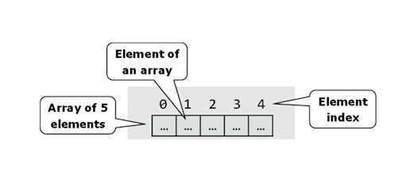
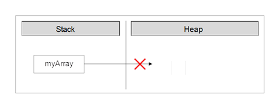
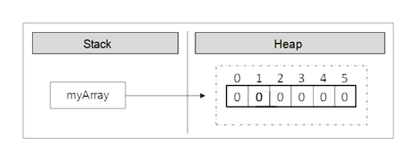
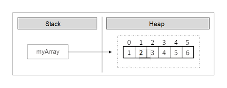
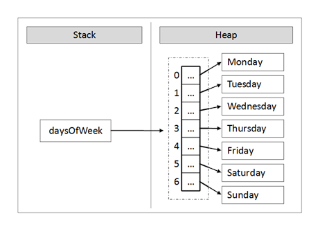
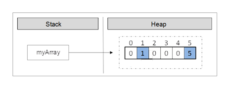
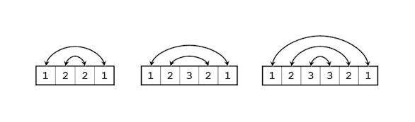
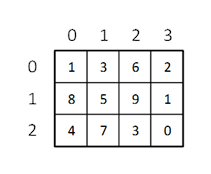
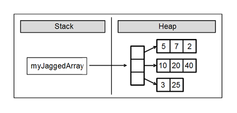

# Chapter 7. Arrays

## In This Chapter

In this chapter we will learn about arrays as a **way to work with sequences of elements** of the same type. We will explain what **arrays** are, how we declare, create, instantiate and use them. We will examine one-dimensional and **multidimensional arrays.** We will learn different ways to iterate through the array, read from the standard input and write to the standard output. We will give many example exercises, which can be solved using arrays and we will show how useful they really are.

## What Is an "Array"?

**Arrays** are vital for most programming languages. They are collections of variables, which we call **elements:**


 
An array’s elements in C# are numbered with 0, 1, 2, ... N-1. Those numbers are called **indices.** The total number of elements in a given array we call **length of an array.**

All elements of a given array are of the same type, no matter whether they are **primitive** or **reference** types. This allows us to represent a group of similar elements as an ordered sequence and work on them as a whole.

Arrays can be in different dimensions, but the most used are the **one-dimensional** and the **two-dimensional arrays.** One-dimensional arrays are also called **vectors** and two-dimensional are also known as **matrices.**

## Declaration and Allocation of Memory for Arrays

In C# the arrays have fixed length, which is set at the time of their instantiation and determines the total number of elements. Once the length of an array is set we cannot change it anymore.

### Declaring an Array

We declare an array in C# in the following way:

```cs
int[] myArray;
```

In this example the variable `myArray` is the name of the array, which is of integer type (`int[]`). This means that we declared an array of integer numbers. With `[]` we indicate, that the variable, which we are declaring, is an array of elements, not a single element.

When we declare an array type variable, it is a **reference,** which does not have a value (it points to `null`). This is because the memory for the elements is not allocated yet.

The figure below shows how a declared array variable looks, when the memory for elements of the array is not allocated yet:


 
In the program’s execution stack the variable with the name `myArray` is created and its value is set to `null` (meaning it holds no value).

### Creation of an Array – the Operator "`new`"

In C# we create an array with the help of the keyword new, which is used to allocate memory:

```cs
int[] myArray = new int[6];
```

In this example we allocate an array with length of 6 elements of type `int`. This means that in the dynamic memory (heap) an area of 6 integer numbers is allocated and they all are initialized with the value 0:


 
The figure shows, that after the allocation of memory for the array the variable `myArray` points to an address in the dynamic memory, where the values are. In C#, the elements of an array are always stored in the dynamic memory (called also **heap**).

During the allocation of the memory for an array we set the total number of the elements in the brackets (a non-negative integer number), defining its length. The type of the elements is written after the reserved word `new`, so we indicate what type of elements are going to be allocated in the memory.

### Array Initialization and Default Values

Before we can use an element of a given array, it has to be **initialized** or to have a **default value.** In some programming languages there are no default values and then if we try to access an element, which is not initialized, this may cause an error. In C# all variables, including the elements of arrays have a default initial value. This value is either `0` for the numeral types or its equivalent for the non-primitive types (for example `null` for a reference type and `false` for the `bool` type).

Of course we can set initial values explicitly. We can do this in different ways. Here is one of them:

```cs
int[] myArray = { 1, 2, 3, 4, 5, 6 };
```

In this case we create and initialize the elements of the array at the time of the declaration. On the figure below we see how the array is allocated in the memory when its values are initialized at the moment of its declaration:



With this syntax we use curly brackets instead of the operator `new`. Between the brackets we list the initial values of the array, separated by commas. Their count defines the length of the array.

#### Declaration and Initialization of an Array – Example

Here is one more example how to **declare and initialize an array:**

```cs
string[] daysOfWeek =
    { "Monday", "Tuesday", "Wednesday","Thursday", "Friday",     "Saturday", "Sunday" };
```

In this case we allocate an array of seven elements of type `string`. The type `string` is a reference type (object) and its values are stored in the dynamic memory. The variable `daysOfWeek` is allocated in the stack memory, and points to a section of the dynamic memory containing the elements of the array. The type of each of these seven elements is `string`, which itself points to a different section of the dynamic memory, where the real value is stored.

On this figure we see **how the array is allocated in the memory:**


 
### Boundaries of an Array

Arrays are by default **zero-based,** which means the enumeration of the elements starts from **0.** The first element has the index 0, the second – 1, etc. In an array of **N** elements, the last element has the index **N-1.**

## Access to the Elements of an Array

We access the array elements directly using their **indices.** Each element can be accessed through the name of the array and the element’s **index** (consecutive number) placed in the brackets. We can access given elements of the array both for reading and for writing, which means we can treat elements as variables.

Here is an example for accessing an element of an array:

```cs
myArray[index] = 100;
```

In the example above we set a value of 100 to the element, which is at position `index`.

Here is an example, where we allocate an array of numbers and then we change some of them:

```cs
int[] myArray = new int[6];
myArray[1] = 1;
myArray[5] = 5;
```

After the change, the array is allocated in the memory as shown below:
 


As we can see, all elements, except those for which values are explicitly set, are initialized with the value 0 when the memory of the array was allocated.

We can **iterate** through the array using a **loop** statement. The most common form of such iteration is by using a `for`-loop:

```cs
int[] arr = new int[5];
for (int i = 0; i < arr.Length; i++)
{
    arr[i] = i;
}
```

### Going Out of Bounds of the Array

The .NET Framework does an **automatic check** on each element access attempt, whether the index is valid or it is **out of the range** of the array. When we try to access an invalid (not existing) element in an array, a `System.IndexOutOfRangeException` is thrown. The automatic check really helps the developers find errors while working with arrays. Of course, checking for exceptions has its price. Checks affect the performance, but that’s nothing compared to avoiding errors like "out of range", "access to unallocated memory", etc.

Here is an example, where we are trying to access an element, which is out of the range of the array:

| IndexOutOfRangeExample.cs |
|:---|

```cs
class IndexOutOfRangeExample
{
    static void Main()
    {
        int[] myArray = { 1, 2, 3, 4, 5, 6 };
        Console.WriteLine(myArray[6]);
    }
}
```

In the example above we allocate an array, which contains six integer numbers. The first index is 0, and the last index is 5. We are trying to print to the console an element with index 6, but because there is no such element this leads to an exception:

```console
Unhandled Exception: System.IndexOutOfRangeException: Index was outside the bounds of the array.
    at IndexOutOfRangeExample.Main() in C:\Projects\OutOfRange\OutOfRange\Program.cs:line 8
Press any key to continue . . . 
```
 
#### Reversing an Array – Example

In the next example we will access elements and change them using their indices. The task is to print the elements in **reversed order.** We will reverse the elements of the array using a second, auxiliary array, where we will keep the elements of the first one, but in a reversed order. Note that the length of both arrays is the same and it stays unchanged after the first allocation:

ArrayReverseExample.cs |
|:---|

```cs
class ArrayReverseExample
{
    static void Main()
    {
        int[] array = { 1, 2, 3, 4, 5 };
        // Get array size
        int length = array.Length;
        // Declare and create the reversed array
        int[] reversed = new int[length];

        // Initialize the reversed array
        for (int index = 0; index < length; index++)
        {
            reversed[length - index - 1] = array[index];
        }

        // Print the reversed array
        for (int index = 0; index < length; index++)
        {
            Console.Write(reversed[index] + " ");
        }
    }
}
// Output: 5 4 3 2 1
```

The example works in the following way: initially we allocate a one-dimensional array of type int and we initialize it with the numbers from 1 to 5. After that we keep the length of the array in the variable `length`. Note that we are using the property `Length`, which returns the total count of the elements of the array. In C# each array has a length property.

After that we declare the array `reversed` with the same `length`, where we will keep elements of the original array, but in a reversed order.

To reverse the elements we use a `for`-loop. At each iteration we increment the `index` variable by one and we make sure we access all consecutive elements of the `array`. The loop condition ensures that the array will be iterated from end to end.

Let’s follow what happens when we iterate through the `array`. On the first iteration, `index` has a value of 0. Using `array[index]` we access the first element of the `array`, and respectively with `reversed[length - index - 1]` we access the last element of the new array `reversed` where we assign the values. Thus, we appropriated the value of the first element of the **array** to the last element of the **reversed** array. At each iteration `index` is incremented by one. This way, we access the next element in the order of `array` and the previous element in the order of `reversed`.

As a result we reversed the array and printed it. In the example we showed consecutive iterations through the array, which can also be done with different types of loop constructs (e.g. `while` and `foreach`).

## Reading an Array from the Console

Let’s see how we can read values of an array from the console. We will use a `for`-loop and the .NET Framework tools for reading from the console.

Initially we read a line from the console using `Console.ReadLine()`, and then we parse that line to an integer number using `int.Parse()` and we set it to the variable `n`. We then use the number n as length of the array.

```cs
int n = int.Parse(Console.ReadLine());
int[] array = new int[n];
```

Again we use a loop to iterate through the array. At each iteration we set the current element to what we have read from the console. The loop will continue **n** times, which means it will iterate through the array and so we will read a value for each element of the array:

```cs
for (int i = 0; i < n; i++)
{
    array[i] = int.Parse(Console.ReadLine());
}
```

#### Check for Symmetric Array – Example

An array is symmetric if the first and the last elements are equal and at the same time the second element and the last but one are equal as well and so on. On the figure a few examples for symmetric arrays are shown:


 
In the next example we will check whether an array is symmetric:

```cs
Console.Write("Enter a positive integer: ");
int n = int.Parse(Console.ReadLine());
int[] array = new int[n];

Console.WriteLine("Enter the values of the array:");

for (int i = 0; i < n; i++)
{
    array[i] = int.Parse(Console.ReadLine());
}

bool symmetric = true;
for (int i = 0; i < array.Length / 2; i++)
{
    if (array[i] != array[n - i - 1])
    {
        symmetric = false;
        break;
    }
}

Console.WriteLine("Is symmetric? {0}", symmetric);
```

We initialize an array and we read its elements from the console. We need to iterate through half of the array to check whether it is symmetric. The middle element of the array has an index `array.Length / 2`. If the length is an odd number this index is exactly the middle one, but if it is an even number, the index is to the right of the middle (the middle is between two elements). Thus the loop runs from `0` to `array.Length / 2` (non-inclusive).

To check whether an array is **symmetric,** we use a `bool` variable, and initially assume that the array is symmetric. During the iteration through the array we compare the first with the last element, the second with the last but one and so on. If at some point the compared elements are not equal, then we set the `bool` variable to `false`, which means the array is not symmetric.

In the end we print the value of the `bool` variable to the console.

## Printing an Array to the Console

Often we have to **print the elements of a given array** to the console, after we have finished working with it.

We print elements of an array to the console similarly to the initializing of the elements, i.e. by using a loop to iterate through the array. There are no strict rules for printing, but often some sort of suitable formatting is used.

A frequent mistake is an attempt to print an array like a number:

```cs
string[] array = { "one", "two", "three", "four" };
Console.WriteLine(array);
```

Unfortunately this code **does not print the elements of an array,** just its type. Here is what we get after the execution of this code:

```console
System.String[]
Press any key to continue . . .
```
 
We print the elements of an array by hand, by using a `for`-loop:

```cs
string[] array = { "one", "two", "three", "four" };

for (int index = 0; index < array.Length; index++)
{
    // Print each element on a separate line
    Console.WriteLine("Element[{0}] = {1}", index, array[index]);
}
```

We are iterating through the array using the `for`-loop, which will go `array.Length` times, and we will print the current element using `Console.WriteLine()` and a formatted string. Here is the result:

```console
Element[0] = one
Element[1] = two
Element[2] = three
Element[3] = four
```

## Iteration through Elements of an Array

As we can see, the iteration through the elements of an array is one of the most used techniques when we work with arrays. **Consecutive iterating** using a loop will allow us to access each element through its index and we will be able to modify it as we want. We can do that with different loop constructs, but the most appropriate loop is the `for`-statement. We will examine in details how this type of iteration works.

### Iteration with a For Loop

It is a good practice to use `for`-loops, when we work with arrays and structures with indices. In the following example we will double the values of all elements of an array of numbers and we will print them:

```cs
int[] array = new int[] { 1, 2, 3, 4, 5 };

Console.Write("Output: ");
for (int index = 0; index < array.Length; index++)
{
    // Doubling the number
    array[index] = 2 * array[index];
    // Print the number
    Console.Write(array[index] + " ");
}
// Output: 2 4 6 8 10
```

Using a `for`-loop we keep track of the current **index** of the array and we access the elements as needed. We do not have to iterate consecutively through all of them, which means the index that we are using in the for-loop may **iterate through the elements** in a way that our algorithm requires. For example we can iterate through some of the elements of the array, not through all of them:

```cs
int[] array = new int[] { 1, 2, 3, 4, 5 };

Console.Write("Output: ");
for (int index = 0; index < array.Length; index += 2)
{
    array[index] = array[index] * array[index];
    Console.Write(array[index] + " ");
}
// Output: 1 9 25
```

In this example we are iterating through all elements at even positions and we square their values.

Sometimes we want to **iterate through the array in a reverse order.** We do that in a similar way, except that the `for`-loop will start with the index of the last element and the index will decrease on each step until its value gets to 0 (inclusive). Here is an example:

```cs
int[] array = new int[] { 1, 2, 3, 4, 5 };

Console.Write("Reversed: ");
for (int index = array.Length - 1; index >= 0; index--)
{
    Console.Write(array[index] + " ");
}
// Reversed: 5 4 3 2 1
```

In this example we are iterating through the array in reverse order and we print each element to the console.

### Iteration with "`foreach`" Loop

One of the most used constructs for iterating through elements of an array is foreach. The **`foreach`-loop construct in C#** is as follows:

```cs
foreach (var item in collection)
{
    // Process the value here
}
```

In this programming construct `var` is the type of the elements, which we iterate through. The `collection` is the array (or any other collection of elements) and `item` is the current element of the array on each step.

In general the `foreach` loop construct has the same properties like the `for`-loop. The main difference is that the iteration is made **always through all elements** – from the start to the end. We cannot access the current index, we are just iterating through the collection in a way, defined by the collection itself. For arrays the order of iteration is consecutive from the first element to the last one. The loop variable in `foreach`-loops is **read-only** so we cannot modify the current loop item from the loop body.

The `foreach`-loop statement is used, when we do not need to change the elements, but just to read them.

#### Iteration with "foreach" Loop – Example

In the next example we will learn how to use the `foreach` loop to **iterate through the array:**

```cs
string[] capitals =
    { "Sofia", "Washington", "London", "Paris" };

foreach (string capital in capitals)
{
    Console.WriteLine(capital);
}
```

After we declared an array of strings `capitals`, we iterate through the array using `foreach` loop and we print the elements to the console. The current element on each step is stored in a variable `capital`. We get the following result when we execute the code:

```console
Sofia
Washington
London
Paris
```

## Multidimensional Arrays

The **one-dimensional arrays** are known also as **vectors** in mathematics. Often we need arrays with more than one dimension. For example we can easily represent the standard chess board as a two-dimensional array with size 8 by 8 (8 cells in a horizontal direction and 8 cells in a vertical direction).

### What Is a Multidimensional Array? What Are Matrices?

Every valid type in C# can be used for a type of an array. So, we can have an array of arrays, which we will discuss later.

We declare a one-dimensional array of integer numbers using `int[]`, and we declare a two-dimensional with `int[,]`. This example shows that:

```cs
int[,] twoDimensionalArray;
```

Those arrays we will call **two-dimensional,** because they have two dimensions. They are also known as **matrices** (it is mathematical term). In general arrays with more than one dimension we will call **multidimensional.**

This way we can declare three-dimensional arrays as we add one more dimension:

```cs
int[,,] threeDimensionalArray;
```

In theory there is **no limit for an array dimensions,** but in practice we do not use much arrays with more than two dimensions therefore we will focus on two-dimensional arrays.

### Multidimensional Array Declaration and Allocation

We declare multidimensional arrays in a way similar to one-dimensional arrays. Each dimension except the first is marked with comma:

```cs
int[,] intMatrix;
float[,] floatMatrix;
string[,,] strCube;
```

In the example above we create **two-dimensional** and **three-dimensional** arrays. Each dimension is represented by a comma in the square brackets `[]`.

We are allocating memory for multidimensional arrays by using the **keyword** new and for each dimension we set a length in the brackets as shown:

```cs
int[,] intMatrix = new int[3, 4];
float[,] floatMatrix = new float[8, 2];
string[,,] stringCube = new string[5, 5, 5];
```

In this example `intMatrix` is a two-dimensional array with 3 elements of type `int[]` and each of those 3 elements has a length of 4. Two-dimensional arrays are difficult to understand explained that way. Therefore we can imagine them as **two-dimensional matrices,** which have rows and columns for the dimensions:


 
The rows and the columns of the square matrices are numbered with indices from 0 to n-1. If a two-dimensional array has a size of `m` by `n`, there are exactly `m*n` elements.

### Two-Dimensional Array Initialization

We initialize two-dimensional arrays in the same way as we initialize one-dimensional arrays. We can list the element values straight after the declaration:

```cs
int[,] matrix =
{
    {1, 2, 3, 4}, // row 0 values
    {5, 6, 7, 8}, // row 1 values
};
// The matrix size is 2 x 4 (2 rows, 4 cols)
```

In the example above we **initialize a two-dimensional array** of type integer with size of 2 rows and 4 columns. In the outer brackets we place the elements of the first dimension, i.e. the rows of the array. Each row contains one dimensional array, which we know how to initialize.

### Accessing the Elements of a Multidimensional Array

Matrices have two dimensions and respectively we access each element by using two indices: one for the rows and one for the columns. Multidimensional arrays have **different indices for each dimension.**

| :warning: | Each dimension in a multidimensional array starts at index 0. |
|:--:|:---|

Let’s examine the next example:

```cs
int[,] matrix =
{
    {1, 2, 3, 4},
    {5, 6, 7, 8},
};
```

The array `matrix` has 8 elements, stored in 2 rows and 4 columns. Each element can be accessed in the following way:

```cs
matrix[0, 0]     matrix[0, 1]     matrix[0, 2]     matrix[0, 3]
matrix[1, 0]     matrix[1, 1]     matrix[1, 2]     matrix[1, 3]
```

In this example we can access each element using indices. If we assign the index for rows to `row`, and the index for columns to `col`, then we can access any element as shown:

```cs
matrix[row, col]
```

When we use multidimensional arrays each element is unique and can be identified with indices from the array:

```cs
nDimensionalArray[index1, ..., indexN]
```

### Length of Multidimensional Arrays

Each dimension of a multidimensional array has its own **length,** which can be accessed during the execution of the program. Let’s look at an example for a two-dimensional array:

```cs
int[,] matrix =
{
    {1, 2, 3, 4},
    {5, 6, 7, 8},
};
```

We can get the number of the rows of this two-dimensional array by using `matrix.GetLength(0)` and the number of all columns per row with `matrix.GetLength(1)`. So, in this case `matrix.GetLength(0)` returns 2 and` matrix.GetLength(1)` returns 4.

#### Printing Matrices – Example

In the next example we will demonstrate how we can print two-dimensional arrays to the console:

```cs
// Declare and initialize a matrix of size 2 x 4
int[,] matrix =
{
    {1, 2, 3, 4}, // row 0 values
    {5, 6, 7, 8}, // row 1 value
};

// Print the matrix on the console
for (int row = 0; row < matrix.GetLength(0); row++)
{
    for (int col = 0; col < matrix.GetLength(1); col++)
    {
        Console.Write(matrix[row, col]);
    }
    Console.WriteLine();
}
```

First we declare and initialize an array, which we want to iterate through and print to the console. The array is two-dimensional, therefore we use a `for`-loop which will iterate through the rows and a nested for loop which **for each row will iterate through the columns.** At each iteration we will print the current element using the appropriate method to access this element by using its two indices (row and column). Finally, if we execute this piece of code we will get the following result:

```console
1 2 3 4
5 6 7 8
```

#### Reading Matrices from the Console – Example

In this example we will learn how to **read a two-dimensional array** from the console. First, we read the values (lengths) of the two-dimensions and then by using two nested loops we assign the value of each element (and in the end we print out the values of the array):

```cs
Console.Write("Enter the number of the rows: ");
int rows = int.Parse(Console.ReadLine());

Console.Write("Enter the number of the columns: ");
int cols = int.Parse(Console.ReadLine());

int[,] matrix = new int[rows, cols];

Console.WriteLine("Enter the cells of the matrix:");

for (int row = 0; row < rows; row++)
{
    for (int col = 0; col < cols; col++)
    {
        Console.Write("matrix[{0},{1}] = ",row, col);
        matrix[row, col] = int.Parse(Console.ReadLine());
    }
}

for (int row = 0; row < matrix.GetLength(0); row++)
{
    for (int col = 0; col < matrix.GetLength(1); col++)
    {
        Console.Write(" " + matrix[row, col]);
    }
    Console.WriteLine();
}
```

The program output when we execute it (in this case the array consists of three rows and two columns) is:

```console
Enter the number of the rows: 3
Enter the number of the columns: 2
Enter the cells of the matrix:
matrix[0,0] = 2
matrix[0,1] = 3
matrix[1,0] = 5
matrix[1,1] = 10
matrix[2,0] = 8
matrix[2,1] = 9
 2 3
 5 10
 8 9
```

#### Maximal Platform in a Matrix – Example

In the next example we will solve another interesting problem: we are given a two-dimensional rectangular array (matrix) of integers and our task is **to find the sub-matrix of size of 2 by 2 with maximum sum** of its elements and to print it to the console.

One solution to the problem might be the following:

| MaxPlatform2x2.cs |
|:---|

```cs
class MaxPlatform2x2
{
    static void Main()
    {
        // Declare and initialize the matrix
        int[,] matrix = {
            { 0, 2, 4, 0, 9, 5 },
            { 7, 1, 3, 3, 2, 1 },
            { 1, 3, 9, 8, 5, 6 },
            { 4, 6, 7, 9, 1, 0 }
        };

        // Find the maximal sum platform of size 2 x 2
        long bestSum = long.MinValue;
        int bestRow = 0;
        int bestCol = 0;

        for (int row = 0; row < matrix.GetLength(0) - 1; row++)
        {
            for (int col = 0; col < matrix.GetLength(1) - 1; col++)
            {
                long sum = matrix[row, col] + matrix[row, col + 1] +
                    matrix[row + 1, col] + matrix[row + 1, col + 1];
                if (sum > bestSum)
                {
                    bestSum = sum;
                    bestRow = row;
                    bestCol = col;
                }
            }
        }

        // Print the result
        Console.WriteLine("The best platform is:");
        Console.WriteLine("  {0} {1}",
            matrix[bestRow, bestCol],
            matrix[bestRow, bestCol + 1]);
        Console.WriteLine("  {0} {1}",
            matrix[bestRow + 1, bestCol],
            matrix[bestRow + 1, bestCol + 1]);
        Console.WriteLine("The maximal sum is: {0}", bestSum);
    }
}
```

If we execute the program, we will see that it works properly:

```console
The best platform is:
  9 8
  7 9
The maximal sum is: 33
```

We will explain the algorithm. First we create a two-dimensional array, which contains integer numbers. We declare our auxiliary variables `bestSum`, `bestRow`, `bestCol` and we initialize `bestSum` with the minimal value of type `long` (so any other value is greater than this one). Note that sum of 4 integers may not fit in `int`, so we use `long`.

In the variable `bestSum` we keep the current maximal sum and in `bestRow` and `bestCol` we keep the current best sub-matrix. This means the current row and current column describe the start element for the sub-matrix of size 2 x 2, which is currently found to have the maximal sum of its elements.

To access all elements of a sub-array with a size of 2 by 2 we need the indices of the first element. Having them we can easily access the rest 3 elements:

```cs
matrix[row, col]
matrix[row, col + 1]
matrix[row + 1, col]
matrix[row + 1, col + 1]
```

In this example `row` and `col` are the indices of the first element of the sub-matrix with a size of 2 by 2, which is part of the array `matrix`.

After we know how to access all four elements of the matrix with a size of 2 by 2, starting from a particular row and column, we can look at the algorithm, which we will use to find the maximal sub-matrix.

We need to iterate through each 2 x 2 platform in the matrix until we reach the platform with the best sum. We will do this using two nested `for`-loops and two variables `row` and `col`. Note that we are not iterating through the entire matrix, because if we try to access index `row + 1` or `col + 1`, as we are at the last row or column we will go out of the range of the matrix, respectively `System.IndexOutOfRangeException` will be thrown.

We access the neighbor elements of each current element of the sub-matrix and we sum them. Then we check if our current sum is bigger than our current highest sum for the moment. If it is so, our current sum becomes our best sum and our current indices will update `bestRow` and `bestCol`. So, after the entire iteration through the main matrix we will find the maximal sum and the first element of the sub-matrix of size 2 by 2 and its indices.

If there is more than one sub-matrix with the same maximal sum, we will find the one, which appears first.

At the end of the example we are printing to the console the requested sub-matrix of size 2 x 2 and its sum of elements in an appropriate way.

## Arrays of Arrays

In C# we can have arrays of arrays, which we call **jagged** arrays.

Jagged arrays are **arrays of arrays,** or arrays in which each row contains an array of its own, and that array can have length different than those in the other rows.

### Declaration and Allocation an Array of Arrays

The only difference in the declaration of the jagged arrays compared to the regular multidimensional array is that we do not have just one pair of brackets. With the jagged arrays we have a pair brackets per dimension. We **allocate** them this way:

```cs
int[][] jaggedArray;
jaggedArray = new int[2][];
jaggedArray[0] = new int[5];
jaggedArray[1] = new int[3];
```

Here is how we declare, allocate and initialize an array of arrays (a jagged array whose elements are arrays of integer values):

```cs
int[][] myJaggedArray = {
    new int[] {5, 7, 2},
    new int[] {10, 20, 40},
    new int[] {3, 25}
};
```

### Memory Allocation

The figure below depicts how the now declared jagged array `myJaggedArray` is allocated in the memory. As we see the jagged arrays are an aggregation of references. A jagged array does not directly contain any arrays, but rather has **elements pointing to them.** The size is unknown and that is why CLR just keeps references to the internal arrays. After we allocate memory for one array-element of the jagged array, then the reference starts pointing to the newly created block in the dynamic memory. The variable `myJaggedArray` is stored in the execution stack of the program and points to a block in the dynamic memory, which contains a sequence of three references to other three blocks in memory; each of them contains an array of integer numbers – the elements of the jagged array:



### Initialization and Access to the Elements

We can access elements of the arrays, which are part of the jagged array by using their index. In next example we will access the element with index 3 of the array stored at index 0 in the `myJaggedArray` declared above:

```cs
myJaggedArray[0][2] = 45;
```

The elements of the jagged array can be **one-dimensional** and **multi-dimensional arrays.** Here is an example for jagged array of two-dimensional arrays:

```cs
int[][,] jaggedOfMulti = new int[2][,];
jaggedOfMulti[0] = new int[,] { { 5, 15 }, { 125, 206 } };
jaggedOfMulti[1] = new int[,] { { 3, 4, 5 }, { 7, 8, 9 } };
```

#### Pascal’s Triangle – Example

In the next example we will use a jagged array to generate and visualize the **Pascal’s triangle.** As we know from mathematics, the first row of the triangle contains the number 1 and each next number is generated by sum of the two numbers on the row above it. The Pascal’s triangle looks like this:

```console
        1
      1   1
    1   2   1
  1   3   3   1
1   4   6   4   1
      . . .
```

To have a Pascal’s triangle with a given height, for example 12, we allocate a jagged array `triangle[][]`, which contains 1 element on the zero row, 2 – on first, 3 – on second and so on. First we initialize `triangle[0][0]` = 1 and the rest of the cells will have a default value than **0** by allocation. Then we loop through the rows and from `row` we will get the values for `row+1`. It works with nested `for` loop through the columns on the current row and the following Pascal definitions for values in the triangle: we add the value of the current cell of the current row (`triangle[row][col]`) to the cell below (`triangle[row+1][col]`) and to the cell below on the right (`triangle[row+1][col+1]`). We print using an appropriate number of spaces (using method `PadLeft()` of class `String`), because we want the result to be aligned.

Here is the code of the described algorithm:

| PascalTriangle.cs |
|:---|

```cs
class PascalTriangle
{
    static void Main()
    {
        const int HEIGHT = 12;

        // Allocate the array in a triangle form
        long[][] triangle = new long[HEIGHT + 1][];

        for (int row = 0; row < HEIGHT; row++)
        {
            triangle[row] = new long[row + 1];
        }

        // Calculate the Pascal's triangle
        triangle[0][0] = 1;
        for (int row = 0; row < HEIGHT - 1; row++)
        {
            for (int col = 0; col <= row; col++)
            {
                triangle[row + 1][col] += triangle[row][col];
                triangle[row + 1][col + 1] += triangle[row][col];
            }
        }

        // Print the Pascal's triangle
        for (int row = 0; row < HEIGHT; row++)
        {
            Console.Write("".PadLeft((HEIGHT - row) * 2));
            for (int col = 0; col <= row; col++)
            {
                Console.Write("{0,3} ", triangle[row][col]);
            }
            Console.WriteLine();
        }
    }
}
```

If we execute the program, we will see that it is working properly and it generates a **Pascal’s triangle** by a given numbers of rows (in our case the HEIGHT is 12):

```console
                      1
                    1   1
                  1   2   1
                1   3   3   1
              1   4   6   4   1
            1   5  10  10   5   1
          1   6  15  20  15   6   1
        1   7  21  35  35  21   7   1
      1   8  28  56  70  56  28   8   1
    1   9  36  84 126 126  84  36   9   1
  1  10  45 120 210 252 210 120  45  10   1
1  11  55 165 330 462 462 330 165  55  11   1
```