# Chapter 9. Methods

## In This Chapter

In this chapter we will get more familiar with what **methods** are and why we need to use them. The reader will be shown how to **declare methods,** what **parameters** are and what a method’s signature is, how to **call a method,** how to **pass arguments** of methods and how methods **return values.** At the end of this chapter we will know how to create our own method and how to use (invoke) it whenever necessary. Eventually, we will suggest some good practices in working with methods. The content of this chapter accompanied by detailed examples and exercises that will help the reader practice the learned material.

## Subroutines in Programming

To solve a certain task, especially if it is a complex one, we apply the method that ancient Romans did **"divide and conquer".** According to this principle, the problem we solve must be divided into small subproblems. Taken separately they are well defined and easy to be resolved compared to the original problem. At the end by finding solutions for all the small problems we solve the complex one.

Using the same analogy, whenever we write a software program we aim to solve particular task. To do it in an efficient and "easy-to-make" way we use the same mentioned above principle "divide and conquer". We separate the given task into smaller tasks, then develop solutions for them and put them together into one program. Those smaller tasks we call **subroutines.**

In some other programming languages subroutines can be named as functions or procedures. In C#, they are called methods.

## What Is a "Method"?

A **method** is a basic part of a program. It can **solve a certain problem, eventually take parameters and return a result.**

A method represents all data conversion a program does, to resolve a particular task. Methods consist of the **program’s logic.** Moreover they are the place where the "real job" is done. That is why methods can be taken as a base unit for the whole program. This on the other hand, gives us the opportunity, by using a simple block, to build bigger programs, which resolve more complex and sophisticated problems. Below is a simple example of a method that calculates rectangle’s area:

```cs
static double GetRectangleArea(double width, double height)
{
    double area = width * height;
    return area;
}
```

## Why to Use Methods?

There are many reasons we should use methods. Some of them are listed below, and by gaining experience, you will assure yourself that methods are something that cannot be avoided for a serious task.

### Better Structured Program and More Readable Code

Whenever a program has been created, it is always a good practice to use methods, in a way to **make your code better structured and easy to read,** hence to be maintained by other people.

A good reason for this is the fact, that of the time that a program exists, only about 20% of the effort is spent on creating and testing the program. The rest is for **maintenance** and adding new features to the initial version. In most of the cases, once the code has been released, it is maintained not only from its creator, but by many other developers. That is why it is very important for the code to be as well structured and readable as possible.

### Avoid Duplicated Code

Another very important reason to use methods is that methods help us to **avoid code repeating.** This has a strong relationship to the idea of **code reuse.**

### Code Reuse

If a piece of code is used more than once in a program, it is good to separate it in a method, which can be called many times – thus enabling reuse of the same code, without rewriting it. This way we **avoid code repeating,** but this is not the only advantage. The program itself becomes more readable and **well structured.**

Repeating code may become very noxious and hazardous, because it impedes the maintenance of the program and leads to errors. Often, whenever change of repeating code is needed, the developer fixes only some of the blocks, but the problems is still alive in the others, about which they forgot. So for example if a defect is found into a piece of 50 lines code, that is copied to 10 different places over the program, to fix the defect, the repeated code must be fixed for the all 10 places. This, however, is not what really happens. Often, due to lack of concentration or some other reasons, the developer **fixes only some of the pieces of code, but not all of them.** For example, let’s say that in our case the developer has fixed 8 out of 10 blocks of code. This eventually, will lead to unexpected behavior of our program, only in rare cases and, moreover, it will be very a difficult task to find out what is going wrong with the program.

## How to Declare, Implement and Invoke a Method?

This is the time to learn how to distinguish three different actions related to existing of a method: declaring, implementation (creation) and calling of a method.

**Declaring a method** we call method registration in the program, so it can be successfully identified in the rest of the program.

**Implementation (creation)** of a method is the process of typing the code that resolves a particular task. This code is in the method itself and represents its logic.

**Method call** is the process that invokes the already declared method, from a part of the code, where a problem, that the method resolves, must be solved.

## Declaring Our Own Method

Before we learn how to declare our own method, it is important to know where we are allowed to do it.

### Where Is Method Declaration Allowed?

Although we still haven’t explained how to declare a class, we have seen it in the exercises before. We know that every class has opening and closing curly brackets – "`{`" and "`}`", between which the program code is placed. More detailed description for this can be found in the chapter "Defining Classes", however we mention it here, because a method exists only if it is declared **between the opening and closing brackets of a class** – "`{`" and "`}`". In addition a method **cannot** be declared inside another method's body (this will be clarified later).

| :warning: | In the C# language, a method can be declared only between the opening "{" and the closing "}" brackets of a class. |
|:--:|:--|

A typical example for a method is the already known method `Main(...)` – that is always declared between the opening and the closing curly brackets of our class. An example for this is shown below:

| HelloCSharp.cs |
|:--|

```cs
public class HelloCSharp
{ // Opening brace of the class

    // Declaring our method between the class' body braces
    static void Main(string[] args)
    {
        Console.WriteLine("Hello C#!");
    }
} // Closing brace of the class
```

### Method Declaration

To **declare a method** means to **register** the method in our program. This is shown with the following declaration:

```cs
[static] <return_type> <method_name>([<param_list>])
```

There are some mandatory elements to declare method:

- Type of the result, returned by the method – `<return_type>`.
- Method’s name – `<method_name>`.
- List of parameters to the method – `<param_list>` – it can be empty list or it can consist of a sequence of parameters declarations.

To clarify the **elements of method’s declaration,** we can use the `Main(...)` method from the example `HelloCSharp` show in the previous block:

```cs
static void Main(string[] args)
```

As can be seen the **type of returned value** is `void` (i.e. that method does not return a result), the method’s name is Main, followed by round brackets, between which is a list with the method’s **parameters.** In the particular example it is actually only one **parameter** – the array `string[] args`.

The sequence, in which the elements of a method are written, is strictly defined. Always, at the very first place, is the type of the value that method returns `<return_type>`, followed by the method’s name `<method_name>` and list of parameters at the end `<param_list>` placed between in round brackets – "`(`" and "`)`". Optionally the declarations can have **access modifiers** (as `public` and `static`).

| :warning: | When a method is declared keep the sequence of its elements description: first is the type of the value that the method returns, then is the method’s name, and at the end is a list of parameters placed in round brackets. |
|:--:|:--|

The list with parameters is allowed to be `void` (empty). In that case the only thing we have to do is to type "`()`" after the method’s name. Although the method has not parameters the round brackets must follow its name in the declaration.

| :warning: | The round brackets – "(" and ")", are always placed after the method’s name, no matter whether it has or has not any parameters.|
|:--:|:--|

For now we will not focus at what `<return_type>` is. For now we will use void, which means the method will not return anything. Later, we will see how that can be changed

The keyword `static` in the description of the declaration above is not mandatory but should be used in small simple programs. It has a special purpose that will be explained later in this chapter. Now the methods that we will use for example, will include the keyword `static` in their declaration. More about methods that are not declared as `static` will be discussed in the chapter "Defining Classes", section "Static Members".

### Method Signature

Before we go on with the basic elements from the method’s declaration, we must pay attention to something more important. In object-oriented programming a method is identified by a pair of elements of its declaration: name of the method, and list of parameters. These two elements define the so-called **method specification** (often can be found as a **method signature).**

C#, as a language used for object oriented programming, also distinguishes the methods using their specification (signature) – method’s name `<method_name>` and the list with parameters – `<param_list>`.

Here we must note that the type of returned value of a method is only part of its declaration, not of its signature.

| :warning: | What identifies a method is its signature. The return type is not part of the method signature. The reason is that if two methods differ only by their return value types, for the program is not clear enough which of them must be called.|
|:--:|:--|

A more detailed explanation on why the type of the returned value is not part of the method signature, you will find later in this chapter.

### Method Names

Every method solves a particular task from the whole problem that our program solves. **Method’s name** is used when method is called. Whenever we call (start) a particular method, we type its name and if necessary we pass values (if there are any).

In the example below, the name of our method is `PrintLogo`:

```cs
static void PrintLogo()
{
    Console.WriteLine("Microsoft");
    Console.WriteLine("www.microsoft.com");
}
```

### Rules to Name a Method

It is recommended, when declare a method, to follow **the rules for method naming** suggested by Microsoft:

- The name of a method must start with **capital letter.**
- The `PascalCase` rule must be applied, i.e. each new word, that concatenates so to form the method name, must start with capital letter.
- It is recommended that the method name must consist of **verb, or verb and noun.**

Note that these rules are not mandatory, but recommendable. If we aim our C# code to follow the style of all good programmers over the globe, we must use Microsoft’s code convention. A more detailed recommendation about method naming will be given in the chapter "High-Quality Code", section "Naming Methods".

Here some examples for well named methods:

- `Print`
- `GetName`
- `PlayMusic`
- `SetUserName`

And some examples for bad named methods:

- `Abc11
- `Yellow___Black
- `foo
- `_Bar

It is very important that the method name describes the method’s purpose. All behind this idea is that when a person that is not familiar with our program reads the method name, they can easily understand what that method does, without the need to look at the method’s source code.

To name a method it is good to follow these rules:

- Method name must describe the method’s purpose.
- Method name must begin with capital letter.
- The `PascalCase` rule must be applied.
- The method name must consist of verb, or verb and noun.

### Modifiers

A **modifier** is a keyword in C#, which gives additional information to the compiler for a certain code.

We have already met some modifiers – `public` and `static`. Now we will briefly describe what **modifiers** are actually. Detailed description will be given later in the chapter "Defining Classes", section "Access Modifiers". So let’s begin with an example:

```cs
public static void PrintLogo()
{
    Console.WriteLine("Microsoft");
    Console.WriteLine("www.microsoft.com");
}
```

With this example we define a public method by the modifier `public`. It is a special type modifier, called also **access modifier** and is used to show that method can be called by any C# class, no matter where it is. Public modifiers are not restricted in the meaning of "who" can call them.

Another example for access modifier, that we can meet, is the modifier `private`. Its function is opposite to that of the `public`, i.e. if a method is declared by access modifier `private`, it cannot be called from anywhere, except from the class in which it is declared.

If a method is declared **without an access modifier** (either `public` or `private`), it is **accessible from all classes** in the current assembly, but not accessible for any other assemblies (let say from other projects in Visual Studio). For the same reason, when we are writing small programs, like those in this chapter, we will not specify access modifiers.

For now, the only thing that has to be learned is that in method declaration there cannot be more than one access modifier.

When a method has a keyword `static`, in its declaration, this method is called `static`. To call a static method there is no need to have an instance of a class in which the static method is declared. For now the reader can accept that, the methods must be static. Dealing with non-static methods will be explained in the chapter "Defining Classes", section "Methods".

## Implementation (Creation) of Own Method

After a method had been declared, we must write its implementation. As we already explained above, **implementation (body)** of the method consists of the code, which will be executed by calling the method. That code must be placed in the method’s body and it represents the method’s logic.

### The Body of a Method

**Method body** we call the piece of code, that is placed in between the curly brackets "`{`" and "`}`", that directly follow the method declaration.

```cs
static <return_type> <method_name>(<parameters_list>)
{
    // ... code goes here – in the method's body ...
}
```

The real job, done by the method, is placed exactly in the method body. So, the algorithm used in the method to solve the particular task is placed in the method body.

So far we have seen many examples of method body however, we will show one more with the code below:

```cs
static void PrintLogo()
{ // Method's body starts here
    Console.WriteLine("Microsoft");
    Console.WriteLine("www.microsoft.com");
} // ... And finishes here
```

Let’s consider one more time one rule about method declaration:

| :warning: | Method can NOT be declared inside the body of another method.|
|:--:|:--|

### Local Variables

Whenever we declare a variable inside the body of a method, we call that variable **local variable** for the method. To name a variable we should follow the identifiers rules in C# (refer to chapter "Primitive Types and Variables").

The area where a local variable exists, and can be used, begins from the line where the variable is declared and ends at the closing curly bracket "}" of the method body. This is the so-called **area of visibility of the variable (variable scope).** If we try to declare variable, after we have already declared a variable with the same name, the code will not compile due to an error. Let’s look at the example below:

```cs
static void Main()
{
    int x = 3;
    int x = 4;
}
```

Compiler will not let’s use the name x for two different variables, and will return a message similar to the one below:

```console
A local variable named 'x' is already defined in this scope.
```

A **block of code** we call a code that is placed between opening and closing curly brackets "`{`" and "`}`".

If a variable is declared within a block, it is also called **local** (for this block). Its area of visibility begins from the line where the variable is declared, and ends at the line where block’s closing bracket is.

## Invoking a Method

Invoking or **calling a method** is actually the process of **execution** of the method’s code, placed into its body.

It is very easy to invoke a method. The only thing that has to be done is to write the method’s name `<method_name>`, followed by the round brackets and semicolon "`;`" at the end:

```cs
<method_name>();
```

Later will see an example for when the invoked method has a parameter list (in the case here the method has no parameters).

To clarify how method invocation works, the next fragment shows how the method `PrintLogo()` will be called:

```cs
PrintLogo();
```

Result of method’s execution is:

```console
Microsoft
www.microsoft.com
```

### Who Takes Control over the Program when We Invoke a Method?

When a method executes **it takes control over the program.** If in the caller method, however, we call another one, the caller will give the control to the called method. The called method will return back the control to the caller right after its execution finishes. The execution of the caller will continue from that line, where it was before calling the other method.

For example, let’s call `PrintLogo()` from the Main() method:

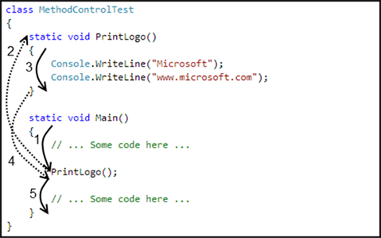

First the code of method `Main()`, that is marked with (1) will be executed, then the control of the program will be given to the method `PrintLogo()` – the dotted arrow (2). This will cause the execution of the code in method `PrintLogo()`, numbered with (3). When the method `PrintLogo()` work is done, the control over the program is returned back to the method `Main()` – dotted arrow (4). Execution of `Main()` will continue from the line after `PrintLogo()` call – marked with (5).

### Where a Method Can Be Invoked From?

A method can be invoked from the following places:

- From the main program method – `Main()`:

```cs
static void Main()
{
    PrintLogo();
}
```

- From some other method:

```cs
static void PrintLogo()
{
    Console.WriteLine("Microsoft");
    Console.WriteLine("www.microsoft.com");
}

static void PrintCompanyInformation()
{
    // Invoking the PrintLogo() method
    PrintLogo();

    Console.WriteLine("Address: One, Microsoft Way");
}
```
- A method can be invoked from its own body. Such a call is referred to as **recursion.** We will discuss it in details in the chapter "Recursion".

### Method Declaration and Method Invocation

In C# the order of the methods in the class is not important. We are allowed to invoke (call) a method before it is declared in code:

```cs
static void Main()
{
    // ...
    PrintLogo();
    // ...
}

static void PrintLogo()
{
    Console.WriteLine("Microsoft");
    Console.WriteLine("www.microsoft.com");
}
```

If we create a class that contains the code above, we will see that the code will compile and run successfully. It doesn’t matter whether we declared the method before or after the main method. In some other languages (like Pascal), invocation of a method that is declared below the line of the invocation is not allowed.

| :warning: | If a method is called in the same class, where it is declared and implemented, it can be called at a line before the line at which it is declared.|
|:--:|:--|

## Parameters in Methods

Often to solve certain problem, the method may need additional information, which depends on the environment in what the method executes.

So if there is a method, that has to find the area of a square, in its body there must be the algorithm that finds that area (equation S = a<sup>2</sup>). Since the area depends on the square side length, to calculate that equation for each square, the method will need to pass a value for the square side length. That is why we have to pass somehow that value, and for this purpose we use **parameters.**

### Declaring Methods with Parameters

To pass information necessary for our method we use the **parameters list.** As was already mentioned, we must place it between the brackets following the method name, in method the declaration:

```cs
static <return_type> <method_name>(<parameters_list>)
{
    // Method's body
}
```

The parameters list `<parameters_list>` is a list with zero or more **declarations of variables,** separated by a comma, so that they will be used for the implementation of the method’s logic:

```
<parameters_list> = [<type1> <name1>[, <typei> <namei>]],
where i = 2, 3, ...
```

When we create a method, and we need certain information to develop the particular algorithm, we choose that variable from the list, which is of type **<type<sub>i</sub>>** and so we use it by its name **<name<sub>i</sub>>.**

The parameters from the list can be of any type. They can be primitive types (`int`, `double`, ...) or object types (for example `string` or `array` – `int[]`, `double[]`, `string[]`, ...).

#### Method to Display a Company Logo – Example

To make the mentioned above more clear, we will change the example that shows the logo of "Microsoft":

```cs
static void PrintLogo(string logo)
{
    Console.WriteLine(logo);
}
```

Now, executing our method, we can display the logo of other companies, not only of "Microsoft". This is possible because we used a parameter of type `string` to pass the company name. The example shows how to use the information given in the parameters list – the variable `logo`, which is defined in the parameters list, is used in the method’s body by the name given in the definition.

#### Method to Calculate the Sum of Prices of Books – Example

We mentioned above, that whenever it is necessary we can use arrays as parameters for a certain method (`int[]`, `double[]`, `string[]`, ...). So let’s take a look at another example to illustrate this.

Imagine we are in a bookstore and we want to calculate the amount of money we must pay for all the books we bought. We will create a method that gets the prices of all the books as an array of type `decimal[]`, and then returns the total amount we must pay:

```cs
static void PrintTotalAmountForBooks(decimal[] prices)
{
    decimal totalAmount = 0;
    foreach (decimal singleBookPrice in prices)
    {
        totalAmount += singleBookPrice;
    }
    Console.WriteLine("The total amount for all books is:" +
        totalAmount);
}
```

### Method Behavior According to Its Input

When a method with parameters is declared, our purpose is that every time we invoke the method, its result changes according to its input. Said with another word, the algorithm is the same, but due to **input** change, the **result** changes too.

| :warning: | When a method has parameters, its behavior depends upon parameters values. |
|:--:|:--|

#### Method to Show whether a Number is Positive – Example

To clarify the way method execution depends upon its input let’s take look at another example. The method gets as input a number of type int, and according to it returns to the console "`Positive`", "`Negative`" or "`Zero`":

```cs
static void PrintSign(int number)
{
    if (number > 0)
    {
        Console.WriteLine("Positive");
    }
    else if (number < 0)
    {
        Console.WriteLine("Negative");
    }
    else
    {
        Console.WriteLine("Zero");
    }
}
```

### Method with Multiple Parameters

So far we had some examples for methods with parameter lists that consist of a **single parameter.** When a method is declared, however, it can have as **multiple parameters** as the method needs.

If we are asking for maximal of two values, for example, the method needs two parameters:

```cs
static void PrintMax(float number1, float number2)
{
    float max = number1;

    if (number2 > max)
    {
        max = number2;
    }
    Console.WriteLine("Maximal number: " + max);
}
```

### Difference in Declaration of Methods with Multiple Parameters

When a method with multiple parameters is declared, we must note that even if the parameters are of the same type, usage of short way of variable declaration is not allowed. So the line below in the methods declaration is invalid and will produce compiler error:

```cs
float var1, var2;
```

Type of the parameters has to be explicitly written before each parameter, no matter if some of its neighbors are of the same type.

Hence, declaration like one shown below is not valid:

```cs
static void PrintMax(float var1, var2)
```

Correct way to do so is:

```cs
static void PrintMax(float var1, float var2)
```

### Invoking Methods with Parameters

Invocation of a method with one or several parameters is done in **the same way as invocation of methods without parameters.** The difference is that between the brackets following the method name, we place values. These values (called **arguments)** will be assigned to the appropriate parameters form the declaration and will be used when method is executed.

Several examples for methods with parameters are show below:

```cs
PrintSign(-5);
PrintSign(balance);

PrintMax(100.0f, 200.0f);
```

### Difference between Parameters and Arguments of a Method

Before we continue with this chapter, we must learn how to distinguish between parameters naming in the parameters list in the methods declaration and the values that we pass when invoking a method.

To clarify, when we declare a method, any of the elements from the parameters list we will call **parameters** (in other literature sources they can be named as **formal parameters**).

When we call a method the values we use to assign to its parameters are named as **arguments.**

In other words, the elements in the parameters list (var1 and varr2) are called **parameters:**

```cs
static void PrintMax(float var1, float var2)
```

Accordingly, the values by the method invocation (`-23.5` and `100`) are called **arguments:**

```cs
PrintMax(100.0f, -23.5f);
```

### Passing Arguments of a Primitive Type

As just was explained, in C# when a variable is passed as a method argument, its value is copied to the parameter from the declaration of the method. After that, the copy will be used in the method body.

There is, however, one thing we should be aware of. If the declared parameter is of a **primitive type,** the usage of the arguments does not change the argument itself, i.e. the argument value will not change for the code after the method has been invoked.

So if we have piece of code like that below:

```cs
static void PrintNumber(int numberParam)
{
    // Modifying the primitive-type parameter
    numberParam = 5;

    Console.WriteLine("in PrintNumber() method, after " +
        "modification, numberParam is: {0}", numberParam);
}
```

Invocation of the method from `Main()`:

```cs
static void Main()
{
    int numberArg = 3;

    // Copying the value 3 of the argument numberArg to the
    // parameter numberParam
    PrintNumber(numberArg);

    Console.WriteLine("in the Main() method numberArg is: " +
        numberArg);
}
```

The value 3 of `numberArg`, is copied into the parameter `numberParam`. After the method `PrintNumber()` is invoked, to `numberParam` is assigned value 5. This does not affect the value of variable `numberArg`, because by invocation of that method, the variable `numberParam` keeps a **copy** of the argument value. That is why the method `PrintNumber()` prints the number 5. Hence, after invocation of method `PrintNumber()` in the method `Main()` what is printed is the value of `numberArg` and as it can be seen that value is not changed. The result from the above line is printed below:

```console
in PrintNumber() method, after modification, numberParam is: 5
in the Main() method numberArg is: 3
```

### Passing Arguments of Reference Type

When we need to declare (and so to invoke) a method, that has parameters of **reference type** (as arrays), we must be very careful.

Before explaining the reason for the above consideration, we have to remind ourselves something from chapter "Arrays". An array, as any other reference type, consists of a variable-pointer **(object reference)** and a **value** – the real information kept in the computer’s memory (we call it an **object**). In our case the object is the real array of elements. The address of this object, however, is kept in the variable (i.e. the address where the array elements are placed in the memory):

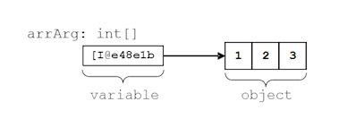

So whenever we operate with arrays in C#, we always access them by that variable (the address / pointer / reference) we used to declare the particular array. This is the principle for any other reference type. Hence, whenever an argument of a reference type is passed to a method, the method’s parameter receives the reference itself. But what happens with the object then (the real array)? Is it also copied or no?

To explain this, let’s have the following example: assume we have method `ModifyArray()`, that modifies the first element of an array that is passed as a parameter, so it is reinitialized the first element with value 5 and then prints the elements of the array, surrounded by square brackets and separated by commas:

```cs
static void ModifyArray(int[] arrParam)
{
    arrParam[0] = 5;
    Console.Write("In ModifyArray() the param is: ");
    PrintArray(arrParam);
}

static void PrintArray(int[] arrParam)
{
    Console.Write("[");
    int length = arrParam.Length;
    if (length > 0)
    {
        Console.Write(arrParam[0].ToString());
        for (int i = 1; i < length; i++)
        {
            Console.Write(", {0}", arrParam[i]);
        }
    }
    Console.WriteLine("]");
}
```

Let’s also declare a method `Main()`, from which we invoke the newly created method `ModifyArray()`:

```cs
static void Main()
{
    int[] arrArg = new int[] { 1, 2, 3 };

    Console.Write("Before ModifyArray() the argument is: ");
    PrintArray(arrArg);

    // Modifying the array's argument
    ModifyArray(arrArg);

    Console.Write("After ModifyArray() the argument is: ");
    PrintArray(arrArg);
}
```

What would be the result of the code execution? Let’s take a look:

```console
Before ModifyArray() the argument is: [1, 2, 3]
In ModifyArray() the param is: [5, 2, 3]
After ModifyArray() the argument is: [5, 2, 3]
```

It is apparent that after execution of the method `ModifyArray()`, the array to which the variable `arrArg` refer, does not consists of `[1,2,3]`, but `[5,2,3]` instead. What does this mean?

The reason for such result is the fact that by passing arguments of reference type, only the value of the variable that keeps the address to the object is copied. Note that this **does not copy the object itself.**

| :warning: | By passing the argument that are of reference type, the only thing that is copied is the variable that keeps the reference to the object, but not the object data. |
|:--:|:--|

Let’s try to illustrate what just was explained. We will use few drawings for the example we used above. By invocation of the method `ModifyArray()`, the value of the parameter `arrParam` is not defined and it does not keep a reference to any particular object (not a real array):

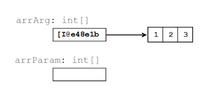

By the time of `ModifyArray()` invocation, the value that is kept in the argument `arrArg` is copied to the parameter `arrParam`:

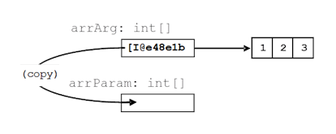

This way, copying the reference to the elements of the array in the memory from the argument into the parameter, we tell the parameter to point to the same object, to which the argument points:

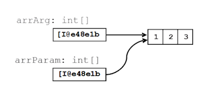

This actually is where we have to be very careful. If **the invoked method modifies the object,** to which a reference is passed, this may affect the execution of the code after the method invocation (as we have seen in the example – the method `PrintArray()` does not print the array, that was initially passed).

The difference between dealing with arguments of primitive and reference type is in the way they are passed: **primitive types are passed by their values, the objects, however, are passed by reference.**

### Passing of Expressions as Method Arguments

When a method is invoked, we can pass a **whole expression** instead of arguments. By doing so, C# calculates the values for those expressions and by the time of code execution (if it is possible this is done at compile time) replaces the expression with its result, when the method is invoked. The following code shows methods invocation, by passing **expressions as method arguments:**

```cs
PrintSign(2 + 3);

float oldQuantity = 3;
float quantity = 2;
PrintMax(oldQuantity * 5, quantity * 2);
```

The result of those methods execution is:

```console
Positive
Maximal number: 15.0
```

When a method with parameters is invoked, we must be aware of some specific rules, which will be explained in the next few subsections.

### Passing of Arguments Compatible with the Parameter Type

We must know that we can pass only arguments that are of type **compatible** with the related parameter, declared in the method’s parameters list.

For example, if the parameter that the method expects in its declaration is of type `float`, by invocation of the method we can pass a value that is of type `int`. It will be converted by the compiler to a value of type `float` and then will be passed to the method for its execution:

```cs
static void PrintNumber(float number)
{
    Console.WriteLine("The float number is: {0}", number);
}

static void Main()
{
    PrintNumber(5);
}
```

In the example, by invocation of `PrintNumber()` in the method `Main()`, first the integer literal 5 (that implicitly is of type `int`) is converted to the related floating point value 5.0f. Then the so converted value is passed to the method `PrintNumber()`.

As can be expected, the result of that code execution is:

```console
The float number is: 5.0
```

### Compatibility of the Method Parameter and the Passed Value

The result from the calculation of an expression, passed as argument, must be **of the same type,** as the type of the declared parameter is, or **compatible** with that type (refer to the passage above).

So if a parameter of type `float` is required, we can pass the value calculated by an expression that is of a type `int`. E.g. in the example above, if instead of `PrintNumber(5)`, we called the method, with 5 replaced by the expression `2+3`, the result of the calculation of that expression must be of type `float` (one that the method expects), or of a type that can be converted to `float` with no loss (in our case this is `int`). So let’s modify a little the method `Main()` from the passage above, to illustrate what just was explained:

```cs
static void Main()
{
    PrintNumber(2 + 3);
}
```

In this example first the summing will be executed. Then the integer result 5 will be converted to its floating point equivalent `5.0f`. When this is done the method `PrintNumber(...)` will be invoked with argument `5.0f`. The result again will be:

```console
The float number is: 5.0
```

### Keeping the Declaration Sequence of the Arguments Types

Values, that are passed to the method, in the time of its invocation, must be in the **same order** as the parameters are declared in the parameters list. This is due to the method signature, mentioned above.

To clarify, let’s discuss the following example: we have a method `PrintNameAndAge()`, in which method declaration is a parameters list, with parameters of type’s `string` and `int`, ordered as shown below:

| Person.cs |
|:--|

```cs
class Person
{
    static void PrintNameAndAge(string name, int age)
    {
        Console.WriteLine("I am {0}, {1} year(s) old.", name, age);
    }
}
```

Let’s add a method `Main()` to our class, in that method we will invoke the `PrintNameAndAge()` method. Now let’s try to pass parameters in reverse (as types) order, so instead "`John`" and `25`, we will use `25` and "`John`":

```cs
static void Main()
{
    // Wrong sequence of arguments
    Person.PrintNameAndAge(25, "John");
}
```

The compiler in this case will not be able to find a method that is called `PrintNameAndAge`, which accepts parameters in the sequence `int` and `string`. That is why, the compiler will notify for an error:

```console
The best overloaded method match for 'Person.PrintNameAndAge(string, int)' has some invalid arguments
```

### Variable Number of Arguments (var-args)

So far, we examined declaration of methods for which the parameters list coincides with the count of the arguments we pass to that method, by its invocation.

Now we will see how to declare methods that allow the count of arguments to be different any time the method is invoked, so to meet the needs of the invoking code. Such methods are often called methods with a **variable number of arguments.**

Let’s we look at the example, that calculates the sum of a given array of book prices, the one that already was explained above. In that example, as a parameter we passed an array of type `decimal` that consists of the prices of the chosen books:

```cs
static void PrintTotalAmountForBooks(decimal[] prices)
{
    decimal totalAmount = 0;

    foreach (decimal singleBookPrice in prices)
    {
        totalAmount += singleBookPrice;
    }
    Console.WriteLine(
        "The total amount of all books is:" + totalAmount);
}
```

Defined in this way, the method suppose, that always before its invocation, we will have created an array with numbers of type `decimal` and they will be initialized with certain values.

After we created a C# method that accepts variable number of parameters, is possible, whenever a list of parameters **from the same type** must be passed, instead of passing the array that consists of those values, to pass them directly, as arguments, separated by comma.

In our case with the books, we need to create a new array, especially for that method invocation:

```cs
decimal[] prices = new decimal[] { 3m, 2.5m };
PrintTotalAmountForBooks(prices);
```

However, if we add some code (we will see it in a moment) to the method declaration, we will be able to directly pass list with the books prices, as method arguments:

```console
PrintTotalAmountForBooks(3m, 2.5m);
PrintTotalAmountForBooks(3m, 5.1m, 10m, 4.5m);
```

Such invocation is possible only if we have declared the method in a way, so it accepts variable number of arguments (var-args).

### How to Declare Method with Variable Number of Arguments

Formally the declaration of a method with variable number of arguments is the same as the declaration of any other method:

```cs
static <return_type> <method_name>(<parameters_list>)
{
    // Method's body
}
```

The difference is that the `<parameters_list>` is declared with the keyword `params` in the way shown below:

```console
<parameters_list> =
    [<type1> <name1>[, <typei> <namei>], params <var_type>[] <var_name>]
where i= 2, 3, ...
```

**The last element from the list declaration** – `<params>`, is the one that allows passing of random count of arguments of type `<var_type>`, for each invocation of the method.

In the declaration of that element, before its type `<var_type>` we must add params: "`params <var_type>[]`". The type `<var_type>` can be either primitive or by reference.

Rules and special characteristics for the other elements from the method’s parameters list, that precede the var-args parameter `<var_name>`, are the same, as those we discussed in the section "Method Parameters".

To clarify what was explained so far, we will discuss an example for declaration and invocation of a method with variable number if arguments:

```cs
static long CalcSum(params int[] elements)
{
    long sum = 0;
    foreach (int element in elements)
    {
        sum += element;
    }
    return sum;
}

static void Main()
{
    long sum = CalcSum(2, 5);
    Console.WriteLine(sum);

    long sum2 = CalcSum(4, 0, -2, 12);
    Console.WriteLine(sum2);

    long sum3 = CalcSum();
    Console.WriteLine(sum3);
}
```

The example sums the numbers, as their count is not known in advance. The method can be invoked with one, two or more parameters, as well as with no parameters at all. If we execute the example we will get the following result:

```console
7
14
0
```

### Variable Number of Arguments: Arrays vs. "params"

From the formal definition, given above, of parameter that allows passing of **variable number of arguments** by the method invocation – `<var_name>`, is actually a name of an **array of type `<var_type>`.** By the method invocation, the arguments of type `<var_type>` or compatible type that we pass to the method (with no care for their count) will be kept into this array. Then they will be used in the method body. The access and dealing with these parameters is in the same way we do when we work with arrays.

To make it clearer we will modify the method that calculates the sum of the prices of chosen books, to get variable number of arguments:

```cs
static void PrintTotalAmountForBooks(params decimal[] prices)
{
    decimal totalAmount = 0;

    foreach (decimal singleBookPrice in prices)
    {
        totalAmount += singleBookPrice;
    }
    Console.WriteLine("The total amount of all books is:" +
        totalAmount);
}
```

As we can see the only change is to change the declaration of the array `prices` with adding `params` before `decimal[]`. In the body of our method, "`prices`" is still an array of type `decimal`, so we use it in the same way as before.

Now we can invoke our method, with no need to declare in advance an array of number and pass it as an argument:

```cs
static void Main()
{
    PrintTotalAmountForBooks(3m, 2.5m);
    PrintTotalAmountForBooks(1m, 2m, 3.5m, 7.5m);
}
```

The result of the two invocations will be:

```console
The total amount of all books is: 5.5
The total amount of all books is: 14.0
```

Since `prices` is an array, it can be assumed that we can declare and initialize an array before invocation of our method. Then to pass that array as an argument:

```cs
static void Main()
{
    decimal[] pricesArr = new decimal[] { 3m, 2.5m };

    // Passing initialized array as var-arg:
    PrintTotalAmountForBooks(pricesArr);
}
```

The above is legal invocation, and the result from that code execution is the following:

```console
The total amount of all books is: 5.5
```

### Position and Declaration of a Method with Variable Arguments

A method, that has a variable number of its arguments, can also have **other parameters** in its parameters list.

The following code, for example, has as a first parameter an element of type `string`, and right after it there can be one or more parameters of type `int`:

```cs
static void DoSomething(string strParam, params int[] x)
{
}
```

The one thing that we must consider is that the element from the parameters list in the method’s definition, that allows passing of a variable number of arguments, must **always be placed at the end** of the parameters list.

| :warning: | The element of the parameters list, that allows passing of variable number of arguments by invocation of a method, must always be declared at the end of the method’s parameters list. |
|:--:|:--|

So, if we try to put the declaration of the var-args parameter x, shown in the last example, not at the last place, like so:

```cs
static void DoSomething(params int[] x, string strParam)
{
}
```

The compiler will return the following error message:

```console
A parameter array must be the last parameter in a formal parameter list
```

### Limitations on the Count for the Variable Arguments

Another limitation, for the methods with variable number of arguments, is that the method cannot have in its declaration more than one parameter that allows passing of variable numbers of arguments. So if we try to compile a method declared in the following way:

```cs
static void DoSomething(params int[] x, params string[] z)
{
}
```

The compiler will return the already known error message:

```console
A parameter array must be the last parameter in a formal parameter list
```

This rule can be taken as a special case of the rule for the var-args position, i.e. the related parameter to be at the end of the parameters list.

### Specifics of Empty Parameter List

After we got familiar with the declaration and invocation of methods with variable number of arguments, one more question arises. What would happen if we invoke such method, but with no parameters?

For example, what would be the result of the invocation of our method that calculates the sum of books prices, in a case we did not liked any book:

```cs
static void Main()
{
    PrintTotalAmountForBooks();
}
```

As can be seen this code is compiled with no errors and after its execution the result is as follows:

```console
The total amount of all books is: 0
```

This happens because, although, we did not pass any value to our method, by its invocation, the array `decimal[] prices` is created, but it is empty (i.e. it does not consists of any elements).

This has to be remembered, because even if we did not initialize the array, C# takes care to do so for the array that has to keep the parameters.

#### Method with Variable Number of Arguments – Example

Bearing in mind how we define methods with variable number of arguments, we can write the `Main()` method of a C# program in the following way:

```cs
static void Main(params string[] args)
{
    // Method body comes here
}
```

The definition above is valid and is accepted without any errors by the compiler.

### Optional Parameters and Named Arguments

Named arguments and optional parameters are two different functionalities of the C# language. However, they often are used together. These parameters are introduced in C#, version 4.0. **Optional parameters** allow some parameters to be skipped when a method is invoked. **Named arguments** on their side, allow method parameter values to be set by their name, instead of their exact position in the parameters list. These two features in the C# language syntax are very useful in cases, when we invoke a method with a different combination of its parameters.

Declaration of optional parameters can be done just by using a **default value** in the way shown below:

```cs
static void SomeMethod(int x, int y = 5, int z = 7)
{
}
```

In the example above `y` and `z` are optional and can be skipped upon method’s invocation:

```cs
static void Main()
{
    // Normal call of SomeMethod
    SomeMethod(1, 2, 3);
    // Omitting z - equivalent to SomeMethod(1, 2, 7)
    SomeMethod(1, 2);
    // Omitting both y and z – equivalent to SomeMethod(1, 5, 7)
    SomeMethod(1);
}
```

We can pass a value by a particular **parameter name,** by setting the parameter’s name, followed by a colon and the value of the parameter. An example of using **named arguments** is shown below:

```cs
static void Main()
{
    // Passing z by name and x by position
    SomeMethod(1, z: 3);
    // Passing both x and z by name
    SomeMethod(x: 1, z: 3);
    // Reversing the order of the arguments passed by name
    SomeMethod(z: 3, x: 1);
}
```

All invocations in the sample above are equivalent to each other – parameter y is skipped, but x and z are set to 1 and 3. The only difference between the second and third call is that the parameter values are calculated in the same order they are passed to the method, in the last invocation 3 will be calculated before 1. In this example all parameters are constants and their purpose is only to clarify the idea of **named and optional parameters.** However, the mentioned consideration may lead to some unexpected behavior when the order of parameters calculation matters.

### Method Overloading

When in a class a method is declared and its name coincides with the name of another method, but their signatures differ by their **parameters list** (count of the method’s parameters or the way they are arranged), we say that there are different **variations / overloads of that method (method overloading).**

As an example, let’s assume that we have to write a program that draws letters and digits to the screen. We also can assume that our program has methods for drawing strings `DrawString(string str)`, integers – `DrawInt(int number)`, and floating point digits – `DrawFloat(float number)` and so on:

```cs
static void DrawString(string str)
{
    // Draw string
}

static void DrawInt(int number)
{
    // Draw integer
}

static void DrawFloat(float number)
{
    // Draw float number
}
```

As we can see the C# language allows us to create variations of the same method `Draw(...)`, called **overloads.** The method below gets combinations of different parameters, depending of what we want to write on the screen:

```cs
static void Draw(string str)
{
    // Draw string
}

static void Draw(int number)
{
    // Draw integer
}

static void Draw(float number)
{
    // Draw float number
}
```

The definitions of the methods above are valid and will compile without error messages. The method `Draw(...)` is also called **overloaded.**

### Method Parameters and Method Signature

As mentioned above, there are only two things required in C# to specify a method signature: the **parameter type** and **the order in which the parameters are listed.** The names of the method’s parameters are not significant for the method’s declaration.

| :warning: | The most important aspect of creating an unambiguous declaration of a method in C# is the definition of its signature and the type of the method’s parameters in particular. |
|:--:|:--|

For example in C#, the following two declarations are actually declarations of one and the same method. That’s because the parameter type in each of their parameters is the same – int and float. So the names of the variables we are using – `param1` and `param2` or `p1` and `p2`, are not significant:

```cs
// These two lines will cause an error
static void DoSomething(int param1, float param2) { }
static void DoSomething(int p1, float p2) { } 
```

If we declare two or more methods in one class, in the way shown above, the compiler will show an **error message,** which will look something like the one below:

```console
Type '<the_name_of_your_class>' already defines a member called 'DoSomething' with the same parameter types.
```

If we change the parameter type from a **given position of the parameter list to a different type,** in C# they will count as two absolutely different methods, or more precisely said, **different variations of a method with the same name.**

For example if in the second method, the second parameter from the parameter list of any of the methods – `float` `p2`, is declared not as `float`, but as `int` for example, we will have two different methods with two different signatures – `DoSomething(int, float)` and `DoSomething(int, int)`. Now the second element from their signature – **parameter list,** is different, due to difference of their second element type:

```cs
static void DoSomething(int p1, float p2) { }
static void DoSomething(int param1, int param2) { }
```

In this case even if we type the same name for the parameters, the compiler will accept this declaration, because they are practically different methods:

```cs
static void DoSomething(int param1, float param2) { }
static void DoSomething(int param1, int param2) { }
```

The compiler will accept the code again if we declare two variations of the method, but this time we are going to change the order of the parameters instead of their type.

```cs
static void DoSomething(int param1, float param2) { }
static void DoSomething(float param2, int param1) { }
```

In the example above the **order of the parameter types** is different and this makes the signature different too. Since the parameter lists are different, it plays no role that the name (`DoSomething`) is the same for both methods. We still have different signatures for both methods.

### Overloaded Methods Invocation

Since we have declared methods with the same name and different signatures, we can invoke each of them as any other method – just by using their name and arguments. Here is an example:

```cs
static void PrintNumbers(int intValue, float floatValue)
{
    Console.WriteLine(intValue + "; " + floatValue);
}

static void PrintNumbers(float floatValue, int intValue)
{
    Console.WriteLine(floatValue + "; " + intValue);
}

static void Main()
{
    PrintNumbers(2.71f, 2);
    PrintNumbers(5, 3.14159f);
}
```

When the code executes, we will see, that the first invocation refers to the second method, and the second invocation refers to the first method. Which method will be invoked depends on the type of the used parameters. The result after executing the code above is:

```console
2.71; 2
5; 3.14159
```

The lines below, however, **will not compile** and execute:

```cs
static void Main()
{
    PrintNumbers(2, 3);
}
```

The reason for this not to work is that the compiler tries to convert both integer numbers to suitable types before passing them to any of the methods named `PrintNumbers`. In this case, however, these conversions are not equal. There are two possible options – either to convert the first parameter to `float` and call the method `PrintNumbers(float, int)` or to convert the second parameter to `float` and call the method `PrintNumbers(int, float)`. This ambiguity has to be manually resolved, and one way to do so is shown in the example below:

```cs
static void Main()
{
    PrintNumbers((float)2, (short)3);
}
```

The code above will be compiled without errors, because after the arguments are transformed, it is clearly decided which method we refer to – `PrintNumbers(float, int)`.

### Methods with Coinciding Signatures

We will discuss some other interesting examples that show how to use methods. Let’s take a look at an example of an incorrect redefinition (overload) of methods:

```cs
static int Sum(int a, int b)
{
    return a + b;
}

static long Sum(int a, int b)
{
    return a + b;
}

static void Main()
{
    Console.WriteLine(Sum(2, 3));
}
```

The code from the example will show an **error message** upon compilation process, because there are two methods with same parameters lists (i.e. with same signature) which return results of different types. This makes the method invocation ambiguous, so it is not allowed by the compiler.

#### Triangles with Different Size – Example

It would be a good time now to give a little bit more complex example, since we know now how to declare methods with parameters, how to invoke them as well as how to get result back from those methods. Let’s assume we want to write a program, which prints **triangles** on the console, as those shown below:

```console
n = 5
1
1 2
1 2 3
1 2 3 4
1 2 3 4 5
1 2 3 4
1 2 3
1 2
1

n = 6
1
1 2
1 2 3
1 2 3 4
1 2 3 4 5
1 2 3 4 5 6
1 2 3 4 5
1 2 3 4
1 2 3
1 2
1
```

A possible solution of this task is given below:

| Triangle.cs |
|:--:

```cs
using System;

class Triangle
{
    static void Main()
    {
        // Entering the value of the variable n
        Console.Write("n = ");
        int n = int.Parse(Console.ReadLine());
        Console.WriteLine();

        // Printing the upper part of the triangle
        for (int line = 1; line <= n; line++)
        {
            PrintLine(1, line);
        }

        // Printing the bottom part of the triangle
        // that is under the longest line
        for (int line = n - 1; line >= 1; line--)
        {
            PrintLine(1, line);
        }
    }

    static void PrintLine(int start, int end)
    {
        for (int i = start; i <= end; i++)
        {
            Console.Write(i + " ");
        }
        Console.WriteLine();
    }
}
```

Let’s discuss how the example code works. We should think of the triangles as sequences of numbers, placed on separate lines, since we can print each line directly on the console. In order to print each line of the triangle on the console we need a tool. For this purpose we created the method `PrintLine(...)`.

In this method, by using a `for`-loop, we print a line of consequent numbers. The first number from this sequence is the first parameter from the method’s parameter list (the variable `start`). The last element of the sequence is the number, passed to the method, as second parameter (the variable `end`).

Notice that since the numbers are sequential, the length (count of the numbers) of each line corresponds to the difference between the second parameter end and the first one – `start`, from the methods parameters list (this will be useful later, when we build the triangles).

Then we implement an algorithm that prints the triangles, as whole figures, in the `Main()` method. With another method `int.Parse`, we get the n variable and print the empty line.

Now with two sequential `for`-loops we build the triangle according to the entered `n`. With the first loop we print all the lines that draw the upper part of the triangle and the middle (longest) line inclusively. With the second loop, we print the rest of the triangle’s lines that lie below the middle line.

As we mentioned above, the line number, corresponds to the element count placed on the appropriate line. And since we always start from 1, the line number will always be equal to the last element in the sequence, which has to be printed on that line. So, we can use this when we call `PrintLine(...)`, as it requires exactly that for its parameters.

Note that, the count of the elements on each next line, increases with one and so the last element of each sequent line must be greater (one is added) than the last element of the preceding line. That’s why at each loop iteration of the first for-loop, we pass to the `PrintLine(...)` method, as first parameter 1, and as a second – the current value of the variable `line`. Since, on each execution of the body of the loop, `line` increases with one, at each iteration `PrintLine(...)` the method prints a line that has more than one element than the preceding line.

With the second loop, that draws the part under the middle triangle line, we follow the reverse logic. The downward we print lines, the shorter lines we print. Each line decreases with one element according to its preceding line. Hence, we set the initial value for the variable `line` in the second loop: line = n-1. After each iteration of the loop `line` decreases with one and pass it as second parameter to the `PrintLine(...)`.

We can improve the program, as we take the logic that prints the triangle, in a separate method. It can be noticed that, logically, the triangle print is clearly defined, that is why we can declare a method with one parameter (the value that we get from the keyboard) and to invoke it from the `Main()` method:

```cs
static void Main()
{
    Console.Write("n = ");
    int n = int.Parse(Console.ReadLine());
    Console.WriteLine();

    PrintTriangle(n);
}

static void PrintTriangle(int n)
{
    // Printing the upper part of the triangle
    for (int line = 1; line <= n; line++)
    {
        PrintLine(1, line);
    }

    // Printing the bottom part of the triangle
    // that is under the longest line
    for (int line = n - 1; line >= 1; line--)
    {
        PrintLine(1, line);
    }
}
```

If we execute the program and enter for `n` the value 3, we will get the following result:

```console
n = 3

1
1 2
1 2 3
1 2
1
```

## Returning a Result from a Method

So far, we always were given examples, in which the method does something like printing on the console, and nothing more. Methods, however, usually do not just execute a simple code sequence, but in addition they often **return results.** So let’s take a look at how this actually happens.

### Declaring a Method that Returns a Result

Let’s see again how to declare a method.

```cs
static <return_type> <method_name>(<parameters_list>)
```

Earlier we said that at the place of `<return type>` we will always put `void`. Now we will extend this definition, as we will see, that `void` is not the only choice. Instead of void we can return any type either primitive (`int`, `float`, `double`, ...) or by reference (as `string` or array), depending on the type of the result that the method shall return after its execution.

For example, take a method that calculates the area of a square and instead of printing it to the console **returns it as a result.** So, the declaration would look as follows:

```cs
static double CalcSquareSurface(double sideLength)
```

As can be seen the result of the calculation of the area is of type `double`.

### How to Use the Returned Value?

When the method is executed and returns a value, we can imagine that C# puts this value where this method has been invoked from. Then the program continues work with that value. Respectively, that returned value, we can use for any purpose from the calling method.

### Assigning to a Variable

We can also assign the result of the method execution to a variable of an appropriate type:

```cs
// GetCompanyLogo() returns a string
string companyLogo = GetCompanyLogo();
```

### Usage in Expressions

After a method returns a **result,** it can be used then in **expressions** too.

So for example, to find the total price for invoice calculation, we must get the single price and to multiply it by the quantity:

```cs
float totalPrice = GetSinglePrice() * quantity;
```

### Using the Returned Value as Method Parameter

We can pass the result from the method execution as value in the parameters list from another method:

```cs
Console.WriteLine(GetCompanyLogo());
```

In this example, in the beginning we invoke the method `GetCompanyLogo()`, and write it as an argument of the method `WriteLine()`. Right after the `GetCompanyLogo()` method finishes its execution it will return a result. Let’s say that the result will be "Microsoft Corporation". Then C# will put the result returned by the method’s execution in the method’s place. So we can assume that this is represented in the code in the following way:

```cs
Console.WriteLine("Microsoft Corporation");
```

### Returned Value Type

As it was already explained above, the result that a method returns can be of any type – `int`, `string`, array and so on. When, however, instead of a type we use the keyword void instead of a type, this mean that method does not return value.

### The Operator "`return`"

To make a method return value, the keyword `return` must be placed in the method’s body, followed by an **expression** that will be returned as a result by the method:

```cs
static <return_type> <method_name>(<parameters_list>)
{
    // Some code that is preparing the method's result comes here
    return <method's_result>;
}
```

Respectively `<method's_result>`, is of type `<return_type>`. For example:

```cs
static long Multiply(int number1, int number2)
{
    long result = number1 * number2;
    return result;
}
```

In this method after the multiplication, by using the `return` the method will produce as a result of its execution the integer variable `result`.

### Compatibility of the Result and the Retuning Type

The result returned by the method, can be of a type that is **compatible** (the one that can be implicitly converted) with the type of the returned value `<return_type>`.

For example, we can modify the following example, in which the type of the returned value to be of type `float`, but not `int` and to keep the following code in the shown way:

```cs
static float Multiply(int number1, int number2)
{
    int result = number1 * number2;
    return result;
}
```

In this case after the multiplication execution, the result will be of type `int`. Even though the type of the expression after the `return` keyword is not of type `float`, it can be returned, because it can be implicitly converted to `float`.

### Using an Expression after the Return Operator

It is allowed (whenever this will not make the code look complicated / ugly) to directly put some expression after the keyword return:

```cs
static int Multiply(int number1, int number2)
{
    return number1 * number2;
}
```

In this situation, after the calculation of **number1 * number2,** the result that this expression produces will be replaced where the expression is, and hence will be returned by the **return** operator.

### Features of the Return Operator

The execution of return does two things:

- **Stops immediately** the method execution.
- **Returns the result** of the executed method to the calling method.

In relation to the first feature of **`return` operator,** we must note that, since it stops the method’s execution (and no code after it and before the method body’s closing bracket will be executed), we should not put any code after the `return` operation.

Though, if we do so, the compiler will show a **warning message:**

```cs
static int Add(int number1, int number2)
{
    int result = number1 + number2;
    return result;

    // Let’s try to "clean" the result variable here:
    result = 0;
}
```

In this example the compilation will be successful, but for the lines after `return`, the compiler will output a warning message like this:

```console
Unreachable code detected
```

When the method has `void` for returned value type, then after `return`, there would be no expression to be returned. In that case `return` usage is only used to **stop the method’s execution:**

```cs
static void PrintPositiveNumber(int number)
{
    if (number <= 0)
    {
        // If the number is NOT positive, terminate the method
        return;
    }
    Console.WriteLine(number);
}
```

### Multiple Return Statements

The last thing that must be said about the operator `return` is that it can be called from several places in the code of our method, but should be guaranteed that at least one of the operators **return** that we have used, will be reached while executing the method.

So let’s take a look, at the example for a method that gets two numbers, and then upon their values return 1 if the first is greater than the second, 0 if both are equal, or -1 if the second is greater than the first:

```cs
static int CompareTo(int number1, int number2)
{
    if (number1 > number2)
    {
        return 1;
    }
    else if (number1 == number2)
    {
        return 0;
    }
    else
    {
        return -1;
    }
}
```

Having **multiple return statements** is usual in programming and is typical for methods that check several cases, like the above.

### Why Is the Returned Value Type not a Part of the Method Signature?

In C# it is not allowed to have several methods that have equal name and parameters, but different type of returned value. This means that the following code **will fail to compile:**

```cs
static int Add(int number1, int number2)
{
    return (number1 + number2);
}

static double Add(int number1, int number2)
{
    return (number1 + number2);
}
```

The reason for this limitation is that the compiler doesn’t know which of both methods must be invoked. Both methods have the **same signature** (sequence of parameters along with their types). Note that the return value is not part of the method’s signature. That is why on the declaration of the methods an error message like the one below will be returned:

```console
Type '<the_name_of_your_class>' already defines a member called 'Add' with the same parameter types
```

Where `<the_name_of_your_class>` is the name of the class in which we have tried to declare those methods.

#### Fahrenheit to Celsius Conversion – Example

Now we have to write a program that for a given (by the user) body temperature, measured in Fahrenheit degrees, has to convert that temperature and output it in Celsius degrees, with the following message: **"Your body temperature in Celsius degrees is X",** where **X** is respectively the Celsius degrees. In addition if the measured temperature in Celsius is higher than 37 degrees, the program should warn the user that they are ill, with the following message **"You are ill!".**

For starters, we can make fast **research in Internet** and find out that the **Celsius to Fahrenheit** formula is like this one: `°C = (°F - 32) * 5 / 9`, where respectively with °C we mark the temperature measured in Celsius, and with °F – the temperature in Fahrenheit.

After analysis of the current task, we can see that it can be divided to subtasks as follow:

- Take the temperature measured in Fahrenheit degrees as an **input** from the console (the user must enter it).
- **Convert** that number to its corresponding value, for temperature measured in Celsius.
- **Print** a message for the converted temperature in Celsius.
- If the temperature is found to be **higher than 37** °C, print a message that the user is ill.

A sample implementation of the above described algorithm is given below in the class TemperatureConverter:

| TemperatureConverter.cs |
|:--|

```cs
using System;

class TemperatureConverter
{
    static double ConvertFahrenheitToCelsius(double temperatureF)
    {
        double temperatureC = (temperatureF - 32) * 5 / 9;
        return temperatureC;
    }

    static void Main()
    {
        Console.Write(
            "Enter your body temperature in Fahrenheit degrees: ");
        double temperature = double.Parse(Console.ReadLine());

        temperature =     ConvertFahrenheitToCelsius(temperature);

        Console.WriteLine(
            "Your body temperature in Celsius degrees is {0}.",
            temperature);

        if (temperature >= 37)
        {
            Console.WriteLine("You are ill!");
        }
    }
}
```

The operations for input of the temperature and output of the messages are **trivial,** so we will skip their explanation, as we will focus on the approach to convert the temperatures. As we can see this is a logical unit that can be separated in its own method. By doing so, not only the program source code will get clearer, but moreover, we will have the opportunity to reuse that piece of code, whenever we need it, so we just will use the same method. So we declare the method `ConvertFahrenheitToCelsius(...)`, with list of one parameter with the name `temperatureF` that represents the measured value of the temperature in Fahrenheit. Then the method returns a result of type `double`, which represents the calculated body temperature in Celsius degrees. In the method’s body we use the formula we found on Internet (and write it according to the C# syntax).

Since we are done with this step from our task solution, we have decided that the rest of the steps we will not need to be in separate methods, so we just implement them in the `Main()` method of the class.

By the method `double.Parse(...)`, we get the user’s body temperature as we have previously asked him for it, by the following message: **"Enter your body temperature in Fahrenheit degrees".**

Then we invoke the method `ConvertFahrenheitToCelsius()` and we store the returned result in the variable `temperature`.

By the method `Console.WriteLine()` we print the message **"Your body temperature in Celsius degrees is X",** where X is replaced with the value of `temperature`.

The last step we must make is to check whether the temperature is higher than 37 degrees in Celsius or no. This can be done by using a conditional statement `if`. So if the temperature is higher than 37 degrees Celsius a message that the user is ill must be printed.

Below is shown a possible output of the program:

```console
Enter your body temperature in Fahrenheit degrees: 100
Your body temperature in Celsius degrees is 37,777778.
You are ill!
```

#### Difference between Two Months – Example

Let’s take a look at the following task: we have to write a program which, by given two numbers, that are between **1** and **12** (so to correspond to a particular month) prints the count of months between these months. The message that must be printed to the console must be "**There is X months period from Y to Z.**", where X is the count of the months, that we must calculate, and Y and Z, are respectively the names of the months that mark start and end of the period.

By reading carefully the task we will try to divide it into subtasks, that can be more easily solved, and then by combining them to get the whole solution. We can see that we have to solve the following subtasks:

- To **enter** the months numbers that mark beginning and end of the period.
- To **calculate** the period between the input months.
- To **print** the message.
- In the message instead of the numbers we entered, for beginning and end of the period, we must write their corresponding **month names** in English.

A possible solution of the given task is shown below:

| Months.cs |
|:--|

```cs
using System;

class Months
{
    static string GetMonthName(int month)
    {
        string monthName;
        switch (month)
        {
          case 1:
               monthName = "January";
               break;
          case 2:
              monthName = "February";
              break;
          case 3:
              monthName = "March";
              break;
          case 4:
              monthName = "April";
              break;
          case 5:
              monthName = "May";
              break;
          case 6:
              monthName = "June";
              break;
          case 7:
              monthName = "July";
              break;
          case 8:
              monthName = "August";
              break;
          case 9:
              monthName = "September";
              break;
          case 10:
              monthName = "October";
              break;
          case 11:
              monthName = "November";
              break;
          case 12:
              monthName = "December";
              break;
          default:
              Console.WriteLine("Invalid month!");
              return null;
        }
        return monthName;
    }

    static void SayPeriod(int startMonth, int endMonth)
    {
        int period = endMonth - startMonth;
        if (period < 0)
        {
            // Fix negative distance
            period = period + 12;
        }
        Console.WriteLine(
            "There is {0} months period from {1} to {2}.",
            period, GetMonthName(startMonth),
            GetMonthName(endMonth));
    }

    static void Main()
    {
        Console.Write("First month (1-12): ");
        int firstMonth = int.Parse(Console.ReadLine());

        Console.Write("Second month (1-12): ");
        int secondMonth = int.Parse(Console.ReadLine());

        SayPeriod(firstMonth, secondMonth);
    }
}
```

The first task solution is trivial. In the `Main()` method we will use `int.Parse(...)` so we get the months for the period, the length of which we aim to calculate.

Then we see that period calculation and message printing can be logically separated as a subtask, so we create a method `SayPeriod(...)` that has two parameters – numbers representing month numbers that mark the beginning and the end of the period. This method will not return a value but it will calculate period and print the message, described in the task, to the console, by the standard output – `Console.WriteLine(...)`.

Apparently, to find the length of the period between two months, we have to subtract the number of the beginning month from that of the end month. We consider also, that if the second month has number less that the number of the first month, then the user most probably has had the assumption that the second month is not in the current year, but in the next one. That is why, if the difference between the two months is negative, we must add 12 to it – the length of a year in months, and so to find the length of the given period. Then we must print the message, as for the months names we use the method `GetMonthName(...)`.

The method that gets the month’s name by its number can be easily created with conditional `switch-case` statement, in which we could get the months for each of the input numbers. If the value is not in the range of [1...12], the program will **report an error.** Later in the chapter "Exception Handling" we will discuss in details how to notify for an error occurring. You will be shown how to catch and deal with the exceptions (error notifications). However, for now we just will print an error message to the console. This is generally an incorrect behavior and we will learn how to avoid it in the chapter "High-Quality Code", section "What Should a Method Do".

At the end, in the `Main()` method we invoke the `SayPeriod()` method, by entered numbers for beginning and end of the period. By doing so, we have completely solved the task.

A possible output, if the input was 2 and 6, is shown below:

```console
First month (1-12): 2
Second month (1-12): 6
There is 4 months period from February to June.
```

#### Input Data Validation – Example

In this task we must write a program that asks the user what time it is, by printing on the console "**What time is it?**". Then the user must enter two numbers – one for hours and one for minutes. If the input data represents a valid time, the program must output the message "**The time is `hh:mm` now.**", where hh respectively means the hours, and mm – the minutes. If the entered hours or minutes are not valid, the program must print the message "**Incorrect time!**".

After we read the task carefully, we see that it can be divided into the following subtasks:

- Get input data for hours and minutes.
- Check if input data is valid (input validation).
- Print the corresponding message – either an error message, or the valid time message.

We consider that getting the input data and printing the output messages will not be a problem anymore, so we will focus on input data validation, i.e. validation the numbers for hours and minutes. We know that the hours are in the range from 0 to 23 inclusive, and the minutes respectively from 0 to 59 inclusive. Since the data (for hours and for minutes) has not the same nature, we decide to create two separate methods. One of them will check the validity of hours, while the other will check the validity for minutes.

A solution is shown below:

| DataValidation.cs |
|:--|

```cs
using System;

class DataValidation
{
    static void Main()
    {
        Console.WriteLine("What time is it?");

        Console.Write("Hours: ");
        int hours = int.Parse(Console.ReadLine());

        Console.Write("Minutes: ");
        int minutes = int.Parse(Console.ReadLine());

        bool isValidTime =
            ValidateHours(hours) && ValidateMinutes(minutes);
        if (isValidTime)
        {
            Console.WriteLine("The time is {0}:{1} now.",
                hours, minutes);
        }
        else
        {
            Console.WriteLine("Incorrect time!");
        }
    }

    static bool ValidateHours(int hours)
    {
        bool result = (hours >= 0) && (hours < 24);
        return result;
    }

    static bool ValidateMinutes(int minutes)
    {
        bool result = (minutes >= 0) && (minutes <= 59);
        return result;
    }
}
```

The method that checks the hours is named `ValidateHours()`, and it gets a number of type `int` for the hours, and returns result of type `bool`, i.e. `true` if the input number is a valid hour, otherwise – `false`:

```cs
static bool ValidateHours(int hours)
{
    bool result = (hours >= 0) && (hours < 24);
    return result;
}
```

We use simple logic to declare method, which checks the validity of the minutes. We named it `ValidateMinutes()`, since it gets a parameter that is integer value and represents the minutes, and returns a value of type `bool`. If the input number is a valid minute value, the method will return as result `true`, otherwise – `false`:

```cs
static bool ValidateMinutes(int minutes)
{
    bool result = (minutes >= 0) && (minutes <= 59);
    return result;
}
```

Since we are done with the most complicated part of the task, we declare the `Main()` **method.** In its body we print out the question according to the task – "**What time is it?**". Then by the method `int.Parse(...)`, we read from the console the numbers for hours and minutes, then the results are kept in the integer variables `hours` and `minutes`:

```cs
Console.WriteLine("What time is it?");

Console.Write("Hours: ");
int hours = int.Parse(Console.ReadLine());

Console.Write("Minutes: ");
int minutes = int.Parse(Console.ReadLine());
```

The result from the validation is kept in a variable of type `bool` – `isValidTime`, as we sequentially invoke the methods we have already declared – `ValidateHours()` and `ValidateMinutes()`, as of course we pass the appropriate variables `hours` and `minutes` to each of them. To validate the input data as a whole, we unite the results from the methods invocation with the operator for logical "and" `&&`:

```cs
bool isValidTime =
    ValidateHours(hours) && ValidateMinutes(minutes);
```

After we stored the result, telling us whether the input data is valid or not, in the variable `isValidTime`, we use the conditional statement `if`, cope with the last problem for the given task – Printing the information to the user, whether the input is valid or not. With the method `Console.WriteLine(...)`, if `isValidTime` is true, we print on the console "**The time is `hh:mm` now.**" where hh is respectively the value of the variable hours, and mm – of the variable `minutes`. In the else part of the conditional statement we print that the input time was invalid – "**Incorrect time!**".

A possible output of the program, with correct data, is shown below:

```console
What time is it?
Hours: 17
Minutes: 33
The time is 17:33 now.
```

And here’s how the program behaves, when the data is incorrect:

```console
What time is it?
Hours: 33
Minutes: -2
Incorrect time!
```

#### Sorting – Example

Let’s try to create a method that sorts (puts in order) a set of values in ascending order. The result will be a string with the sorted numbers.

With this in mind, we suppose that the subtasks we have to cope with are two:

- How to give the numbers to our method, so it could sort them
- How to sort those numbers

Our method has to take an array on numbers as a parameter, create a sort of that array and return it:

```cs
static int[] Sort(int[] numbers)
{
    // The sorting logic comes here ...

    return numbers;
}
```

This solution seems to satisfy the task requirements. However, it seems that we could optimize it more, and instead of the argument to be an integer array, we can declare it in such way that it could accept a variable count of integer parameters.

This will save us the need to initialize the array in advance when we invoke the method with a small set of numbers. In case of bigger sets of input numbers, as we saw in the subsection for method declaration with a variable number of arguments, we could directly pass an already initialized array of integers, instead of passing them as parameters of the method. Hence, the initial declaration turns into:

```cs
static int[] Sort(params int[] numbers)
{
    // The sorting logic comes here ...

    return numbers;
}
```

Now we must to decide how to sort our array. One of the easiest ways for this to be done is to use the so-called **"selection sort" algorithm.** This method considers the array as two parts – sorted and unsorted. The sorted part is in the left side of the array, while the unsorted is in the right. For each step of the algorithm, the sorted part expands to the right with one element and the unsorted shrinks with one element from its left part.

Let’s take a look at an example. So assume we have the following unsorted array and we want to order its elements by **selection sorting:**

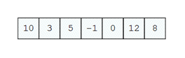
 
On each step our algorithms must find the minimal element in the unsorted part of the array:

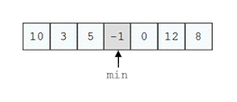
 
Then the minimal element must swap with the first element from the unsorted part of the array:

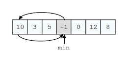
 
Then we look for the minimal element again, from the rest of the unsorted part of the array (all elements except the first one):

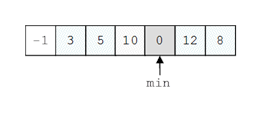
 
That minimal element now exchanges with the first from the unsorted part:

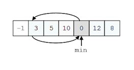

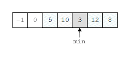

So this step is repeated until the unsorted part of the array reaches a length of 0, i.e. it is empty:
 
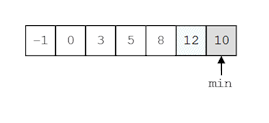

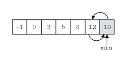
 
As a result the array is sorted:

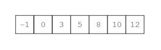
 
This is a variant of a code, which implements the algorithm explained above (selection sort):

```cs
static int[] Sort(params int[] numbers)
{
    // The sorting logic:
    for (int i = 0; i < numbers.Length - 1; i++)
    {
        // Loop operating over the unsorted part of the array
        for (int j = i + 1; j < numbers.Length; j++)
        {
            // Swapping the values
            if (numbers[i] > numbers[j])
            {
                int temp = numbers[i];
                numbers[i] = numbers[j];
                numbers[j] = temp;
            }
        }
    } // End of the sorting logic
    return numbers;
}
```

Let’s declare a method `PrintNumbers(params int[])` that outputs the list with numbers to the console, and then to test this example by writing a few lines directly into the `Main(...)` method:

| SortingEngine.cs |
|:--|

```cs
using System;

class SortingEngine
{
    static int[] Sort(params int[] numbers)
    {
        // The sorting logic:
        for (int i = 0; i < numbers.Length - 1; i++)
        {
            // Loop that is operating over the un-sorted part of
            // the array
            for (int j = i + 1; j < numbers.Length; j++)
            {
                // Swapping the values
                if (numbers[i] > numbers[j])
                {
                    int oldNum = numbers[i];
                    numbers[i] = numbers[j];
                    numbers[j] = oldNum;
                }
            }
        } // End of the sorting logic
        return numbers;
    }

    static void PrintNumbers(params int[] numbers)
    {
        for (int i = 0; i < numbers.Length; i++)
        {
            Console.Write("{0}", numbers[i]);
            if (i < (numbers.Length - 1))
            {
                Console.Write(", ");
            }
        }
    }

    static void Main()
    {
        int[] numbers = Sort(10, 3, 5, -1, 0, 12, 8);
        PrintNumbers(numbers);
    }
}
```

After this code is compiled and executed, the result is exactly as the one that was expected – the array is ordered ascending:

```console
-1, 0, 3, 5, 8, 10, 12
```

## Best Practices when Using Methods

In the chapter "High-Quality Programming Code" we will explain in details about the good practices for writing methods. None the less, we will look at some of them right now, so we can start applying the good practices and start developing a good programming style:

- Each method must resolve a **distinct, well defined task.** This feature is also known as **strong cohesion,** i.e. to give a focus onto one single task, not to several tasks no strongly related logically. A single method should perform a single task, its code should be well structured, easy to understand, and easy to be maintained. One method must NOT solve several tasks!
- A method has to have a **good name,** i.e. name that is descriptive and from which becomes clear **what the method does.** As an example: a method that sorts numbers should be named `SortNumbers()`, but should not be named `Number()` or `Processing()` or `Method2()`. If it cannot be given a good name, this may indicate that the method solves more than one task and, hence, it must be separated into sub-methods.
- Method names should **describe an action,** so they should contain a **verb** or a **verb + noun** (possibly with an adjective to supplement the noun). For example good method names are `FindSmallestElement()`, `Sort(int[] arr)` and `ReadInputData()`.
- It is assumed that all the method names in C# will start with capital letter. **PascalCase** rule is used, i.e. each new word that is concatenated to the end of the method name must start with capital letter. For example: `SendEmail(...)`, but not `sendEmail(...)` or `send_email(...)`.
- A method must do whatever is described with its name, or it must return an error (throws an exception). It is not correct that the methods return wrong or unusual result when it has received invalid input data. **The method resolves the task it is created for, or returns an error.** Any other behavior is incorrect. We will discuss this principle in "High-Quality Programming Code", section "What a Method Should Do".
- A method must have **minimum dependency** to the class in which the method is declared and to other methods and classes. This feature of the methods is also known as **loose coupling.** This means that the method must do its job by using the data that passed to it as parameters, but not data that can be accessed from other places. Methods should not have **side effects** (for example to change some global variable or print something on the console in the meantime).
- It is recommended that the methods **must be short.** Methods that are longer than a computer screen must be avoided. To do so, the logic implemented in the method is divided by functionality, to several smaller sub-methods. These sub-methods are then called from the original place they were cut off.
- To improve the readability of a method and the code structure, it is good idea a functionality that is well detached logically, to be placed in a separate method. For example if we have a method that calculates the volume of a dam lake, the process of calculating the volume of a parallelepiped can be defined in a separate method. Then that new method can be invoked as many times as necessary. Hence, **the sub-task is separated from the main task.** Since the dam lake can be taken as set of many different parallelepipeds, calculating the volume of each one of them is logical detached functionality.
- The last but most important rule is that **a method should either do what it name says or throw an exception.** If a method cannot perform its job (e.g. due to incorrect input), it should **throw an exception,** not return invalid or neutral result. How to throw an exception will be explained in the chapter "Exception Handling", but for now you should remember that **returning an incorrect result or having a side effect are bad practices.** If a method cannot do its job, it should inform its caller about this by throwing appropriate exception. Methods should **never return wrong result!**
