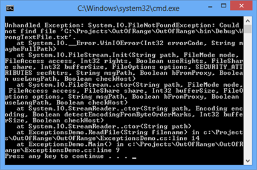

# Chapter 12. Exception Handling

## In This Chapter

In this chapter we will discuss **exceptions** in the object-oriented programming and in C# in particular. We will learn how to **handle exceptions** using the try-catch construct, how to pass them to the calling methods and how to **throw standard or our own exceptions** using the `throw` construct. We will give various examples for using exceptions. We will look at the types of exceptions and the **exceptions hierarchy** in the .NET Framework. At the end, we will look at the advantages of using exceptions, best practices and how to apply them in different situations.

## What Is an Exception?

When we write a program, we describe step-by-step what the computer must do (at least in imperative programming; in the functional programming things look a bit different) and in most of the cases we rely that the program will execute normally. Indeed, most of the time, programs are following this normal pattern, but there are some exceptions. Let’s say we want to read a file and display its contents on the screen. Let’s assume the file is located on a remote server and during the process of reading it, the connection goes down. The file then will be only partially loaded. The program will not be able to execute normally and show file’s contents on the screen. In this case, we have an **exception** from the normal (and correct) program execution and this exception must be reported to the user and/or the administrator.

### Exceptions

**Exception** is a **notification that something interrupts the normal program execution.** Exceptions provide a programming paradigm for detecting and reacting to unexpected events. When an exception arises, the state of the program is saved, the normal flow is interrupted and the control is passed to an **exception handler** (if such exists in the current context).

Exceptions are raised or **thrown** by programming code that must send a signal to the executing program about **an error or an unusual situation.** For example, if we try to open a file, which doesn’t exist, the code responsible for opening the file will detect this and will throw an exception with a proper error message.

Exceptions are one of the main paradigms of object-oriented programming (OOP), which is described in details in the chapter "Object-Oriented Programming Principles".

### Catching and Handling Exceptions

**Exception handling** is a mechanism, which allows **exceptions to be thrown and caught.** This mechanism is provided internally by the CLR (Common Language Runtime). Parts of the exception handling infrastructure are the **language constructs in C#** for throwing and catching exceptions. CLR takes care to propagate each exception to the code that can handle it.

### Exceptions in the Object-Oriented Programming

In Object-Oriented Programming (OOP), exceptions are a powerful mechanism for **centralized processing of errors** and exceptional situations. This mechanism replaces the procedure-oriented method of error handling in which each function returns a code indicating an error or a successful execution.

Usually in OOP, a code executing some operation will cause an exception if there is a problem and the **operation could not be successfully completed.** The method causing the operation could catch the exception (and handle the error) or pass the exception through to the calling method. This allows handling errors to be delegated to some upper level in the call stack and in general, allows flexible management of errors and unexpected situations.

Another fundamental concept is **exceptions hierarchy.** In OOP, exceptions are classes and they can be inherited to build hierarchies. When an exception is handled (caught), the handling mechanism could catch a whole class of exceptions and not just a particular error (as in the traditional procedural programming).

In OOP, it is recommended to **use exceptions for managing error situations or unexpected events** that may arise during a program execution. This replaces the procedural error-handling approach and gives important advantages such as centralized error processing, handling multiple errors in one place and ability to pass errors to a higher-level handler. Another important advantage is that exceptions self-describe themselves and can create hierarchies.

Sometimes exceptions are used not so much to signal a problem but to handle some expected event. This is not considered a good practice as exceptions should not control the normal flow of the program. At the end of the chapter we will look in more details into this.

### Exceptions in .NET

**Exception** in .NET is an **object,** which signals an error or an event, which is not anticipated in the normal program flow. When such unusual event takes place, the executing method ’throws' a special object containing information about the type of the error, the place in the program where the error occurred as well as the program state at the moment of the error.

Each exception in .NET contains the so-called **stack trace,** which gives information of where exactly the error occurred. This will be discussed in more details later in this chapter.

### An Example Code Throwing an Exception

Here is an example for a code that will **throw an exception:**

```cs
class ExceptionsDemo
{
	static void Main()
	{
		string fileName = "WrongTextFile.txt";
		ReadFile(fileName);
	}

	static void ReadFile(string fileName)
	{
		TextReader reader = new StreamReader(fileName);
		string line = reader.ReadLine();
		Console.WriteLine(line);
		reader.Close();
	}
}
```

This program will compile successfully but if you run it, the result will look like the following (`FileNotFoundException` dumped on the console):



In this example, we have a code trying to open a text file for reading and then display the first line of this file on the screen. We will discuss working with files in more details in the chapter "Text Files".

The first two lines of `ReadFile()` contain code that throws an exception. In this example, if the file `WrongTextFile.txt` doesn’t exist, the constructor `StreamReader(string, fileName)` will throw a `FileNotFoundException`. If an unexpected problem occurs during the input-output operations, the stream methods, such as `ReadLine()` will throw an `IOException`.

The code above will successfully compile but at run-time it will throw an exception if the `WrongTextFile.txt` file does not exist. The end result in this case is an error message displayed on the console. The console output also contains information of where and how the error occurred.

### How Do Exceptions Work?

If during the normal program execution one of the methods throws an exception, the normal flow of the program is interrupted. In the example above this happens when the StreamReader is initialized. Let’s take a look on the following line:
TextReader reader = new StreamReader("WrongTextFile.txt");
If this line triggers an error, the reader local variable will not be initialized and it will have its default value of null. None of the lines that follow in the method will be executed. The program will be interrupted until the CLR finds a handler that can process the exception.
Catching Exceptions in C#
After a method throws an exception, CLR is looking for an exception handler that can process the error. To understand how this works, we will take a closer look on the concept of a call-stack. The program call-stack is a stack structure that holds information about method calls, their local variables, method parameters and the memory for value types.
.NET programs start from the Main(…) method, which is the entry point of the program. Another method, let’s name it "Method 1" could be called from Main. Let "Method 1" call "Method 2" and so on until "Method N" is called.
When "Method N" finishes, the program flow returns back to its calling method (in our example it would be "Method N-1"), then back to its calling method and so on. This goes on until the Main(…) method is reached. Once Main(…) finishes, the entire program exits.
The general principle is that when a new method is called, it is pushed on top of the stack. When the method finishes, it is pulled back from the stack. At any given point in time, the call-stack contains all the methods called during the execution – from the starting method Main(…) to the last called method, which is currently executing, along with their local variables and arguments taken as input.
The exception handling mechanism follows a reversed process. When an exception is thrown, CLR begins searching an exception handler in the call-stack starting from the method that has thrown the exception. This is repeated for each of the methods down the call-stack until a handler is found which catches the exception. If Main(…) is reached and no handler is found, CLR catches the exception and usually displays an error message (either in the console or in a special error dialog box).
The described method call and exception handling process could be visualized in the following diagram (steps 1 through 5):
 
The try-catch Programming Construct
To handle an exception, we must surround the code that could throw an exception with a try-catch block:
try
{
	// Some code that may throw an exception
}
catch (ExceptionType objectName)
{
	// Code handling an Exception
}
catch (ExceptionType objectName)
{
	// Code handling an Exception
}
The try-catch construct consists of one try block and one or more catch blocks. Within the try block we put the code that could throw exceptions. The ExceptionType in the catch block must be a type, derived from System.Exception or the code wouldn’t compile. The expression within brackets after catch is also a declaration of a variable, thus inside the catch block we can use objectName to use the properties of the exception or call its methods.
Catching Exceptions – Example
Let’s now modify the code in our previous example to make it handle its exceptions. To do this, we wrap the code that could create problems in try-catch and then we add catch blocks to handle the two types of exceptions we know could arise.
static void ReadFile(string fileName)
{
	// Exceptions could be thrown in the code below
	try
	{
		TextReader reader = new StreamReader(fileName);
		string line = reader.ReadLine();
		Console.WriteLine(line);
		reader.Close();
	}
	catch (FileNotFoundException fnfe)
	{
		// Exception handler for FileNotFoundException
		// We just inform the user that there is no such file
		Console.WriteLine(
			"The file '{0}' is not found.", fileName);
	}
	catch (IOException ioe)
	{
		// Exception handler for other input/output exceptions
		// We just print the stack trace on the console
		Console.WriteLine(ioe.StackTrace);
	}
}
Now our method works in a different way. When FileNotFoundException is thrown during the StreamReader initialization when executing the constructor new StreamReader(filename), the CLR will not execute the following lines but will jump to the row where we catch the exception catch (FileNotFoundException fnfe):
catch (FileNotFoundException fnfe)
{
	// Exception handler for FileNotFoundException
	// We just inform the user that there is no such file
	Console.WriteLine("The file '{0}' is not found.", fileName);
}
In our example, users will simply be informed that such file does not exist by a message printed on the standard output:
The file 'WrongTextFile.txt' is not found.
Similarly, if an IOException is thrown during reader.ReadLine(), it is handled by the block below:
catch (IOException ioe)
{
	// Exception handler for FileNotFoundException
	// We just print the stack trace on the screen
	Console.WriteLine(ioe.StackTrace);
}
In this case, we display the exception stack trace on the standard output.
The lines between where the exception is thrown and the catch block that processed it are not executed.
 	Showing the full information about the exception to the end user is not always a good practice!
We will discuss the best practices in exception handling later in this chapter.
Stack Trace
The stack trace contains detailed information about the exception including where exactly it occurred in the program. The stack trace is very useful for programmers when they try to understand the problem causing the exception. The information in the stack trace is very technical and is designed to be used by programmers and system administrators and not by the end users. During debugging the stack trace is a priceless tool.
Stack Trace – Example
Here is the stack trace from our first example:
Unhandled Exception: System.IO.FileNotFoundException: Could not find file '…\WrongTextFile.txt'.
	at System.IO.__Error.WinIOError(Int32 errorCode, String maybeFullPath)
	at System.IO.FileStream.Init(String path, FileMode mode, FileAccess access, Int32 rights, Boolean useRights, FileShare share, Int32 bufferSize, FileOptions options, SECURITY_ATTRIBUTES secAttrs, String msgPath, Boolean bFromProxy, Boolean useLongPath)
	at System.IO.FileStream..ctor(String path, FileMode mode, FileAccess access, FileShare share, Int32 bufferSize, FileOptions options)
	at System.IO.StreamReader..ctor(String path, Encoding encoding, Boolean detectEncodingFromByteOrderMarks, Int32 bufferSize)
	at System.IO.StreamReader..ctor(String path)
	at Exceptions.Demo1.ReadFile(String fileName) in Program.cs:line 17
	at Exceptions.Demo1.Main() in Program.cs:line 11
The system cannot find the file named "WrongTextfile.txt" and the FileNotFoundException is thrown.
Reading the Stack Trace
To be able to use the stack trace, we must be familiar with its structure.
The stack trace contains the following information:
	The full name of the exception class;
	A message with additional information about the error;
	Information about the call-stack;
In our example above, the full name of the exception is System.IO.FileNotFoundException. The error message follows: "Could not find file '…\WrongTextFile.txt'." What follows is a full call-stack dump, which is usually the longest part of the stack trace. Each line of the call stack dump contains something similar to the following:
 at <namespace>.<class>.<method> in <source file>.cs:line <line>
Every method is shown in a separate line. On the first line is the method that threw the exception and on the least line – the Main() method (notice that the Main() method might not be present in case of an exception thrown by a thread which is not the main thread of the program). Every method is given with full information about the class that contains it and (if possible) even the line in the source code:
	at Exceptions.Demo1.ReadFile(String fileName) in …\Program.cs:line 17
The line numbers are included only if the respective class is compiled with debug information (this information contains line numbers, variable names and other technical information). The debug information is not included in the .NET assemblies but is in separate files called 'debug symbols' (.pdb). As you can see in the example stack trace, debug information is available for some assemblies, while for others (like the .NET assemblies) it is not. This is why some entries in the stack trace have line numbers and others – not.
If the method throwing the exception is a constructor, then instead of method name, the stack trace contains the word .ctor, like in System.IO.
StreamReader..ctor(String path).
This rich information in the stack trace allows quickly and easily to find the class, the method and even the source line where the error has occurred. Then usually it is relatively straightforward to analyze the problem causing the error and fixing it. This is not the same in primitive languages such as C and Pascal where the concept of stack trace is not supported.
Throwing Exceptions (the throw Construct)
Exceptions in C# are thrown using the keyword throw. We need to provide an instance of the exception, containing all the necessary information about the error. Exceptions are normal classes and the only requirement is that they inherit directly or indirectly from the System.Exception class.
Here is an example:
static void Main()
{
	Exception e = new Exception("There was a problem");
	throw e;
}
The result from running this program is:
Unhandled Exception: System.Exception: There was a problem
	at Exceptions.Demo1.Main() in Program.cs:line 11
	
## Exceptions Hierarchy

There are two types of exceptions in .NET Framework: exceptions thrown by the applications we develop (ApplicationException) and exceptions thrown by the runtime (SystemException). Each of these is a base class for a hierarchy of exception classes:
 
As all of these classes have different characteristics, we will examine them one by one.
The Exception Class
In .NET Framework, Exception is the base class for all exceptions. Several classes inherit directly from it, including ApplicationException and SystemException. These two classes are base classes for almost all exceptions that occur during the program execution.
The Exception class contains a copy of the call-stack at the time the exception instance was created. The class also has a (usually) short message describing the error (filled in by the method throwing the exception). Every exception could have a nested exception also sometimes called an inner exception, wrapped exception or internal exception.
The ability to wrap an exception with another exception is very useful in some cases and allows exceptions to be linked in the so called exception chain.
Exception – Constructors, Methods and Properties
Here is how the System.Exception class looks like:
[SerializableAttribute]
[ComVisibleAttribute(true)]
[ClassInterfaceAttribute(ClassInterfaceType.None)]
public class Exception : ISerializable, _Exception
{
	public Exception();
	public Exception(string message);
	public Exception(string message, Exception innerException);
	public virtual IDictionary Data { get; }
	public virtual string HelpLink { get; set; }
	protected int HResult { get; set; }
	public Exception InnerException { get; }
	public virtual string Message { get; }
	public virtual string Source { get; set; }
	public virtual string StackTrace { get; }
	public MethodBase TargetSite { get; }
	public virtual Exception GetBaseException();
}
The full specification of the Exception class given above is complex to be explained, so we will discuss only its most important methods and properties as they are inherited by all exceptions in .NET Framework.
	We have three constructors with different combinations for message and inner exception.
	The Message property returns a text description of the exception. For example if the exception is FileNotFoundException, the message could provide information which file was not found. In most of the cases, the code throwing the exception passes the message in the constructor. Once set, the Message property cannot be changed.
	The InnerException property returns the inner (wrapped, nested) exception or null if such doesn’t exist.
	The GetBaseException() returns the innermost exception from a given exception chain. By definition, calling this method for every exception within an exception chain will always yield the same result – the first exception that happened.
	The StackTrace property returns information for the entire stack contained in the exception (we have already seen how this information looks like).
Application vs. System Exceptions
Exceptions in .NET are two types – system and application. System exceptions are defined in .NET libraries and are used by the framework, while application exceptions are defined by application developers and are used by the application software. When we, as developers, design our own exception classes, it is a good practice to inherit from ApplicationException and not directly from SystemException (or even worse – directly from Exception). SystemException should only be inherited internally within the .NET Framework.
Some of the worst system exceptions include ExecutionEngineException (which is thrown on internal error within CLR), StackOverflowException (call-stack overflow, most probably due to infinite recursion) and OutOfMemoryException (insufficient memory). In all of these cases, our application could hardly recover or react in some reasonable manner. Most frequently, when such exception occurs, the application just crashes.
Exceptions related to interaction with external components (like COM components) inherit from ExternalException. Examples are COMException and Win32Exception.

## Throwing and Catching Exceptions

Let’s look in more details at throwing and catching exceptions.
Nested Exceptions
We’ve already seen that each exception could contain a nested (inner) exception. Let’s explain in more details why it is a common practice in OOP error handling to wrap exceptions in this way.
In software engineering, it is a good practice for every software component to define small number of specific application exceptions. The component then would throw only these specific application exceptions and not the standard .NET exceptions. In this way the users of the software component would know what exceptions could expect from it.
For instance, if we have a banking software and we have a component dealing with interests, this component would define (and throw) exceptions like InterestCalculationException and InvalidPeriodException. The interest component should not throw exceptions like FileNotFoundException, DivideByZeroException and NullReferenceException. When an error occurs, which is not directly related to interest calculation, the respective exception is wrapped in InterestCalculationException and the calling code will be informed that the interest calculation was not correctly done.
Still, these business application exceptions usually do not have detailed technical information about the nature of the problem. This is why, it is considered a good practice to include technical details about the problem and this is where inner exceptions come in handy. When the component throws its application exception, it should keep the original exception as an inner exception in order to preserve the technical details about the error.
Another example is when a software component (let’s call it Component A) defines its own application exceptions (A-exceptions). This component internally uses another component (called Component B). If for some reason B throws a B exception (an exception defined in B), perhaps A will have to propagate the error because it will not be able to do its task. And because A cannot simply throw a B-exception, it must throw an A-exception, containing the B-exception as a nested exception.
There could be various reasons why A cannot simply throw a B exception:
	Component A users should not even know Component B exists (see the discussion regarding abstractions in the "Principles of OOP" chapter);
	Component A had not declared it would throw Component B exceptions;
	Component A users are not prepared to receive Component B exceptions. They expect component A exceptions only.
How to Read the Stack Trace with Nested Exceptions?
Below we have an example that creates an exception chain. We will demonstrate how such exception chain is created and how the stack trace looks like in the output:
37
38
39
40
41
42
43
44
45
46
47
48
49
50
51
52
53
54
55	static void Main()
{
	try
	{
		string fileName = "WrongFileName.txt";
		ReadFile(fileName);
	}
	catch (Exception e)
	{
		throw new ApplicationException("Smth. bad happened", e);
	}
}
static void ReadFile(string fileName)
{
	TextReader reader = new StreamReader(fileName);
	string line = reader.ReadLine();
	Console.WriteLine(line);
	reader.Close();
}
In this example, we call the ReadFile() method (line 42), which will throw an exception (line 51) because the file "WrongFileName.txt" does not exist. In the Main() method we catch all exceptions (line 44), wrap them into a new exception of type ApplicationException and throw them again (line 46). As we shall see later in the section "Grouping Different Error Types", caching an Exception also catches all its descendant exceptions in its hierarchy. Finally the thrown exception (at line 46) is caught by .NET Framework and its stack trace is dumped on the console.
The result of running the above example is shown below:
 
Let’s look more carefully at the stack trace. We now see an additional section marking the end of the nested exception:
--- End of inner exception stack trace ---
This gives useful information about how the exception was thrown.
If you look more closely on the first line, you will notice it contains information in the following format:
Unhandled Exception: Exception1: Msg1 ---> Exception2: Msg2
This shows that an exception of type Exception1 is wrapped around an exception of type Exception2. After each exception type, we can see the message of the respective exception (as contained in the Message property). Using the information in the stack-trace (the file name, the method and the line number), we can find out how the exceptions occurred and where.
Visualizing Exceptions
In console applications errors are usually printed in the output although this might not be the most user-friendly way to notify the user for problems.
In Web applications, errors are frequently shown in the beginning or at the bottom of the page or near the UI field related to the error.
In GUI applications we should show the errors in a dialog window containing user-friendly description of the error. An example of user-friendly error message dialog box is given below:
 
As you can see, there is no single 'right' way to handle and visualize exceptions as it depends on the type of the application and its intended audience. Still there are some recommendations regarding how to handle exceptions and what is the best way to show them to the users. We will discuss these recommendations in the "Best Practices" section.
Which Exceptions to Handle and Which Not?
There is one universal rule regarding exception handling:
 	A method should only handle exceptions which it expects and which it knows how to process. All the other exceptions must be left to the calling method.
If we follow this rule and every method leaves the exceptions it is not competent to process to the calling method, eventually we would reach the Main() method (or the starting method of the respective thread of execution) and if this method does not catch the exception, the CLR will display the error on the console (or visualize it in some other way) and will terminate the program.
A method is competent to handle an exception if it expects this exception, it has the information why the exception has been thrown and what to do in this situation. If we have a method that must read a text file and return its contents as a string, that method might catch FileNotFoundException and return an empty string in this case. Still, this same method will hardly be able to correctly handle OutOfMemoryException. What should the method do in case of insufficient memory? Return an empty string? Throw some other exception? Do something completely different? So apparently the method is not competent to handle such exception and thus the best way is to pass the exception up to the calling method so it could (hopefully) be handled at some other level by a method competent to do it. Using this simple philosophy allows exception handling to be done in a structured and systematic way.
Throwing Exceptions from the Main() Method – Example
Throwing exceptions from the Main() method is generally not a good practice. Instead, it is better all exceptions to be caught in Main(). Still it is of course possible to throw exceptions from Main() just as from any other method:
static void Main()
{
	throw new Exception("Ooops!");
}
Every exception which is not handled in Main() is eventually caught by the CLR and visualized by printing the stack trace on the console output or in some other way. While for small applications it is not such a problem, big and complex applications generally should not crash in such ungraceful manner.
Catching Exceptions at Different Levels – Example
The ability to pass (or bubble) exceptions through a given method up to the calling method allows structured exception handling to be done at multiple levels. This means that we can catch certain types of exceptions in given methods and pass all other exceptions to the previous levels in the call-stack. In the example below, the exceptions in the ReadFile() method are handled at two levels (in the try-catch block of the ReadFile() method itself and in the try-catch block of the Main() method):
static void Main()
{
	try
	{
		string fileName = "WrongFileName.txt";
		ReadFile(fileName);
	}
	catch (Exception e)
	{
		throw new ApplicationException("Bad thing happened", e);
	}
}

static void ReadFile(string fileName)
{
	try
	{
		TextReader reader = new StreamReader(fileName);
		string line = reader.ReadLine();
		Console.WriteLine(line);
		reader.Close();
	}
	catch (FileNotFoundException fnfe)
	{
		Console.WriteLine("The file {0} does not exist!",
			filename);
	}
}
In this example the ReadFile() method catches and handles only FileNotFoundException while passing all other exceptions up to the Main() method. In the Main() method we handle only exceptions of type IOException and will let the CLR to handle all other exceptions (for instance, if OutOfMemoryException is thrown during program’s execution, it will be handled by the CLR).
If the Main() method passes a wrong filename, FileNotFoundException will be thrown while initializing the TextReader in ReadFile(). This exception will be handled by the ReadFile() method itself. If on the other hand the file exists but there is some problem reading it (insufficient permissions, damaged file contents etc.), the respective exception that will be thrown will be handled in the Main() method.
Handling exceptions at different levels allows the error conditions to be handled at the most suitable place for the particular error. This allows the program code to be clear and structured and the flexibility achieved is enormous.

## The try-finally Construct

Every try block could contain a respective finally block. The code within the finally block is always executed, no matter how the program flow leaves the try block. This guarantees that the finally block will be executed even if an exception is thrown or a return statement is executed within the try block.
 	The code in the finally block will not be executed if while executing the try block, CLR is unexpectedly terminated, e.g. if we stop the program through Windows Task Manager.
The basic form of the finally block is given below:
try
{
	// Some code that could or could not cause an exception
}
finally
{
	// Code here will always execute
}
Every try block may have zero or more catch blocks and at most one finally block. It is possible to have multiple catch blocks and a finally block in the same try-catch-finally construct.
try
{
	some code
}
catch (…)
{
	// Code handling an exception
}
catch (…)
{
	// Code handling another exception
}
finally
{
	// This code will always execute
}
When Should We Use try-finally?
In many applications we have to work with external for our programs resources. Examples for external resources include files, network connections, graphical elements, pipes and streams to or from different hardware devices (like printers, card readers and others). When we deal with such external resources, it is critically important to free up the resources as early as possible when the resource is no longer needed. For example, when we open a file to read its contents (let’s say to load a JPG image), we must close the file right after we have read the contents. If we leave the file open, the operating system will prevent other users and applications to make certain operations on the file. Perhaps you faced such a situation when you could not delete some directory or a file because it is being used by a running process.
The finally block is priceless when we need to free an external resource or make any other cleanup. The finally block guarantees that the cleanup operations will not be accidentally skipped because of an unexpected exception or because of execution of return, continue or break.
Because proper resource management is an important concept in programming, we will look at it in some more details.
Resource Cleanup – Defining the Problem
In our example, we want to read a file. To accomplish this, we have a reader that must be closed when the file has been read. The best way to do this is to surround the lines using the reader in a try-finally block. Here is a refresh of how our example looks like:
static void ReadFile(string fileName)
{
	TextReader reader = new StreamReader(fileName);
	string line = reader.ReadLine();
	Console.WriteLine(line);
	reader.Close();
}
What is the problem with this code? Well, what the code is supposed to do is to open up a file reader, read the data and then close the reader before the method returns. This last part is a problem because the method could finish in one of several ways:
	An exception could be thrown when the reader is initialized (say if the file is missing).
	During reading the file, an exception could arise (imagine a file on a remote network device which goes offline during file reading).
	A return statement could be executed before the reader is closed (in our trivial example this would be obvious but it is not always as apparent).
	Everything goes as expected and the method is executed normally.
So our method as written in the example above has a critical flaw: it will close the reader only in the last scenario. In all of the other cases, the code closing the reader will not be executed. And if this code is within a loop, things get even more complex as continue and break operators must be considered too.
Resource Cleanup – Solving the Problem
In the previous section we explained the fundamental flaw of the solution 'open the file ? read ? close'. If an error occurs during opening or reading the file, we will leave the file open.
To solve this, we can use the try-finally construct. We will first discuss the case in which we have one resource to clean-up (in this case a file). Then we will give an example when we have two or more resources.
Closing a file stream could be done using the following pattern:
static void ReadFile(string fileName)
{
	TextReader reader = null;
	try
	{
		reader = new StreamReader(fileName);
		string line = reader.ReadLine();
		Console.WriteLine(line);
	}
	finally
	{
		// Always close "reader" (if it was opened)
		if (reader != null)
		{
			reader.Close();
		}
	}
}
In this example we first declare the reader variable, and then initialize the TextReader in a try block. Then in the finally block we close the reader. Whatever happens during TextReader’s initialization or during reading, it is guaranteed that the file will be closed. If there is a problem initializing the reader (say the file is missing), then reader will remain null and this is why we do a check for null in the finally block before calling Close(). If the value is indeed null, then the reader has not been initialized and there is no need to close it. The code above guarantees that if the file has been opened, then it will be closed no matter how the method exits.
The example above should, in principle, properly handle all exceptions related to opening and initialization of the reader (like FileNotFoundException). In our example, these exceptions are not handled and are simply propagated to the caller.
We have chosen file streams for our example for freeing resources up but the same principle applies to all resources that require proper cleanup. These could be remote connections, operating system resources, database connections and so on.
Resource Cleanup – Better Solution
While the above solution is correct, it is unnecessary complex. Let’s look at a simplified version:
static void ReadFile(string fileName)
{
	TextReader reader = new StreamReader(fileName);
	try
	{
		string line = reader.ReadLine();
		Console.WriteLine(line);
	}
	finally
	{
		reader.Close();
	}
}
This code has the advantage of being simpler and shorter. We avoid the preliminary declaration of the reader variable and the check for null in the finally block. The null check is now not necessary because the initialization of the reader is outside of the try block and if an exception occurs during the initialization, the finally block will not be executed at all.
This code is cleaner, shorter and clearer and is known as "dispose pattern". However, note that this way the exception will go up to the method calling ReadFile(…).
Multiple Resources Cleanup
Sometimes we need to free more than one resource. It is a good practice to free the resources in in reverse order in respect to their allocation.
We can use the same approach outlined above, nesting the try-finally blocks inside each other:
static void ReadFile(string filename)
{
	Resource r1 = new Resource1();
	try
	{
		Resource r2 = new Resource2();
		try
		{
			// Use r1 and r2
		}
		finally
		{
			r2.Release();
		}
	}
	finally
	{
		r1.Release();
	}
}
Another option is to declare all of the resources in advance and then make the cleanup in a single finally block with respective null checks:
static void ReadFile(string filename)
{
	Resource r1 = null;
	Resource r2 = null;
	try
	{
		Resource r1 = new Resource1();
		Resource r2 = new Resource2();

		// Use r1 and r2
	}
	finally
	{
		if (r1 != null)
		{
			r1.Release();
		}
		if (r2 != null)
		{
			r2.Release();
		}
	}
}
Both of these options are correct and both are applied depending on the situation and programmer’s preference. The second approach is a little bit riskier as if an exception occurs in the finally block, some of the resources will not be cleaned up. In the example above, if an exception is thrown during r1.Release(), r2 will not be cleaned up. If we use the first option, there is no such problem but the code is a bit longer.

## IDisposable and the "using" Statement

It is time to present a new shorter and simplified way to release some kinds of resources in C#. We will demonstrate which resources can use this special programming construct and how it looks like.
IDisposable
The main use of IDisposable interface is to release resources. In .NET such resources are window handles, files, streams and others. We will talk about interfaces in "OOP Principles" chapter. Now we may consider interface as an indication that given type of objects (for example streams for reading files) support a certain number of operations (for example closing the stream and releasing related resources).
We will not go into details how to implement IDisposable since we have to go much deeper and explain how the garbage collector works, how to use destructors, unmanaged resources and so on.
The important method in IDisposable interface is Dispose(). The main thing we need to know about the method is that it releases the resources of the class that implements it. In cases when resources are streams, readers or files releasing resources can be done using the Dispose() method from IDisposable interface, which calls their Close() method. This method closes them and releases their resources. So to close a stream we can do the following:
StreamReader reader = new StreamReader(fileName);
try
{
	// Use the reader here
}
finally
{
	if (reader != null)
	{
		reader.Dispose();
	}
}
The Keyword "using"
The previous example can be written in shorter form with the help of the using keyword in C#, as shown in the following example:
using (StreamReader reader = new StreamReader(fileName))
{
	// Use the reader here
}
The above simplified form of the "dispose pattern" is simple to write, simple to use and simple to read and is guaranteed to release correctly the allocated resources specified in the brackets of the using statement.
It is not necessary to have try-finally or to explicitly call any method to release the resources. The compiler takes care to automatically put try-finally block and the used resources are released by calling the Dispose() method after leaving the using block.
Later in chapter "Text Files" we will extensively use the using statement to correctly read and write text files.
Nested "using" Statements
The using statements can be nested one within another:
using (ResourceType r1 = …)
	using (ResourceType r2 = …)
		…
			using (ResourceType rN = …)
				statements;
The previous example can be written like this:
using (ResourceType r1 = …, r2 = …, …, rN = …)
{
	statements;
}
It is important to mention that using statement is not related to exception handling. Its only purpose is to release the resources no matter whether exceptions are thrown or not. It does not handle exception.
When to Use the "using" Statement?
There is a simple rule when to use using with .NET classes:
 	Use the using statement with all classes that implement the IDisposable interface. Look for IDisposable in MSDN.
When a class implements IDisposable interface this means that the creator of this class expects it can be used with the using statement and the class contains some expensive resource that should not be left unreleased. Implementing IDisposable also means that it should be released immediately after we finish using the class and the easiest way to do this in C# is with using statement.

## Advantages of Using Exceptions

So far we reviewed the exceptions in details, their characteristics and how to use them. Now let’s find out why they were introduced and why they are so widely used.
Separation of the Exception Handling Code
Using exceptions allow us to separate the code, which describes the normal execution of the program from the code required for unexpected execution and the code for error handling. We will demonstrate this separation concept in the following example:
void ReadFile()
{
	OpenTheFile();
	while (FileHasMoreLines)
	{
		ReadNextLineFromTheFile();
		PrintTheLine();
	}
	CloseTheFile();
}
Let’s explore the example step by step. It does the following:
	Open the file;
	While the file has more lines:
	Read the next line from the file;
	Print the line;
	Close the file;
The method looks good but a closer look brings up some questions:
	What will happen if the file does not exist?
	What will happen if the file cannot be opened?
	What will happen if reading a line fails?
	What will happen if the file cannot be closed?
Error Handling without Exceptions
Let’s change the method having these questions in mind without using exceptions. Let’s use error codes returned by any method that we use. Using error codes is standard way for handling errors in procedure oriented programming, where every method returns int, which provides information whether the method was executed correctly. Error code 0 means that everything is correct. Any other code means some error. Different kinds of errors have different codes (usually it is a negative number).
int ReadFile()
{
	errorCode = 0;
	openFileErrorCode = OpenTheFile();

	// Check whether the file is open
	if (openFileErrorCode == 0)
	{
		while (FileHasMoreLines)
		{
			readLineErrorCode = ReadNextLineFromTheFile();
			if (readLineErrorCode == 0)
			{
				// Line has been read properly
				PrintTheLine();
			}
			else
			{
				// Error during line reading
				errorCode = -1;
				break;
			}
		}
		closeFileErrorCode = CloseTheFile();
		if (closeFileErrorCode != 0 && errorCode == 0)
		{
			errorCode = -2;
		}
		else
		{
			errorCode = -3;
		}
	}
	else if (openFileErrorCode == -1)
	{
		// File does not exist
		errorCode = -4;
	}
	else if (openFileErrorCode == -2)
	{
		// File can't be open
		errorCode = -5;
	}
	return errorCode;
}
As a result we have a hard to understand and easy to break "spaghetti" code. Program logic is mixed with the error handling logic. Big parts of the code are the rules for error handling. Errors don’t have type, description or stack trace and we have to wonder what the different error codes mean.
Error Handling with Exceptions
We can avoid all of the above spaghetti code just by using exceptions. Here is how the same method will look like using exceptions instead:
void ReadFile()
{
	try
	{
		OpenTheFile();
		while (FileHasMoreLines)
		{
			ReadNextLineFromTheFile();
			PrintTheLine();
		}
	}
	catch (FileNotFoundException)
	{
		DoSomething();
	}
	catch (IOException)
	{
		DoSomethingElse();
	}
	finally
	{
		CloseTheFile();
	}
}
In fact exceptions don’t save us the effort in finding and processing errors but give us more elegant, short, clear and efficient way to do it.
Grouping Different Error Types
The hierarchical nature of exceptions allows us to catch and handle whole groups of exceptions at one time. When using catch we are not only catching the given type of exception but the whole hierarchy of exception types that are inheritors of the declared type.
catch (IOException e)
{
	// Handle IOException and all its descendants
}
The example above will catch not only the IOException, but all of its descendants including FileNotFoundException, EndOfStreamException, PathTooLongException and many others. In the same time exceptions like UnauthorizedAccessException and OutOfMemoryException will not be caught, because they don’t inherit from IOException. We can look in MSDN for the exceptions hierarchy if we wander which exceptions to catch.
It is not a good practice, but it is possible to catch all exceptions:
catch (Exception e)
{
	// A (too) general exception handler
}
Catching Exception and all of its inheritors is not a good practice. It is better to catch more specific groups of exceptions like IOException or just one type of exception like for example FileNotFoundException.
Catching Exceptions at the Most Appropriate Place
The ability to catch exceptions at multiple locations is extremely comfortable. It allows us to handle the exception at the most appropriate place. Let’s demonstrate this with a simple comparison with the old approach using error codes. Let’s have the following method structure:
Method3()
{
	Method2();
}

Method2()
{
	Method1();
}

Method1()
{
	ReadFile();
}
The method Method3() calls Method2(), which calls Method1() where ReadFile() is called. Let’s suppose that Method3() is the method interested in eventual error in the ReadFile() method. If such error occurs in ReadFile() it wouldn’t be easy to transfer the error to Method3() using the traditional approach with error codes:
void Method3()
{
	errorCode = Method2();
	if (errorCode != 0)
		process the error;
	else
		DoTheActualWork();
}

int Method2()
{
	errorCode = Method1();
	if (errorCode != 0)
		return errorCode;
	else
		DoTheActualWork();
}

int Method1()
{
	errorCode = ReadFile();
	if (errorCode != 0)
		return errorCode;
	else
		DoTheActualWork();
}
First in Method1() we have to analyze the error code returned by ReadFile() method and eventually pass it to Method2(). In Method2() we have to analyze the error code returned by Method1() and eventually pass it to Method3() where to handle the error itself.
How can we avoid all this? Let’s remember that that the CLR searches for exceptions back in the call stack of the methods and lets each of them to define catching and handling of the exceptions. If the method is not interested in catching some exception it is simply sent back in the stack:
void Method3()
{
	try
	{
		Method2();
	}
	catch (Exception e)
	{
		process the exception;
	}
}

void Method2()
{
	Method1();
}

void Method1()
{
	ReadFile();
}
If an error occurs during reading the file it will be ignored in Method1() and Method2() and will be caught and handled in Method3() where is the most appropriate place to handle the error. Let’s remember again the most important rule: every method should catch only exceptions that can handle and skip all the others.

## Best Practices when Using Exceptions

In this section we will give some recommendations and best practices for correctly using exceptions for error handling and unexpected situations. These are important rules that should be remembered and followed.
When to Rely on Exceptions?
To understand when it is good to rely on exceptions let’s see the following example: we have a program that opens a file by given path and file name. While writing the user can write the file name wrong. This should rather be considered normal and not exceptional.
We can be prepared and first check if the file exists before we try to open it:
static void ReadFile(string fileName)
{
	if (!File.Exists(fileName))
	{
		Console.WriteLine(
			"The file '{0}' does not exist.", fileName);
		return;
	}

	StreamReader reader = new StreamReader(fileName);
	using (reader)
	{
		while (!reader.EndOfStream)
		{
			string line = reader.ReadLine();
			Console.WriteLine(line);
		}
	}
}
If we call the method and the file is missing we will see the following message in the console:
The file 'WrongTextFile.txt' does not exist.
The other way to implement this is the following:
static void ReadFile(string filename)
{
	StreamReader reader = null;
	try
	{
		reader = new StreamReader(filename);
		while (!reader.EndOfStream)
		{
			string line = reader.ReadLine();
			Console.WriteLine(line);
		}
		reader.Close();
	}
	catch (FileNotFoundException)
	{
		Console.WriteLine(
			"The file '{0}' does not exist.", filename);
	}
	finally
	{
		if (reader != null)
		{
			reader.Close();
		}
	}
}
We can consider the second option as worse because exceptions should be used for unexpected situations and missing file is more or less usual.
It is not a good practice to rely on exceptions for expected events for another reason: performance. Throwing an exception is time consuming operation. An object has to be created to hold the exception, the stack trace has to be initialized and handler for this exception has to be found and so on.
 	It is hard to define the exact border between expected and unexpected. In general expected event is something related to the program functionality. Input of wrong file name for example. Power cut during the execution of the program, from the other hand, is unexpected event.
Throw Exceptions to the End User?
Exceptions are confusing for most users. They give the impression of a poorly written program that "has bugs". What will the user of our application entering invoices think if suddenly the program shows this dialogue?
 
This dialogue is very suitable for a developers or administrators for example, but it is extremely inappropriate for the end users.
Instead of this dialogue we can show another one, much more user friendly and understandable for the user:
 
This is the good way to show the error message to the end user. The message is easy to understand from the user and also contains technical details that can be used if required but is not visible at the beginning.
It is recommended when exceptions are not caught by anyone (such exceptions can only be runtime errors) to be caught by a global exception handler which saves them on the disk and shows user friendly message such as "An error occurred, please try again later". It is a good a practice to show not only a user friendly message but also technical information (stack trace) available on demand (e.g. through an additional button or link).
Throw Exceptions at the Appropriate Level of Abstraction!
When we throw our own exceptions we must keep in mind the abstractions in the context our methods work. For example if our method works with arrays we can throw IndexOutOfRangeException or NullReferenceException because our method works at low level and directly operates with the memory and the array elements. But if our method is doing accumulating of interests at all accounts in a bank it should not throw IndexOutOfRangeException because this exception is not from the business area of the banking sector. It would be normal accumulation of interests in a bank software to throw InvalidInterestException exception with an appropriate error message where the original IndexOutOfRangeException exception to be attached.
Let’s give another example: we call a method that sorts an array of integers and throws an exception TransactionAbortedException. This is also an inappropriate exception just as NullReferenceException was in accumulation of interests in the bank software. That is why we should consider the abstraction level where our method works when we throw our exception.
If Your Exception Has a Source, Use It!
When we catch an exception and throw a new one with a higher level of abstraction we should always attach the original exception to it. This way the user of our code will be able to easily find the exact reason for the error and the location where it occurred at the first place.
This rule is a special case of more general rule:
 	Each exception should carry detailed information about the problem.
From the rule above many more rules come out: we should have a relevant error message, the error type should match the problem and the exceptions should hold its source as inner exception.
Give a Detailed Descriptive Error Message!
The error message that every exceptions holds is extremely important. In most cases it is enough to give us information what is the problem. If the message is not good enough the users of your methods will not be able to quickly solve the problem.
Let’s take the following example: we have a method that reads the applications settings from a file. For example size and position of all windows in the application and others. There is a problem while reading the settings file and we receive the following error message:
Error.
Is this enough to find the problem? Obviously not. What should be the message so it is descriptive enough? Is this one better?
Error reading settings file.
Obviously the message above is better but it is still not good enough. It explains what the error is but does not tell us what causes it. Let’s suppose we change the program so it gives the following error information:
Error reading settings file: C:\Users\Administrator\MyApp\MyApp.settings
This error message is better because it tells us which file caused the problem (something that would save us time, especially if we are not familiar with the application and don’t know where it keeps its settings files).
The situation could be even worse – we may not have the source code of the application and don’t have the access to the stack trace (if we have compiled without debug information). That is why the error message should be even better. For example like the following:
Error reading settings file: C:\Users\Administrator\MyApp\MyApp.settings. Number expected at line 17.
This message fully describes the problem. Obviously we have an error on line 17, in MyApp.settings file, which is in C:\Users\Administrator\MyApp folder. On this line a number is expected but is not provided. If we open the file we could quickly find the problem.
 	Always give adequate, detailed and correct error message when throwing exceptions! The user of your code should be able to tell what and where is the problem and what caused it when reading the error message.
Let’s give some examples:
	We have a method that searches for an integer in an array. If it throws IndexOutOfRangeException it is important to mention the index that cannot be reached in the error message. For example index 18 when the length of the array is 7. If we don’t know the position we will hardly understand why we are outside the array.
	We have a method that reads integers from a file. If in the file we have a row without an integer we should get an error, which explains that at row 17 for example an integer is expected instead of a string (and prints the string).
	We have a method that calculates the sum of numeric expression. If we find an error in the expression the exception should say what error occurred and at what position. The code that causes the error may use String.Format(…) to build the error message. Here is an example how to implement this:
throw new FormatException(
	string.Format("Invalid character at position {0}. " +
	"Number expected but character '{1}' found.", index, ch));
Error Messages with Wrong Content
Even worse than throwing an exception with not enough information is throwing one with wrong information. If in the last example we say the error is at row 3 instead of row 17 this will be misleading and will be worse than just showing an error and give no details.
 	Be careful not to show messages with incorrect content!
Use English for All Exception Messages
Use English for the error messages when throwing an exception. This rule is a sub-rule of the rule "use English in your entire source code. The reason: English is the only language that is understood by programmers around the world. One day your code could be used by foreigners. If you live in France you probably won’t be happy to get error messages in Chinese and vice-versa, would you?
Note that error messages shown to the end user could be in his native language, but the error messages in the exceptions should always be in English. The exceptions are for the developer. The developers around the world use English. The messages (errors / notifications / warnings) for the end user are different story. These messages could be in the language which is best suited for the end-users and may be customized through localization techniques like resources, embedded resource files and resource strings (see http://msdn.microsoft.com/en-us/magazine/cc163609.aspx for additional information).
Never Ignore the Exceptions You Catch!
Never ignore the exceptions you catch without handling them. Here is an example what we should not do:
try
{
	string fileName = "WrongTextFile.txt";
	ReadFile(fileName);
}
catch (Exception e)
{ }
In the example the exception is caught and ignored. This means that if the file is missing the program will not read anything and there will not be any error message. This gives the user wrong impression the file is read when it is in fact missing. Don't do this!
If we ever need to ignore an exception on purpose we should add a comment, which will help us when reading the code later. Here is an example:
int number = 0;
try
{
	string line = Console.ReadLine();
	number = Int32.Parse(line);
}
catch (Exception)
{
	// Incorrect numbers are intentionally considered 0
}
Console.WriteLine("The number is: " + number);
We can improve the code above by using Int32.TryParse(…) or by initializing the number variable with 0 in the catch block, not outside of it. In the second case the comment in the code and empty catch block are not necessary.
Dump the Error Messages in Extreme Cases Only!
Let’s take our method, which is reading the application settings from a file. If an error occurs it could print it in the console but what will happen with the calling method? It will suppose that the settings are read correctly.
There is an important concept in programming:
 	A method should either do the work it is created for or throw an exception. Any other behavior is incorrect!
This is a very important rule that is why we will repeat it and even extend it:
 	A method should either do the work it is created for or throw an exception. In case of wrong input the method should throw an exception and should not return a wrong result!
We can explain the rule in details: A method is created to do a certain job. What the method is doing should be clear from its name. If we cannot give an appropriate name to the method means that it is doing many things and we should split it so everything is in separate method. If the method cannot do the work it is created for it should throw an exception. For example if we have a method for sorting of an array of integers. If the array is empty the method should either return an empty array or return an error. Wrong input should cause an exception and not return a wrong result! For example if we try to take a substring from index 7 to 12 from a string with length 10, it should cause an exception and not return fewer characters. This is how the Substring() method in String works.
We will give another example, which confirms the rule that a method should do the work it is created for or throw an exception. Let’s suppose we copy a big file from the local disk to an USB flash drive. It could happen so that the space on the flash drive is not enough and the file cannot be copied. Which of the following is correct and the program for coping files (for example Windows Explorer) should do?
	The file is not copied and no error message is shown.
	The file is partially copied and no error message is shown.
	The file is partially copied and error message is shown.
	The file is not copied and error message is shown.
From the user point of view the only correct behavior of the program is the last one: if a problem occurs the file should not be copied partially and an error message should be shown. We should do the same if we have to write a method that copy files. It should fully copy the given file or throw an exception. At the same time it should not leave any traces – it should delete any partial result if such was created.
Don’t Catch All Exceptions!
A very common mistake with exceptions is to catch all exceptions no matter what type they are. Here is an example where all exceptions are handled wrong:
try
{
	ReadFile("CorrectTextFile.txt");
}
catch (Exception)
{
	Console.WriteLine("File not found.");
}
In the code we suppose that there is a method ReadFile(), which reads a text file and returns the content as string. The catch block catches all exceptions (regardless of their type), not only FileNotFoundException, and in all cases prints that file is not found. There are unexpected situations such as when file is locked by another process in the operating system. In such case the CLR will generate UnauthorizedAccessException, but the message that the program will show to the user will be wrong and misleading. The file exists but the program will claim it is not there. The same will happen when during the file opening we are out of memory and OurOfMemoryException is generated. The message will be incorrect again.
Only Catch Exceptions You Know How to Process!
We should handle only errors that we expect and we are prepared for. We should leave the other errors (exceptions) so they are caught by another method that knows how to handle them.
 	A method should not catch all exceptions – it should only catch the ones it can process correctly.
This is a very important rule that should be followed. If you don’t know how to handle an exception do not catch it or wrap it with your exception and pass it on for additional handling.
