# Chapter 14. Defining Classes

## In This Chapter

In this chapter we will understand how to **define custom classes** and their elements. We will learn to declare **fields, constructors and properties** for the classes. We will revise what a method is and we will broaden our knowledge about **access modifiers** and **methods.** We will observe the characteristics of the constructors and we will set out how the program objects coexist in the dynamic memory and how their fields are initialized.

## Custom Classes

The aim of every program written by the programmer is to **solve a given problem** based on the implementation of a certain idea. In order to create a solution, first, we sketch a simplified actual model, which does not represent everything, but focuses on these facts, which are significant for the end result. Afterwards, based on the sketched model, we are looking for an answer (i.e. to create an algorithm) for our problem and the solution we describe via given programming language.

Nowadays, the most used programming languages are the object-oriented. And because the **object-oriented programming (OOP)** is close to the way humans think, using one easily allows us to describe models of the surrounding life. Certain reason for this behavior is, because OOP offers tools to draw the set of concepts, which outline classes of objects in every model. The term – class and the definition of custom classes, different from the .NET system framework’s, is built-in feature of the C# programming language. The purpose of this chapter is to get us know with it.

### Let’s Recall: What Does It Mean Class and Object?

**Class** in the OOP is called a definition (**specification**) of a given type of objects from the real-world. The class represents a pattern, which describes the different states and behavior of the certain objects (the copies), which are created from this class (pattern).

**Object** is a copy created from the definition (specification) of a given class, also called an **instance.** When one object is created by the description of one class we say **the object is from type "name of the class".**

For example, if we have a class type `Dog`, which describes some of the characteristics of a real dog, then, the objects based on the description of the class (e.g. the doggies "Fido" and "Rex") are from type class `Dog`. It means the same when the string "some string" is from class type `String`. The difference is that **objects** from type `Dog` is are copies of the class, which is not part of the system library classes of the .NET Framework, but defined by ourselves (the users of the programming language).

### What Does a Class Contain?

Every class contains a definition of what kind of data types and objects has in order to be described. The object (the certain copy of this class) holds the **actual** data. The data defines the object’s **state.**

In addition to the **state,** in the class is described the **behavior** of the objects. The behavior is represented by actions, which can be performed by the objects themselves. The resource in OOP, through which we can describe this behavior of the objects from a given class, is the declaration of **methods** in the class body.

### Elements of the Class

Now, we will go through the main elements of every class, and we will explain them in details latter. The main **elements of a C# classes** are the following:

- **Class declaration** – this is the line where we declare the name of the class, e.g.:

    ```cs
    public class Dog
    ```

- **Class body** – similar to the method idioms in the language, the classes also have single class body. It is defined right after the class declaration, enclosed in curly brackets "`{`" and "`}`". The content inside the brackets is known as body of the class. The elements of the class, which are numbered below, are part of the body.

    ```cs
    public class Dog
    {
        // ... The body of the class comes here ...
    } 
    ```

- **Constructor** – it is used for **creating new objects.** Here is a typical constructor:

    ```cs
    public Dog()
    {
        // ... Some code ...
    }
    ```

- **Fields** – they are variables, declared inside the class (somewhere in the literature are known as **member-variables**). The data of the object, which these variables represent, and are retained into them, is the specific state of an object, and one is required for the proper work of object’s methods. The values, which are in the fields, reflect the specific state of the given object, but despite of this there are other types of fields, called **static,** which are shared among all the objects.

    ```cs
    // Field definition
    private string name;
    ```

- **Properties** – this is the way to describe the **characteristics** of a given class. Usually, the value of the characteristics is kept in the fields of the object. Similar to the fields, the properties may be held by certain object or to be shared among the rest of the objects.

    ```cs
    // Property definition
    private string Name { get; set; }
    ```

- **Methods** – from the chapter "Methods" we know that methods are named blocks of programming code. They perform particular actions and through them the objects achieve their behavior based on the class type. Methods execute the implemented programming logic (algorithms) and the handling of data.

#### Sample Class: Dog

Here is how a class looks like. The class `Dog` defined here owns all the elements, which we described so far:

```cs
// Class declaration
public class Dog
{    // Opening bracket of the class body

    // Field declaration
    private string name;

    // Constructor declaration (peremeterless empty constructor)
    public Dog()
    {
    }

    // Another constructor declaration
    public Dog(string name)
    {
        this.name = name;
    }

    // Property declaration
    public string Name
    {
        get { return name; }
        set { name = value; }
    }

    // Method declaration (non-static)
    public void Bark()
    {
        Console.WriteLine("{0} said: Wow-wow!",
            name ?? "[unnamed dog]");
    }
}    // Closing bracket of the class body
```

At the moment we will not explain in greater details this code, because the related information will be presented later in this chapter.

## Usage of Class and Objects

In the chapter "Creating and Using Objects" we saw in details how new objects of a given class are created and how they can be used. Now, shortly we will revise this programming technique.

### How to Use a Class Defined by Us (Custom Class)?

In order to be able to use a given class, first we need to create an object of it. This is done by the reserved word `new` in combination with some of the constructors of the class. This will create an object from a given class (type).

If we want to manipulate the newly created object, we will have to assign it to a variable from its class type. By doing it, in this variable we will keep the connection (reference) to the object.
Using the variable, and the "dot" notation, we can call the methods and the properties of the object, and as well as gain access to the fields (member-variables).

#### Example – A Dog Meeting

Let’s have the example from the previous section where we defined the class `Dog`, describing a dog, and let’s add a method `Main()` to the class. In this method we will demonstrate how to use the mentioned elements until here: create few Dog objects, assign properties to these objects and call methods on these objects:

```cs
static void Main()
{
    string firstDogName = null;
    Console.Write("Enter first dog name: ");
    firstDogName = Console.ReadLine();

    // Using a constructor to create a dog with specified name
    Dog firstDog = new Dog(firstDogName);

    // Using a constructor to create a dog wit a default name
    Dog secondDog = new Dog();

    Console.Write("Enter second dog name: ");
    string secondDogName = Console.ReadLine();

    // Using property to set the name of the dog
    secondDog.Name = secondDogName;

    // Creating a dog with a default name
    Dog thirdDog = new Dog();

    Dog[] dogs = new Dog[] { firstDog, secondDog, thirdDog };

    foreach (Dog dog in dogs)
    {
        dog.Bark();
    }
}
```

The output from the execution will be the following:

```console
Enter first dog name: Axl
Enter second dog name: Bobby
Axl said: Wow-wow!
Bobby said: Wow-wow!
[unnamed dog] said: Wow-wow!
```

In the example program, with the help of `Console.ReadLine()`, we got the name of the objects of type dog, which the user should input.

We assigned the first entered string to the variable `firstDogName`. Afterwards we used this variable when we created the first object from class type `Dog` – `firstDog`, by assigning it to the parameter of the constructor.

We created the second object `Dog`, without using a string for the name of the dog in the constructor. With the help of `Console.ReadLine()` we got the name of the dog and then the value was assigned to the property Name. This is done by using a "dot" convention, applied to the variable, which keeps the reference to the second object from type `Dog` – `secondDog.Name`.

When we created the third object from class type `Dog`, we used for the name of the dog its default value which is null. Note that in the `Bark()` method dogs without name (`name == null`) are printed as "[unnamed dog]".

Afterward we created an array from type `Dog`, by initializing it with the three newly created objects.

At the end, we used a loop, to go through the array of objects from type Dog. For every element from the array we again used the "dot" notation, be calling the method `Bark()` for the particular object: `dog.Bark()`.

### Nature of Objects

Let’s revise, when we create an object in .NET, one consists from two parts – the **significant part (data),** which contains its data and it is located in the memory of the operating system called a dynamic memory (heap) and a **reference part** to this object, which resides in the other part of the operating system’s memory, where are stored the local variable and parameters of the methods (the program execution stack).

For example, let’s have a class called `Dog`, which has the properties for name, kind and age. Let’s create a variable `dog` from this class. This variable is a reference to the object and is in the dynamic memory (heap).

The **reference** is a variable, which can access objects. The figure below depicts an example reference, which has link to the real object in the heap, and is called with the name `dog`. One, compare to the variable from primitive (value type), does not contain the real value (i.e. the data of the object), but the address, where one is located in the heap memory:

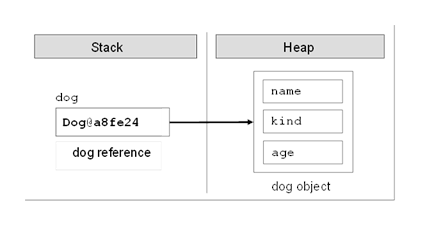
 
When we declare one variable from type a particular class, and we do not want the variable to be associated with a specific object, then we assign to it the value `null`. The reserved word `null` in the C# language means, that the variable does not point to any object (there is a missing value):

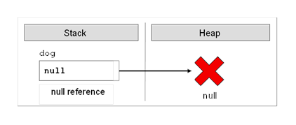
 
## Organizing Classes in Files and Namespaces

In C# the only one limitation regarding the saving of our own custom classes is: they have to be **saved in files with file extension `.cs`**. In such a file several classes, structures and other types can be defined. Although it is not a requirement of the compiler, it is recommended **every class to be stored in exactly one file, which corresponds to its name,** i.e. the class `Dog` should be saved in a file `Dog.cs`.

### Organizing Classes in Namespaces

As we should know from the chapter "Creating and Using Objects", the **namespaces in C# are named group of classes,** which are logically connected, without a requirement how they are stored in the file system.

If we want to include in our code namespaces for the operation in our classes, declared in some file or set of files, this should be done by the so named `using` **directives.** They are not required, but if they exist, they are on the first lines in the class file, before the declaration of the classes or other types. In the next paragraphs we will understand how they exactly are used.

After the insertion of the used namespaces, the next is the declaration of the **namespace** of the classes in the file. As we know, there is no requirement to declare classes in a namespace, but it is a good programming technique if we do it, because the class distribution in the namespace is used for better organization of the code and determination of the classes with equal names.

The namespaces contain classes, structure, interfaces and other types of data, and as well other namespaces. An example of nested namespace is `System`, which contains the namespace `Data`. The full name of the second namespace is `System.Data` and one is nested in the namespace `System`.

The **full name of a class** in .NET Framework is the class name, preceded by the namespace in which the class is declared, e.g.: `<namespace_name>.<class_name>`. By the using reserved word we can use types from certain namespace, without writing the full name, e.g.:

```cs
using System;
...
DateTime date;
```

Instead of:

```cs
System.DateTime date;
```

One typical declaration sequence, which we should follow when we create custom classes in `.cs` files, is:

```cs
// Using directives – optional
using <namespace1>;
using <namespace2>;

// Namespace definition - optional
namespace <namespace_name>
{
    // Class declaration
    class <first_class_name>
    {
        // ... Class body ...
    }

    // Class declaration
    class <second_class_name>
    {
        // ... Class body ...
    }

    // ...

    // Class declaration
    class <n-th_class_name>
    {
        // ... Class body ...
    }
}
```

The declaring of the namespace and the relevant include of it is already explained in the chapter "Creating and Using Objects" and therefore we will not discuss it again.

Before we continue, let’s look into the first line of the previous snippet. Instead include of namespace it is a source code comment. This is not a problem in compilation time, the comments are "removed" from the code and thus the first line is still the including statement.

<!-- Cutting this out. We don't need Cyrillic files

### Encoding of Files and Using of Cyrillic and Unicode

While we are creating a .cs file, in which to declare our classes, it is good to think about its character encoding in the file system.
In the .NET Framework the compiled code is represented in Unicode so it is possible to use characters in our code from alphabets other than Latin. In the next example we use Cyrillic letters for identifiers in Bulgarian language as well as comments in the code, written in Bulgarian (in Cyrillic letters):
using System;

public class EncodingTest
{
    // Ňĺńňîâ ęîěĺíňŕđ
    static int ăîäčíč = 4;

    static void Main()
    {
        Console.WriteLine("years: " + ăîäčíč);
    }
}
This code will compile and execute without a problem, but to keep the characters readable in the Visual Studio editor we need to provide an appropriate encoding of the file.
As we know from the "Strings" chapter, some not all characters can be stored in all encodings. If we use non-standard characters such as Chinese, Cyrillic or Arabic letters, we can use UTF-8 or other character encoding that supports these characters. By default Visual Studio uses the default character encoding (system locale) defined in the regional settings in Windows. This might be ISO-8859-1 in U.K. or U.S. and Windows-1251 in Bulgaria.
To use a different encoding other than the system’s default encoding in Visual Studio, we need to choose the appropriate encoding of the file when opening it in the editor:
    From the File menu we choose Open and then File.
    In the Open File window we click on the option next to the button Open and we choose Open With...
    From the list in the Open With window we choose an editor with encoding support, for example CSharp Editor with Encoding.
    Then press [OK].
    In the window Encoding we choose the appropriate encoding from the dropdown menu Encoding.
    Then press [OK].

 
The steps for saving files in the file system with a specific encoding are:
    From the File menu we choose Save As.
    In the window Save File As we press the drop-down box next to the button Save and choose Save with Encoding.
    In Advanced Save Options we select the desired encoding from the list (preferably the universal UTF-8).
    From the Line Endings we select the desired line ending type.
Although we have the ability to use characters from any non-English alphabet, in .cs files it is highly recommended to write all the identifiers and comments in English, because this way our code will be readable for more people in the world.
Imagine that you live in Germany and you need to type a code written by a Vietnamese person, where the names of all variables and comments are in Vietnamese. You will prefer English, right? Then think about how a developer from Vietnam will handle variables and comments in German. -->

## Modifiers and Access Levels (Visibility)

Let’s revise, from the chapter "Methods" we know that a **modifier** is a reserved word and with the help of it we add additional information for the compiler and the code related to the modifier.

In C# there are four **access modifiers:** `public`, `private`, `protected` and `internal`. The access modifiers can be used only in front the following elements of the class: class declaration, fields, properties and methods.

### Modifiers and Access Levels

As we explained, in C# there are four access modifiers – `public`, `private`, `protected` and `internal`. Based on them we control the access (visibility) to the elements of the class, in front of which they are used. The levels of access in .NET are `public`, `protected`, `internal`, `protected internal` and `private`. In this chapter we will review in details only `public`, `private` and `internal`. More about protected and `protected internal` we will learn in "Object-Oriented Programming Principles".

### Access Level "public"

When we use the modifier `public` in front of some element, we are telling the compiler, that this element **can be accessed from every class,** no matter from the current project (assembly), from the current namespace. The access level `public` defines the miss of restrictions regarding the visibility. This access level is the least restricted access level in C#.

### Access Level "private"

The access level `private` is the one, which defines **the most restrictive level of visibility** of the class and its elements. The modifier `private` is used to indicate, that the element, to which is issued, **cannot be accessed from any other class** (except the class, in which it is defined), even if this class exists in the same namespace. This is the default access level, i.e. it is used when there is no access level modifier in front of the respective element of a class (this is true only for elements inside a class).

### Access Level "internal"

The modifier `internal` is used to limit the access to the elements of the class only to files **from the same assembly,** i.e. the same project in Visual Studio. When we create several projects in Visual Studio, the classes from will be compiled in different assemblies.

### Assembly

.NET assemblies are **collections of compiled types** (classes and other types) and **resources,** which form a logical unit. Assemblies are stored in a binary file of type `.exe` or `.dll`. All types in C# and as general in .NET Framework can reside only inside assemblies. By every compilation of a .NET application one or several assemblies are created by the C# compiler and each assembly is stored inside an `.exe` or `.dll` file.

## Declaring Classes

The definition of a class is based on strict syntactical rules:

```cs
[<access_modifier>] class <class_name>
```

When we declare a class, it is mandatory to use the reserved word `class`. After it must stay the name of the class `<class_name>`.

Besides the reserved word `class` and the name of the class, in the declaration of the class can be used several modifiers, e.g. the reviewed until now modifiers.

### Class Visibility

Let’s consider two classes – `A` and `B`. We say that, class A accesses the elements of class `B`, if the first class can do one of the following:

- Creates an object (instance) from class type `B`.
- Can access distinct methods and fields in the class `B`, based on the access level assigned to the particular methods and fields.
  
There is also another operation, which can be done over the classes, when the visibility allows it. The operation is called **inheritance of a class,** but we will discuss it later in the chapter Object-Oriented Programming Principles.

As we understood, the access level term means **"visibility".** If the class `A` cannot "see" the class `B`, the access level of the methods and the fields in `B` does not matter.

The access levels, which an outer class can have, are only `public` and `internal`. Inner classes can be defined with other access levels.

#### Access Level "public"

If we declare a class access modifier as `public`, we can reach it from **every class and from every namespace,** regardless of where it exists. It means that every other class can create objects from this type and has access to the methods and the fields of the public class.

Just to know, if we want to use a class with access level `public` from other namespace, different from the current, we should use the reserved word for including different namespaces `using` or every time we should write the full name of the class.

#### Access Level "internal"

If we declare one class with access modifier `internal`, one will be **accessible only from the same namespace.** It means that only the classes from the same assembly can create objects from this type class and to have access to the methods and fields (with related access level) of the class. This access level is the default, where it is not used access modifier by the declaration of the class.

If we have two projects in common solution in Visual Studio and we want to use a class from one project into the other one then the referenced class should be declared as `public`.

#### Access Level "private"

If we want to be exhaustive, we have to mention that as access modifier for a class can be used the visibility modifier `private`, but this is related to the term "inner class" (nested class), which we will review in the "Nested Classes" section. Private classes like other private members are accessible only inside the class which defined them.

### Body of the Class

By similarity to the methods, after the declaration of the class follows its body, i.e. the part of the class where resides the following programming code:

```cs
[<access_modifier>] class <class_name>
{
    // ... Class body – the code of the class goes here ...
}
```

The body of the class begins with opening curly bracket "`{`" and ends with closing one – "`}`". The class always should have a body.

### Class Naming Convention

Equal to the methods, for creation of the class names there are the following common standards:

- The names of the classes begin with capital letter, and the rest of the letters are lower case. If the name of the class consists of several words, every word begins with capital letter, without separator to be used. This is the well-known **PascalCase** convention.
- For name of the classes **nouns** are usually used.
- It is recommended the name of the class to be in **English** language.

Here are some example class names, which are following the guidelines:

```console
Dog
Account
Car
BufferedReader
```

More about the name of the classes we will learn in the chapter "High-Quality Programming Code".

## The Reserved Word "this"

The reserved word `this` in C# is used to **reference the current object,** when one is used from method in the same class. This is the object, which method or constructor is called. The reserved word can be deemed as an address (reference), given priory from the language authors, with which we access the elements (fields, methods, constructor) of the own class:

```cs
this.myField; // access a field in the class
this.DoMyMethod(); // access a method in the class
this(3, 4); // access a constructor with two int parameters
```

Currently, we will not explain the given code above. Later, we will do it in other sections of this chapter, dedicated to the elements of the class (fields, methods, constructors) and as well related to the reserved word `this`.

## Fields

Objects describe things from the real world. In order to describe an object, we focus on its **characteristics,** which are related to the problems solved in our program. These characteristics of the real-world object we will hold in the declaration of the class in special types of variables. These variables, called **fields** (or member-variables), are holding the **state of the object.** When we create an object based on certain class definition, the values of the fields are containing the characteristics of the created object (its state). These characteristics have different values different for the different objects.

### Declaring Fields in a Class

Until now we have discussed only two types of variables (see "Methods") depending on where they are declared:

- **Local variables** – these are the variables declared in the body of some method (or block).
- **Parameters** – these are the variables in the list of parameters, which one method can have.

In C# a third type of variable exists, called **field** or **instance variable.**

Fields are declared in the body of the class, outside the body of a single method or constructor.

| :warning: | Fields are declared in the body of the class but not in the bodies of the methods or the constructors. |
|:--:|:--|

This is a sample code declaring several fields:

```cs
class SampleClass
{
    int age;
    long distance;
    string[] names;
    Dog myDog;
}
```

More formal, the declaration of a field is done in the following way:

```cs
[<modifiers>] <field_type> <field_name>;
```

The `<field_type>` part determines the type of a given field. This type can be primitive (`byte`, `short`, `char` and so on), an array, or also some class type (e.g. `Dog` or `string`).

The `<field_name>` part is the name of the field. As the name of the normal variables, when we declare the name of the instance-variables, we should obey the rules for naming of identifiers in C# (see chapter "Primitive Types and Variables").

The `<modifiers>` part is a definition, which describes the access modifiers and as well other modifiers. The last ones are not a mandatory part of the field declaration.

Modifiers and the access modifiers, allowed in the declaration of one field, are explained in chapter "Primitive Types and Variables".

In this chapter, from the other modifiers, which are not based on access levels, and can be used in the declaration of fields, we will discuss `static`, `const` and `readonly`.

#### Scope

The **scope of a class field** starts from the line where is declared and ends at the closing bracket of the body of the class.

### Initialization during Declaration

When we declare one field it is possible to assign to it an initial value. We do this similarly to an assignment of normal local variable:

```cs
[<modifiers>] <field_type> <field_name> = <initial_value>;
```

Of course, the `<initial_value>` has to be a type compatible with the field’s type, e.g.:

```cs
class SampleClass
{
    int age = 5;
    long distance = 234; // The literal 234 is of integer type

    string[] names = new string[] { "Peter", "Martin" };
    Dog myDog = new Dog();

    // ... Other code ...
}
```

### Default Values of the Fields

Every time, when we create a new object of a given class, it is allocated memory in the heap for every field from the class. In order this to be done the memory is **initialized automatically with the default values** for the certain field. The fields, which do not have explicitly a default value in the code, use the default value specified for the .NET type, to which they belong.

This is different for the local variables defined in methods. If a local variable in a method does not have a value assigned, the code will not compile. If a member variable (field) in a class does not have a value assigned, it will be automatically zeroed by the compiler.

| :warning: | When an object is created all of the fields are initialized with their respective default values in .NET, except if they are not explicitly initialized with some other value. |
|:--:|:--|

In some languages (as C and C++) the newly created objects are not initialized with default values of theirs data and this creates conditions for hard-to-find errors. The last leads to **uncontrolled behavior,** where the program sometimes works correctly (when the allocated memory by chance has good values), and sometimes does not work (when the allocated memory does not contain the proper values). In C# and generally in .NET Framework this problem is solved by the default values for each type coming from the framework.

The value of all types is 0 or something similar. For the most used types these values are as the follows:

Type of the Field | Default Value
------------------|--------------
`bool` | `false`
`byte` | `0`
`char` | `'\0'`
`decimal` | `0.0M`
`double` | `0.0D`
`float` | `0.0F`
`int` | `0`
`object reference` | `null`

For more detailed information you can check chapter "Primitive Types and Variables" and its section about the primitive types and their default values.

For example, if we create a class `Dog` and we define for it fields `name`, `age` and `length` and `isHungry`, without explicitly initializing them, they will be automatically zeroed when we create an object of this class:

```cs
public class Dog
{
    string name;
    int age;
    int length;
    bool isHungry;

    static void Main()
    {
        Dog dog = new Dog();
        Console.WriteLine("Dog's name is: " + dog.name);
        Console.WriteLine("Dog's age is: " + dog.age);
        Console.WriteLine("Dog's length is: " + dog.length);
        Console.WriteLine("Dog is hungry: " + dog.isHungry);
    }
}
```

Respectively, when we execute the program we will have as output the following:

```console
Dog's name is:
Dog's age is: 0
Dog's length is: 0
Dog is hungry: False
```

### Automated Initialization of Local Variables and Fields

If we define a local variable in one method, without initializing it, and afterward we try to use it (e.g. printing its value), this will trigger a **compilation error,** because the local variables are not initialized with default values when they are declared.

| :warning: | Unlike fields, local variables are not initialized with default values when they are declared. |
|:--:|:--|

Let’s have look into one example:

```cs
static void Main()
{
    int notInitializedLocalVariable;
    Console.WriteLine(notInitializedLocalVariable);
}
```

If we try to compile, we will receive the following error:

```console
Use of unassigned local variable 'notInitializedLocalVariable'
```

### Custom Default Values

A good programming practice is, when we declare fields in the class, to explicitly initialize them with some default value, even if the default value is zero. This will make our code clearer and easy to read.

One example for such initialization is the modified example class `SampleClass` from the previous section:

```cs
class SampleClass
{
    int age = 0;
    long distance = 0;
    string[] names = null;
    Dog myDog = null;

    // ... Other code ...
}
```

### Modifiers "const" and "readonly"

As was explained in the beginning in this section, in the declaration of one field is allowed to use the modifications `const` and `readonly`. The fields, declared as `const` or `readonly` are called **constants.** They are used when a certain **value is used several times.** These values are declared only ones without repetitions. Examples of constants in the .NET Framework are the mathematical constants `Math.PI` and `Math.E`, and as well the constants `String.Empty` and `Int32.MaxValue`.

#### Constants Based on "const"

The fields, declared with `const`, have to be initialized during the de facto declaration and afterwards theirs value cannot be changed. They can be accessed without to create an instance (an object) of the class and they are common for all created objects in our program. Something more, when we compile the code, the places where `const` fields are referred are replaced with theirs particular values directly without to use the constant variable at all. For this reason the `const` fields are called **compile-time constants,** because they are replaced with the value during the compilation process.

#### Constants Based on "readonly"

The modifier `readonly` creates fields, which values cannot be changed once they are assigned. Fields, declared as `readonly`, allow one-time initialization either in the moment of the declaration or in the class constructors. Later theirs values cannot be changed. Because of this reason, the `readonly` fields are called **run-time constants** – constants, because their values cannot be changed after assignment and run-time, because this process happens during the execution of the program (in runtime).

Let’s illustrate the foregoing with the following example:

```cs
public class ConstAndReadOnlyExample
{
    public const double PI = 3.1415926535897932385;
    public readonly double Size;

    public ConstAndReadOnlyExample(int size)
    {
        this.Size = size; // Cannot be further modified!
    }

    static void Main()
    {
        Console.WriteLine(PI);
        Console.WriteLine(ConstAndReadOnlyExample.PI);
        ConstAndReadOnlyExample instance =
            new ConstAndReadOnlyExample(5);
        Console.WriteLine(instance.Size);

        // Compile-time error: cannot access PI like a field
        Console.WriteLine(instance.PI);

        // Compile-time error: Size is instance field (non-static)
        Console.WriteLine(ConstAndReadOnlyExample.Size);

        // Compile-time error: cannot modify a constant
        ConstAndReadOnlyExample.PI = 0;

        // Compile-time error: cannot modify a readonly field
        instance.Size = 0;
    }
}
```

## Methods

In chapter "Methods" we have discussed how to **declare and use a method.** In this section we will revise how we do this and we will focus on some additional features from the process of creating methods. Till now we have used static methods only. Now it is time to start using non-static (instance) methods.

### Declaring of Class Method

The declaration of methods is done in the following way:

```cs
// Method definition
[<modifiers>] [<return_type>] <method_name>([<parameters_list>])
{
    // ... Method's body ...
    [<return_statement>];
}
```

The mandatory elements for declaration of a method are the type of the return value `<return_type>`, the name of the method `<method_name>` and the opening and the closing brackets – "`(`" and "`)`".

The parameter list `<params_list>` is not mandatory. We use it to pass data to the method, which we declare, when this is required.

We know, if the return type `<return_type>` is `void`, then `<return_statement>` can be declared without the `return` statement. If `<return_type>` is different from `void`, the method has to return a result with the help of the reserved word `return` and an expression, which is from the type `<return_type>` or a compatible one.

The work, which the method has to do, is situated in the method body, enclosed in curly brackets – "`{`" and "`}`".

We already discussed some of the access modifiers that can be used in the declaration of a method in the section "Visibility of Methods and Fields" we will review in details this again.

The `static` modifier will be explained in depth in the section "Static Classes and Static Members".

#### Example – Method Declaration

Let’s see the declaration of a method, which sums two values:

```cs
int Add(int number1, int number2)
{
    int result = number1 + number2;
    return result;
}
```

The name of the method is `Add` and the return value type is `int`. The parameter list consists of two elements – the variables `number1` and `number2`. Accordingly, the return value is the sum of the two parameters as a result.

## Accessing Non-Static Data of the Class

In "Creating and Using Objects", we have discussed how based on the "dot" operator we can access fields and to call the methods of a given class. Now, let’s recall how we use conventional non-static methods of a given class, i.e. the methods do not have the modifier `static` in theirs declaration.

E.g. let’s have the class `Dog` with the field `age`. To print the value of this field we need to create a `Dog` instance and access the field of this instance via a "dot" notation:

```cs
public class Dog
{
    int age = 2;

    static void Main()
    {
        Dog dog = new Dog();
        Console.WriteLine("Dog's age is: " + dog.age);
    }
}
```

The result will be:

```console
Dog's age is: 2
```

### Accessing Non-Static Fields from Non-Static Method

The access to the value of one field can be done via the "dot" notation (as in the last example `dog.age`), or via a method or property. Now, let’s create in the class `Dog` a method, which will return the value of `age`:

```cs
public int GetAge()
{
    return this.age;
}
```

As we see, to access the value of the age field, inside, from the owner class, we use the **reserved word `this`.** We know that the word `this` is a reference to the current object, in which the method resides. Therefore, in our example, with "`return this.age`", we say "from the current object (`this`) take (the use of the operator "dot"), the value of the field `age`, and return it as result from the method (with the help of the reserved word return). Then, instead from the `Main()` method to access the values of the field `age` of the object `dog`, we simple call the method `GetAge()`:

```cs
static void Main()
{
    Dog dog = new Dog();
    Console.WriteLine("Dog's age is: " + dog.GetAge());
}
```

The result of the execution based on the change will be the same.

Formally, the declaration of access to a field in the boundaries of a class is the following:

```cs
this.<field_name>
```

Let’s emphasize, that this access option is possible only from non-static code, i.e. method or block, which is without `static` modifier.

Except for retrieving of the value of one field, we can use the reserved word `this` for modification of the field.

E.g., let’s declare a method **MakeOlder(),** which will be called every year on the date of the birthday of our pet and this method will increment the age with one year:

```cs
public void MakeOlder()
{
    this.age++;
}
```

To check if this is correct in the `Main()` method we add the following lines:

```cs
// One year later, at the birthday date...
dog.MakeOlder();
Console.WriteLine("After one year dog's age is: " + dog.age);
```

After the execution of the program, the result is the following:

```console
Dog's age is: 2
After one year dog's age is: 3
```

### Calling Non-Static Methods

Like the fields, which do not have `static` modifier in theirs declarations, the methods, which are also non-static, can be called in the body of a class via the reserved word `this`. This is happening again with the "dot" notation and more specifically with the required arguments (if there are any):

```cs
this.<method_name>(...)
```

For example, let’s create a method `PrintAge()`, which prints the age of the object from type `Dog`, and for this purpose calls the method `GetAge()`:

```cs
public void PrintAge()
{
    int myAge = this.GetAge();
    Console.WriteLine("My age is: " + myAge);
}
```

The first line of the example is indicating that we want to receive the age (the value of the field `age`) of the current object, using the method `GetAge()`. This is done via the reserved word `this`.

| :warning: | The access to the non-static elements of a class (fields and methods) is done via the reserved word this and the operator for access – "dot". |
|:--:|:--|

### Skip "this" Keyword When Accessing Non-Static Data

When we access the fields of a class or we call its non-static methods, it is possible to **omit the reserved word `this`.** Then both methods, which we already declared will be written in this way:

```cs
public int GetAge()
{
    return age; // The same like this.age
}

public void MakeOlder()
{
    age++; // The same like this.age++
}
```

The reserved word `this` is used to indicate **explicitly** that we want to have access to a non-static field of a class or to call some of its non-static methods. When this explicit clarification is not needed, it can be skipped and directly to access the elements of the class.

Although it is understood clearly, the reserved word `this` is often used for access to fields in the class, because it helps to make the code easier to read, understand and maintain, by explicitly stating that we access a field and not a local variable.

| :warning: | When it is not required explicitly the reserved word `this` can be skipped when we access the elements of the class. For better readability use `this` keyword even when not required. |
|:--:|:--|

## Hiding Fields with Local Variables

From the section "Declaring Fields" above, we know that the **scope of one field** starts from the line where the declaration is made to the closing curly bracket of the class. For example let's see the `OverlappingScopeTest` class:

```cs
public class OverlappingScopeTest
{
    int myValue = 3;

    void PrintMyValue()
    {
        Console.WriteLine("My value is: " + myValue);
    }

    static void Main()
    {
        OverlappingScopeTest instance = new OverlappingScopeTest();
        instance.PrintMyValue();
    }
}
```

This code will have the following result on the console:

```console
My value is: 3
```

On the other hand, when we implement the body of one method we have to declare local variables which we will use for the work of the method. As we know, the **scope of a local variable** begins from the line where it is declared to the closing bracket of the body of the method. For example, let’s add this method to the class `OverlappingScopeTest`:

```cs
int CalculateNewValue(int newValue)
{
    int result = myValue + newValue;
    return result;
}
```

In this case, the local variable, which we will use to calculate the new value, is `result`.

Sometimes the name of the local variable can overlap with the name of some field. In this case there is a collision.

Let’s first look at one example, before we explain what it is about. Let’s modify the method `PrintMyValue()` in the following way:

```cs
void PrintMyValue()
{
    int myValue = 5;
    Console.WriteLine("My value is: " + myValue);
}
```

If we declare in this way the method, could it be possible to compile this code? And if it is compiled, is it possible to execute it? If it is compiled and executed which value will be printed – the one of the field or the one of the local variable?

After the execution of the `Main()` method, the result will be:

```console
My value is: 5
```

This is so, because **C# allows defining local variables, which names match with fields of the class.** If this happens, we say that the scope of the local variable overlays the field variable (**scope overlapping**).

Therefore the scope of the local variable `myValue` with value 5 overlapped the scope of the field variable in the class. Then, when we print we will get the local variable value.

Despite this, sometimes it is required use the field instead the local variable with the same name. In this case, to retrieve the value of the field, we use the reserved word `this`. For this purpose we access the field by using the "dot" operator, applied to the reserved word `this`. In this way, we say deliberately that we want to use the field of the class, and not the local variable with the same name.

Let’s take a look again at our example relate to the printing of the value `myValue`:

```cs
void PrintMyValue()
{
    int myValue = 5;
    Console.WriteLine("My value is: " + this.myValue);
}
```

This time, after we applied the changes, the result from the call of the method is different:

```console
My value is: 3
```

## Visibility of Fields and Methods

In the beginning of this chapter we have discussed the generality of the **modifiers and the access levels** for the elements in one class in C#. Later we have discussed the access level in the declaration for one class.

Now we will discuss the **visibility levels of fields and methods** in a class. Because the fields and the methods are elements of the class (members) and have similar rules for access levels, we will expose these rules simultaneously.

Differently from the declaration of a class, when we declare fields and methods in the class we can use the four access levels – `public`, `protected`, `internal` and `private`. The access level `protected` will not be discussed in this chapter, because it is related to class inheritance and is explained in details in the chapter "Object-Oriented Programming Principles".

Before we continue, let’s revise, if one class `A` is not visible (does not have access) from other class `B`, then none of its elements (fields and method) can be accessed from class `B`.

| :warning: | If two classes are not visible one to other, then their members (fields and methods) are not visible also, regardless of what kind of access levels their elements have. |
|:--:|:--|

In the next subsections, to the explanations until now, we will review examples, in which we have two classes (`Dog` and `Kid`) and which are visible one to other, i.e. every from the classes can create objects from the other type – the other class and to access its elements depending from the defined access level declared. Here is how the first class `Dog` looks like:

```cs
public class Dog
{
    private string name = "Doggy";

    public string Name
    {
        get { return this.name; }
    }

    public void Bark()
    {
        Console.WriteLine("wow-wow");
    }

    public void DoSomething()
    {
        this.Bark();
    }
}
```

In addition to the fields and the methods the property `Name` is used, which just returns the field’s value. We will discuss in details the property concept later, so currently we will just focus on everything else except the properties.

The code of the class `Kid` looks like this:

```cs
public class Kid
{
    public void CallTheDog(Dog dog)
    {
        Console.WriteLine("Come, " + dog.Name);
    }

    public void WagTheDog(Dog dog)
    {
        dog.Bark();
    }
}
```

Currently, all elements (fields and methods) of both classes are declared with access modifier `public`, but when we discuss the other access modifiers we will change some of them accordingly. What we would like to find is how the change in the access levels of the elements (fields and methods) of the class `Dog` will be reflected, when the access is made with:

- The own body of the class Dog.
- The body of the class `Kid`, respectively, taking into account that `Kid` is in the same namespace (or assembly), in which the `Dog` class is defined or not.

### Access Level "public"

When a method or a value of a class is declared with access level `public`, the last **can be used from other classes,** independently from the fact if another class is declared in the same namespace, assembly or outside of it.

Let’s review both type of access to members of a class, which are matched in our classes `Dog` and `Kid`:

- The access to the member of the class is done inside the same class **directly** (the class refers itself).
- The access to the member of the class is done via a **reference** to an object created in the body of another class (the class refers another class).
When the members of both classes are public, we have the following:

| Dog.cs |
|---|

```cs
class Dog
{
    public string name = "Doggy";

    public string Name
    {
        get { return this.name; }        // Direct access
    }

    public void Bark()
    {
        Console.WriteLine("wow-wow");
    }

    public void DoSomething()
    {
        this.Bark();                     // Direct Access
    }
}
```

| Kid.cs |
|---|

```cs
class Kid
{
    public void CallTheDog(Dog dog)
    {
        Console.WriteLine("Come, " + dog.name);  // Reference Access
    }
    public void WagTheDog(Dog dog)
    {
        dog.Bark();                              // Reference Access
    }
}
```

As we can see, we implement without problem the access to the field `name` and the method `Bark()` of the class `Dog` from the body of the same class. Independently, if the namespace of the class `Kid` is the same as `Dog`, we can, from its body, access the field `name` and to call the method `Bark()` via the "dot" operator, applied to the reference `dog` of the object from type `Dog`.

### Access Level "`internal`"

When a member of some class is declared with access level `internal`, then this element from the class **can be accessed from every class in the same assembly** (i.e. in the same project in Visual Studio), but not from classes outside it (i.e. from other projects in Visual Studio – from the same solution or from a different solution).

Not that if we have a Visual Studio project, all classes in it are from the same assembly and classes defined in different Visual Studio projects (in the same or in a different solution) are from different assemblies.

Below is the explanation about the access level `internal`:

| Dog.cs |
|---|

```cs
class Dog
{
    internal string name = "Doggy";

    public string Name
    {
        get { return this.name; }        // Direct Access
    }

    internal void Bark()
    {
        Console.WriteLine("wow-wow");
    }

    public void DoSomething()
    {
        this.Bark();                     // Direct Access
    }
}
```

Respectively, for the class `Kid`, we discuss two cases:

- When the class in **the same assembly,** then the access to the elements of `Dog` will be allowed, independent of whether the classes are in the same namespace or not:

    | Kid.cs |
    |---|

    ```cs
    class Kid
    {
        public void CallTheDog(Dog dog)
        {
            Console.WriteLine("Come, " + dog.name);  // Reference Access
        }

        public void WagTheDog(Dog dog)
        {
            dog.Bark();                              // Reference Access
        }
    }
    ```

- When the class `Kid` is **external for the assembly,** in which `Dog` is declared, then the access to the field `name` and the method `Bark()` will be denied:

    | Kid.cs |
    |---|

    ```cs
    class Kid
    {
        public void CallTheDog(Dog dog)
        {
            Console.WriteLine("Come, " + dog.name);   // NOT ALLOWED
        }

        public void WagTheDog(Dog dog)
        {
            dog.Bark();                               // NOT ALLOWED
        }
    }
    ```

Actually the access level `internal` for members of the class `Dog` is impossible for two reasons: insufficient visibility of the class and insufficient visibility of its members. To allow access from other assembly to the class `Dog`, one is required to be declared `public` and in the same time its members to be declared as `public`. If the class or its members have lower visibility, the access to it from other assemblies is denied (i.e. from other Visual Studio projects which compile to different `.dll` / `.exe` file).

If we try to compile the class `Kid`, when one is external for the assembly, in which the class `Dog` resides, we will get a compilation error.

### Access Level "`private`"

The access level, which is **the most restrictive,** is `private`. The elements of the class, which are declared with access modifier `private` (or without any, because `private` is the default one), **cannot be accessed outside of the class** in which they are declared.

Therefore, if we declare the field `name` and the method `Bark()` of the `class` Dog with access modifier `private`, there is no problem to access them from the same instance of the class `Dog`, but access from any other classes is not permitted. If you try to access a private method from external class, a compilation error occur. Below is the figure about the access level `private`:

| Dog.cs |
|---|

```cs
class Dog
{
    private string name = "Doggy";

    public string Name
    {
        get { return this.name; }        // Direct Access
    }

    private void Bark()
    {
        Console.WriteLine("wow-wow");
    }

    public void DoSomething()
    {
        this.Bark();                     // Direct Access
    }
}
```

Accessing the `name` fields from the same class is permitted, but accessing it from a different class (`Kid`) is restricted:

| Kid.cs |
|---|

```cs
class Kid
{
    public void CallTheDog(Dog dog)
    {
        Console.WriteLine("Come, " + dog.name);  // NOT ALLOWED
    }

    public void WagTheDog(Dog dog)
    {
        dog.Bark();                              // NOT ALLOWED
    }
}
```

We should know, when we assign access modifier to a filed, one in most of the cases has to be `private`, because this ensures the highest level of security applied to the field. Respectively, the access and the modification of the value from other classes (if it is required) will be done only via properties or methods. More about this technique we will learn in the section "Properties and Encapsulation of Fields" as well as in the "Encapsulation" section of the chapter "Object-Oriented Programming Principles".

### How to Decide Which Access Level to Use?

Before we end up the section regarding visibility of the elements of a class, let’s try something. Let’s define in the class `Dog` the field `name` and the method `Bark()` witch access modifier `private`. Let’s also declare the method `Main()` with the following body:

```cs
public class Dog
{
    private string name = "Doggy";

    // ...

    private void Bark()
    {
        Console.WriteLine("wow-wow");
    }

    // ...

    static void Main()
    {
        Dog myDog = new Dog();
        Console.WriteLine("My dog's name is " + myDog.name);
        myDog.Bark();
    }
}
```

The question is, if the class `Dog` can compile when we have declared the elements with access modifier private and in the same time is applied a "dot" notation to `myDog` in `Main()`?

The **compilation finished successfully.** Respectively, the result from the execution of the method `Main()` which is declared in the class `Dog` will be the following:

```console
My dog's name is Rolf
Wow-wow
```

Everything works, because the access modifiers for the elements of the class are applied to the class and not to a level objects. Because the variable `myDog` is defined in the body of the class `Dog` (where also is situated `Main()` – the start method of the program), we can access its elements (fields and methods) via "dot" notation, regardless we have declared the access level as `private`. If we try to do the same in the body of the class Kid, this will be not possible, because the access to `private` fields from outside class is forbidden.

## Constructors

In object-oriented programming, when creating an object from a given class, it is necessary to call a special method of the class known as a **constructor.**

### What Is a Constructor?

**Constructor** of a class is a pseudo-method, which does not have a return type, has the name of the class and is **called using the keyword `new`.** The task of the constructor is to initialize the memory, allocated for the object, where its fields will be stored (those which are not `static` ones).

### Calling a Constructor

The only one way to **call a constructor** in C# is through the **keyword `new`.** It allocates memory for the new object (in the stack or in the heap, depending on whether the object is a value type or a reference type), resets its fields to zero, calls their constructors (or chain of constructors, formed in succession), and at the end returns a reference to the newly created object.

Consider an example, which will clarify how the constructor works. We know from chapter "Creating and Using Objects" how to create an object:

```cs
Dog myDog = new Dog(); 
```

In this case by using the keyword `new` we call the constructor of the class `Dog` and by doing this, memory is allocated, needed for the newly created object of the `Dog` type. When it comes to classes they are allocated in the dynamic memory (in the so called "managed heap").

Let’s follow the process of calling a constructor during the creation of new object step by step.

First, **memory is allocated** for the object:

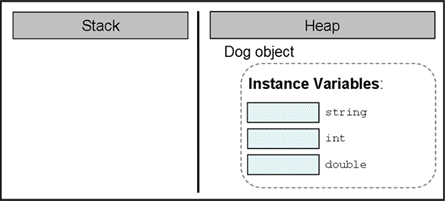
 
Next, its **fields (if any) are initialized with the default values** for their respective types:

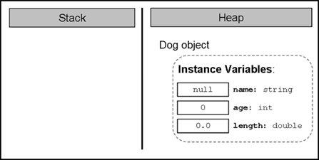
 
If the creation of the new object is successfully completed, the **constructor returns a reference** to it, which is assigned to the variable `myDog`, from class type `Dog`:

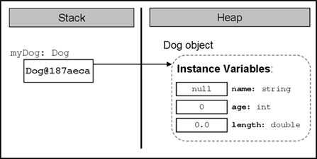
 
### Declaring a Constructor

If we have the class `Dog`, here is how its most simplified constructor (without parameters) will look like:

```cs
public Dog()
{
}
```

Formally, the declaration of the constructor appears in the following way:

```cs
[<modifiers>] <class_name>([<parameters_list>])
```

As we already know, the constructors are similar to methods, but they **do not have a return type** (therefore we called them pseudo-methods).

### Constructor’s Name

In C# it is mandatory that **the name of every constructor matches the name of the class in which it resides** – `<class_name>`. In the example above the name of the constructor is the same as the name of the class – `Dog`. We should know that, as with methods, the name of the constructor is always followed by round brackets – "`(`" and "`)`".

In (C#) it **is not allowed to declare a method whose name matches the name of the class** (hence the name of the constructors). If nevertheless, a method is declared with the class name, this will cause a compilation error.

```cs
public class IllegalMethodExample
{
    // Legal constructor
    public IllegalMethodExample ()
    {
    }

    // Illegal method
    private string IllegalMethodExample()
    {
        return "I am illegal method!";
    }
}
```

When we try to compile this class the compiler will display the following **compilation error message:**

```console
SampleClass: member names cannot be the same as their enclosing type
```

### Parameter List

Similar to the methods, if we need extra data to create an object, the constructor gets it through a **parameter list** – `<parameters_list>`. In the example constructor of the class `Dog` there is no need of additional data to create an object of this type and therefore there is no parameter list. More about the parameter list will be explained in one of the later sections –"Declaring a Constructor with Parameters".

Of course, after the declaration of the constructor its body is following, which is like every method body in C#, but generally contains mostly initialization logic, i.e. setting the initial values of the fields of the class.

### Modifiers

It is evident that **modifiers** can be added in the declaration of the constructors – `<modifiers>`. For modifiers that we know and which are not access modifiers, i.e. `const` and `static`, we should know that only `const` is not allowed to be used in constructors. Later in this chapter, in the "Static Constructors" section we will learn more about the constructors declared with modifier `static`.

### Visibility of the Constructors

Similar to the methods and the fields, the constructors can be declared with **levels of visibility:** `public`, `protected`, `internal`, `protected internal` and `private`. The access levels `protected` and `protected internal` will be explained in chapter "Object-Oriented Programming Principles". The rest of the access levels have the same meaning and behavior as with fields and methods.

### Initialization of the Fields in the Constructor

As explained earlier when creating a new object and calling its constructor, a new memory is allocated for the non-static fields of the object of the class and they are **initialized with the default values** for their types (see the section "Calling a Constructor").

Furthermore, through the constructors we mainly initialize the fields of the class with values set by us and not with the default ones.

E.g., in the examples we discussed so far, the field name of the object from type `Dog` is always initialized during its declaration:

```cs
string name = "Sharo";
```

Instead of doing this during the declaration of the field, a better programming style is to assign its value in the constructor:

```cs
public class Dog
{
    private string name;

    public Dog()
    {
        this.name = "Sharo";
    }

    // ... The rest of the class body ...
}
```

Although we initialize the fields in the constructor, some people recommend **explicitly assigning their type’s default values** during initialization with the purpose of improving the readability of the code, but it is a matter of personal choice:

```cs
public class Dog
{
    private string name = null;

    public Dog()
    {
        this.name = "Sharo";
    }

    // ... The rest of the class body ...
}
```

### Fields Initialization in the Constructor

Let’s see in details what the constructor does after being called and the class fields have been initialized in its body. We know that, when called, it will **allocate memory** for each field and **this memory will be initialized** with the default values.

If the fields are of primitive type, then after the default values, we shall assign new values.

In case the fields are from reference type, such as our field `name`, the constructor will initialize them with `null`. It will then create the object of the corresponding type, in this case the string "Sharo" and at the end a reference will be assigned to the new object in the respective field, in our case the field `name`.

The same will happen if we have other fields, which are not primitive types, and then initialize them in the constructor. E.g. let’s have a class called Collar, which describes a dog’s accessory – `Collar`:

```cs
public class Collar
{
    private int size;

    public Collar()
    {
    }
}
```

Let our class `Dog` has a field called `collar`, which is from type Coll`ar and which is initialized in the constructor of the class:

```cs
public class Dog
{
    private string name;
    private int age;
    private double length;
    private Collar collar;

    public Dog()
    {
        this.name = "Sharo";
        this.age = 3;
        this.length = 0.5;
        this.collar = new Collar();
    }

    static void Main()
    {
        Dog myDog = new Dog();
    }
}
```

### Representation in the Memory

Let’s follow the steps through which the constructor goes, after being called in the `Main()` method. As we know, as a first step it will **allocate memory in the heap** for all the fields and will initialize them with their default values:

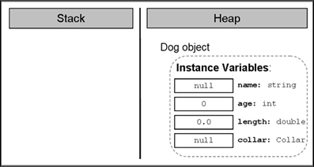
 
Then, the constructor will have to ensure the creation of the object for the field `name`. It will **call the constructor of the class** `string`, which will do the work on the string creation):

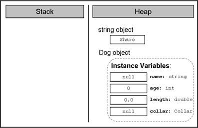
 
Now the constructor will keep the reference to the new string in the field `name` of the Dog object:

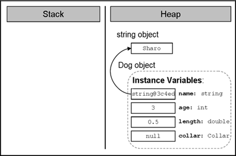
 
Then is the creation of the object from type `Collar`. Our constructor (of the class `Dog`) calls the constructor of the class `Collar`, which allocates memory for the object:

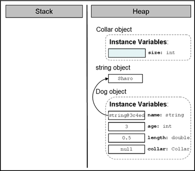
 
Next, the constructor will **initialize it with the default value** for the respective type. The size of the Collar is not explicitly assigned so it will take the default value for its type (0 for int):

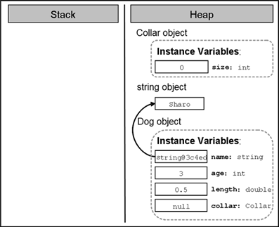
 
After that the reference to the newly created object, which the constructor of the class `Collar` returns as a result, **will be assigned to the field `collar`:**

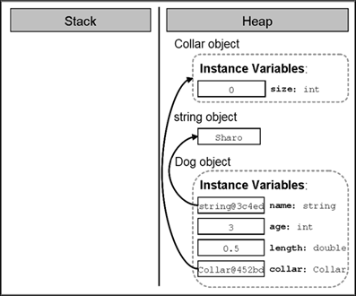
 
Finally, the reference to the new object from type `Dog` **will be assigned to the local variable** `myDog` in the method `Main()`:

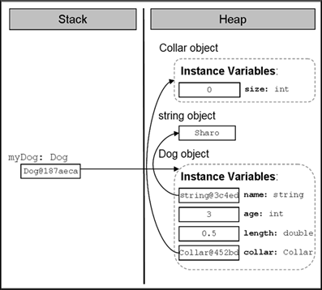
 
### Order of Initialization of the Fields

To avoid confusion, let’s explain the **order in which the fields of a class are initialized** regardless of whether we have assigned to them values and / or initialized them in the constructor.

First **memory is allocated** for the respective field in the heap and this memory is **initialized** with the default value of the field type. E.g. let’s again consider the example with the class `Dog`:

```cs
public class Dog
{
    private string name;

    public Dog()
    {
        Console.WriteLine(
            "this.name has value of: \"" + this.name + "\"");
        // ... No other code here ...
    }
    // ... Rest of the class body ...
}
```

When we try to create a new object of our class type the console will show:

```console
this.name has value of: "" 
```

After the initialization of the fields with the default value for the respective type, the second step in CLR (Common Language Runtime) is to **assign a value to the field** if such has been set when declaring the field.

So, if we change the line in the class `Dog`, where we declare the field `name`, it will first be initialized with the value `null` and then it will be assigned the value "Rex".

```cs
private string name = "Rex";
```

Respectively, for every creation of a new object of the class:

```cs
static void Main()
{
    Dog dog = new Dog();
}
```

The following will be printed:

```console
this.name has value of: "Rex"
```

Only after these two steps of initializing the fields of the class (default value initialization and possibly the value set by the programmer during the declaration of the field) **the constructor of the class is called.** At this time, the fields get the values, which are set in the body of the constructor.

### Declaring a Constructor with Parameters

In the previous section, we saw how we can set values to the fields, other than the default values. Very often, however, during the declaration of the constructor, we don’t know what values the various fields will take. To tackle this problem, the required information, **similar to the methods with parameters,** the fields are assigned the values, given to them in the body of the constructor. For example:

```cs
public Dog(string dogName, int dogAge, double dogLength)
{
    name = dogName;
    age = dogAge;
    length = dogLength;
    collar = new Collar();
}
```

Similarly, the **call of a constructor with parameters** is done in the same way as the call of method with parameters – the required values are supplied as a list, the elements of which are separated with commas:

```cs
static void Main()
{
    Dog myDog = new Dog("Moby", 2, 0.4); // Passing parameters

    Console.WriteLine("My dog " + myDog.name +
        " is " + myDog.age + " year(s) old. " +
        " and it has length: " + myDog.length + " m.");
}
```

The result of the execution of this `Main()` method is the following:

```console
My dog Moby is 2 year(s) old. It has length: 0.4 m.
```

There is no limitation for the number of the constructors of a class in C#. The only requirement is that they **differ in their signature** (what signature is we already explained in chapter "Methods").

### Scope of Parameters of the Constructor

By analogy with the scope of the variables in the parameter list of a method, the **variables in the parameter list of one constructor have a scope** from the opening bracket of the constructor to the closing bracket, i.e. throughout the body of the constructor.

Very often, when we declare a constructor with parameters it is possible to name the variables from the parameter list with **the same names** as the names of the fields, which are going to be initialized. Let’s, for example, consider the constructor of the class `Dog`:

```cs
public Dog(string name, int age, double length)
{
    name = name;
    age = age;
    length = length;
    collar = new Collar();
}
```

Let’s compile and execute the `Main()` method declared a little bit above:

```console
My dog is 0 year(s) old. It has length: 0 m
```

Strange result, isn’t it? In fact this result is not so awkward. The explanation is the following: the scope, in which the variables from the list of the constructor parameters are acting, overlaps the scope of acting of the fields with the same names in the constructor. Thus, **we do not assign any value to the fields** because in practice we have no access to them. For example, instead of assigning the variable value to the field `age`, we assign the value of the variable `age` to the variable itself:

```cs
age = age;
```

As we saw from the section "Hiding Fields with Local Variables", to avoid this problem we should access the field, to which we want to assign a value, **using the keyword `this`:**

```cs
public Dog(string name, int age, double length)
{
    this.name = name;
    this.age = age;
    this.length = length;
    this.collar = new Collar();
}
```

Now, assuming we execute again the `Main()` method:

```cs
static void Main()
{
    Dog myDog = new Dog("Moby", 2, 0.4);

    Console.WriteLine("My dog " + myDog.name +
        " is " + myDog.age + " year(s) old. " +
        " and it has length: " + myDog.length + " m");
}
```

The result will be exactly what we expect it to be:

```console
My dog Moby is 2 year(s) old. It has length: 0.4 m
```

### Constructor with Variable Number of Arguments

Similar to methods with **variable number of arguments,** discussed in chapter "Methods", constructors can also be declared with a parameter for a variable number of arguments. The rules for declaring and calling constructors with a variable number of arguments are the same as the ones, described for declaring and calling with the methods:

1. When we declare a constructor with variable number of arguments, we must use the **reserved word `params`,** and then insert the type of the parameters, followed by square parentheses. Finally the name of the array follows, in which array the arguments used for the calling of the method are stored. For example for whole number arguments we can use `params int[] numbers`.
2. It is allowed for the constructor with a variable number of arguments to have other parameters too in the parameter list.
3. The parameter for the variable number of arguments must be the last in the parameter list of the constructor.

Consider a **sample declaration** of a constructor of a class, which describes a lecture:

```cs
public Lecture(string subject, params string[] studentsNames)
{
    // ... Initialization of the instance variables ...
}
```

The first parameter in the declaration is the name of the subject of the lecture and the next parameter represents a **variable number of arguments** – the names of the students. Here is how a sample object of this class would be constructed:

```cs
Lecture lecture =
    new Lecture("Biology", "Peter", "Mike", "Steven");
```

Accordingly, as the first parameter is the name of the subject – **"Biology",** and all the rest arguments – the names of the attending students.

### Constructor Overloading

As we saw, we can declare constructors with parameters. This gives us a possibility to declare constructors with different signatures (number and order of the parameters) with the purpose of providing convenience to those who will create objects from our class. Creating **constructors with different signatures** is called **constructor overloading.**

Consider, for example, the class `Dog`. We can declare different constructors:

```cs
// No parameters
public Dog()
{
    this.name = "Axl";
    this.age = 1;
    this.length = 0.3;
    this.collar = new Collar();
}

// One parameter
public Dog(string name)
{
    this.name = name;
    this.age = 1;
    this.length = 0.3;
    this.collar = new Collar();
}

// Two parameters
public Dog(string name, int age)
{
    this.name = name;
    this.age = age;
    this.length = 0.3;
    this.collar = new Collar();
}

// Three parameters
public Dog(string name, int age, double length)
{
    this.name = name;
    this.age = age;
    this.length = length;
    this.collar = new Collar();
}

// Four parameters
public Dog(string name, int age, double length, Collar collar)
{
    this.name = name;
    this.age = age;
    this.length = length;
    this.collar = collar;
}
```

### Reusing Constructors

In our last example we saw that, depending on the needs for creating objects of our class, we can declare different variants of the constructors. It is easy to notice that a large part of the **constructor code is repeated.** This leads us to the question whether there is an alternative way for a constructor, which is already doing an initializing, to be reused by the others to perform the same initialization. On the other hand, at the beginning of the chapter it was mentioned that a constructor cannot be called in the manner in which the methods are called but by the keyword `new`. There should be a way – otherwise a lot of code will be repeated unnecessarily.

In C# a mechanism exists through which **one constructor can call another** one declared in the same class. This is done again with the keyword `this`, but used in another syntax structure in declaring the constructors:

```cs
[<modifiers>] <class_name>([<parameters_list_1>])
    : this([<parameters_list_2>])
```

To the well-known form of declaring a constructor (the first line of the declaration above), we can add a colon, followed by the keyword `this`, followed by parentheses. If the constructor we want to call has parameters, in the brackets we need to add a list of parameters `parameters_list_2` to be supplied.

Here is how the code from the section about constructor overloading would look like, in which instead of repeating the initialization of each of the fields, we will call the constructors declared in the same class:

```cs
// No parameters
public Dog()
    : this("Axl") // Constructor call
{
    // More code could be added here
}

// One parameter
public Dog(string name)
    : this(name, 1) // Constructor call
{
}

// Two parameters
public Dog(string name, int age)
    : this(name, age, 0.3) // Constructor call
{
}

// Three parameters
public Dog(string name, int age, double length)
    : this(name, age, length, new Collar()) // Constructor call
{
}

// Four parameters
public Dog(string name, int age, double length, Collar collar)
{
    this.name = name;
    this.age = age;
    this.length = length;
    this.collar = collar;
}
```

As indicated by comments in the first constructor in the example above, if necessary, in addition to calling any of the other constructors with certain parameters, every constructor can add into its body a code, which performs additional initializations or other actions.

### Default Constructor

Consider the following question – what happens if we don’t declare a constructor in our class? How can we create objects from this type?

As it often happens, when a class is without a single constructor, this issue is resolved by C#. When we do not declare any constructors, the compiler will create one for us and this one will be used to create objects such as our class. This constructor is called **default implicit constructor** and it will not have any parameters and will be empty (i.e. it will not do anything in addition to the default zeroing of the object fields).

| :warning: | When we do not declare any constructor in a given class, the compiler will create one, known as a default implicit constructor.|
|:--:|:--|

For example, let’s declare the class `Collar`, without declaring any constructor in it:

```cs
public class Collar
{
    private int size;

    public int Size
    {
        get { return size; }
    }
}
```

Although we do not have an explicitly declared constructor without parameters, we can create objects of this class in the following way:

```cs
Collar collar = new Collar();
```

The **default parameterless constructor** looks the following way:

```cs
<access_level> <class_name>() { }
```

We should know that the default constructor is always named like the class `<class_name>`, and its parameter list is always empty as well as its body. The compiler simply adds one if there is no constructor in the class. The default constructor is usually `public` (except for some very specific situations, where it is `protected`).

| :warning: | The default constructor is always without parameters. |
|:--:|:--|

To make sure that the default constructor is always without parameters let’s try to call the default constructor by setting it with parameters:

```cs
Collar collar = new Collar(5);
```

The compiler will display the following error message:

```console
'Collar' does not contain a constructor that takes 1 arguments
```

### How the Default Constructor Works?

As we can guess, the only thing the default constructor will do when creating objects of our class, is to zero the fields of the class. For example, if in the class `Collar` we have not declared any constructor and we create an object from it, and later we try to print the value in the field `size`:

```cs
static void Main()
{
    Collar collar = new Collar();
    Console.WriteLine("Collar's size is: " + collar.Size);
}
```

The result will be:

```console
Collar's size is: 0
```

We see that the value saved in the field `size` of the object `collar` is just the default value of the whole number type – `int`.

### When a Default Constructor Will Not Be Created?

We have to know that if we declare at least one constructor in a given class then the compiler will not create a default constructor.

To investigate this, consider the following example:

```cs
public Collar(int size)
    : this()
{
    this.size = size;
}
```

Let this be the **only constructor in the class** `Collar`. We try to call a constructor without parameters in it, hoping that the compiler will have created a default parameterless constructor for us. After we try to compile, we will find out that what we are trying to do is not possible. The compiler will show the following error:

```console
'Collar' does not contain a constructor that takes 0 arguments
```

The rule about the default implicit parameterless constructor is:

| :warning: | If we declare at least one constructor in a given class, the compiler will not create a default constructor for us. |
|:--:|:--|

### Difference between a Default Constructor and a Constructor without Parameters

Before we finish this section for the constructors, we will clarify something very important:

| :warning: | Although the default constructor and the one without parameters are similar in signature, they are completely different. |
|:--:|:--|

The difference is that the default implicit constructor is created by the compiler, if we do not declare any constructor in our class, and the **constructor without parameters** is declared by us.

Moreover, as explained earlier, the default constructor will always have access level `protected` or `public`, depending on the access modifier of the class, while the level of access of the constructor without parameters all depends on us – we define it.

## Properties

In the world of object-oriented programming there is an element of the classes called **property,** which is **somewhere between a field and a method** and serves to better protect the state in the class. In some languages for object-oriented programming, like C#, Delphi / Pascal, Visual Basic, Python, JavaScript, and others, the properties are a part of the language, i.e. there is a special mechanism to declare and use them. Other languages like Java do not support the property concept and for this purpose the programmers should declare a pair of methods (for reading and modifying the property) to provide this functionality.

### Properties in C# – Introduction by Example

Using the properties is a good and proven practice and an important part of the concepts for object-oriented programming. The creation of a property in programming is done by **declaring two methods** – one for access **(reading)** and one for modifying **(setting)** the value of the respective property.

Consider an example. Assume we have again class `Dog`, which describes a dog. A characteristic of a dog is, for example, its color. The access to the property "color" of a dog and its corresponding modification can be accomplished in the following way:

```cs
// Getting (reading) a property
string colorName = dogInstance.Color;

// Setting (modifying) a property
dogInstance.Color = "black";
```

### Properties – Encapsulation of Fields

The main objective of the properties is to ensure the **encapsulation of the state of the class** in which they are declared, i.e. to protect the class from falling into **invalid state.**

**Encapsulation** is **hiding of the physical representation** of data in one class so that if we subsequently change this presentation, it will not reflect on other classes, which use this class.

Though the C# syntax this is done by declaring the fields (physical presentation of data) with possibly the most limited level of visibility (mostly with the modifier private) and declaring that access to these fields (reading and modifying) is to take place only through special **accessor methods.**

#### Example of Encapsulation

To illustrate what the encapsulation, which provides properties to a class, is and what the properties themselves represent, we shall consider an example.

Let’s have a class, which represents a **point from the 2D space** with properties representing the coordinates `{x, y}`. Here is how it would look like if we declare each of the coordinates as a field:

| Point.cs |
|---|

```cs
class Point
{
    private double x;
    private double y;

    public Point(int x, int y)
    {
        this.x = x;
        this.y = y;
    }

    public double X
    {
        get { return this.x; }
        set { this.x = value; }
    }

    public double Y
    {
        get { return this.y; }
        set { this.y = value; }
    }
}
```

The fields of the objects of our class (i.e. the point’s coordinates) are declared as `private` and cannot be accessed by a "dot" notation. If we create an object from class `Point`, we can modify and read the properties (the coordinates) of the point only through the properties for access to them:

| PointTest.cs |
|---|

```cs
using System;

class PointTest
{
    static void Main()
    {
        Point myPoint = new Point(2, 3);

        double myPointXCoord = myPoint.X; // Access a property
        double myPointYCoord = myPoint.Y; // Access a property

        Console.WriteLine("The X coordinate is: " + myPointXCoord);
        Console.WriteLine("The Y coordinate is: " + myPointYCoord);
    }
}
```

The result of the execution of the `Main()` method will be:

```console
The X coordinate is: 2
The Y coordinate is: 3
```

If, however, we decide to change the internal representation of the point’s properties, e.g. instead of two fields, we declare them as a one-dimensional array with two elements; we can do it without affecting in any way of the other classes of our project:

| Point.cs |
|---|

```cs
using System;

class Point
{
    private double[] coordinates;

    public Point(int xCoord, int yCoord)
    {
        this.coordinates = new double[2];

        // Initializing the x coordinate
        coordinates[0] = xCoord;

        // Initializing the y coordinate
        coordinates[1] = yCoord;
    }

    public double X
    {
        get { return coordinates[0]; }
        set { coordinates[0] = value; }
    }

    public double Y
    {
        get { return coordinates[1]; }
        set { coordinates[1] = value; }
    }
}
```

The result of the implementation of the `Main()` method will not be changed and will be the same even without changing a single character in the code of the class `PointTest`.

The demonstration is a **good example of data encapsulation** of an object, provided by the mechanism of the properties. Through them we **hide the internal representation** of the information by declaring properties and methods for accessing it, and if later a change occurs in the representation, this will not affect the other classes using our class, because they only use its properties and do not know how the information is represented "behind the scene".

Of course, the example shows only one of the benefits of class fields wrapping (packing) into properties. **Properties allow further control over the data** in the class and they can check whether the assigned values are correct according to some criteria. For example, if we have a property "maximum speed" for a class `Car`, it is possible, through properties, to require its value to be within the range of 1 to 300 km/h.

### Physical Presentation of the Properties in a Class

As we saw above, the properties may have **different presentation in one class** at a physical level. In our example, the information about the properties of the class Point initially was stored in two fields and later in one field–array.

However, if we decide instead of keeping the information about the properties of the point in a field, to save it in a file or a database and every time we need to access the respective property, we can read or write from the file or the database rather than use the fields of the class as in the previous examples. Since the properties are accessed by special methods (called methods for access and modification or **accessor methods**) to be discussed later, for the classes that will use our class the question how the information will be stored would not matter (because of the good encapsulation).

In the most common case, however, the information about the properties of the class is saved in a field of the class, which has the most rigorous level of visibility – `private`.

| :warning: | It does not matter how the information for the properties in a class in C# is saved, but usually this is done by a class field with the most restrictive access level (`private`). |
|:--:|:--|

### Property without Declaration of a Field

Consider an example, in which the property is stored neither in the field, nor anywhere else, but recalculated when trying to access it.

Let’s have the class `Rectangle`, which represents the geometric shape of a rectangle. Accordingly, this class has two fields – for `width` and for `height`. Assume our class has one more property – `area`. Because we always can **calculate the property "area"** of a rectangle based on the width and the height, it is not required to define a separate field in the class to keep this value. Therefore, we can simply declare a method for obtaining the area through which we calculate the area of a rectangle:

| Rectangle.cs |
|---|

```cs
using System;

class Rectangle
{
    private float height;
    private float width;

    public Rectangle(float height, float width)
    {
        this.height = height;
        this.width = width;
    }

    // Obtaining the value of the property area
    public float Area
    {
        get { return this.height * this.width; }
    }
}
```

As we will see later, a property does not necessarily have an accessing and a modifying method at the same time. Therefore, it is allowed to declare only a method for reading the property `Area` of the rectangle. There is no point to have a method, which modifies the value of the area of a rectangle because the area is always one and the same based on given lengths of the sides.

### Declaring Properties in C#

To declare a property in C#, we have to declare access methods (for reading and changing) of the respective property and to decide how we will store the information related to the property in the class.

Before we declare the methods, however, we have to declare the property of the class. Formal declaration of properties appears in the following way:

```cs
[<modifiers>] <property_type> <property_name>
```

With `<modifiers>` we have denoted both the **access modifiers and other modifiers** (e.g. `static`, to be discussed in the next section of this chapter). They are not a mandatory part of the declaration of a field.

The **type of the property** `<property_type>` specifies the type of the values of the property. It may be either a primitive type (e.g. `int`), or a reference type (e.g. array).

Respectively, `<property_name>` is **the name of the property.** It must begin with a capital letter and to satisfy the `PascalCase` rule, i.e. every new word that is adjoined to the end part of the property name, starts with a capital letter. Here are some examples of properly named properties:

```cs
// MyValue property
public int MyValue { get; set; }

// Color property
public string Color { get; set; }

// X-coordinate property
public double X { get; set; }
```

### The Body of a Property

Like classes and methods in C# properties also have **bodies,** where the methods for access are declared (**accessors**).

```cs
[<modifiers>] <property_type> <property_name>
{
    // ... Property's accessors methods go here
}
```

The body of a property begins with an opening bracket "`{`" and ends with a closing bracket – "`}`". Properties should always have a body.

### Method for Reading the Value of a Property (Getter)

As we explained, the declaration of a **method for reading a value of a property** (in the literature called a **getter**) is made in the body of a property by using the following syntaxes:

```cs
get { <accessor_body> }
```

The content of the block surrounded by the braces (`<accessor_body>`) is similar to the contents of any method. The actions, which should be performed to return the result of the method, are declared in it.

The method of reading the value of a property must end with a `return` or `throw` operation. The type of the value, which is returned as a result of this method, has to be the same as `<property_type>` described in the property declaration.

Although earlier in this section we considered many examples of declared properties with a method for reading their values, let’s consider another example of a property – `Age`, which is of type `int` and is declared via a field in the same class:

```cs
private int age;                     // Field declaration

public int Age                    // Property declaration
{
    get { return this.age; }    // Getter declaration
}
```

### Calling a Method for Reading Property’s Value

Assume that the property `Age` from the last example is declared in the class `Dog`. Then calling the method for reading the value of the property is done by a "dot" notation, applied to a variable of the type, in the class of which the property is declared:

```cs
Dog dogInstance = new Dog();
// ...
int dogAge = dogInstance.Age;             // Getter invocation
Console.WriteLine(dogInstance.Age);     // Getter invocation
```

The last two lines of the example show that when accessing through a dot notation the name of the property, its getter method (method for reading its value) is called automatically.

### Method for Modifying Property’s Value (Setter)

Like the method of reading the property’s value we can also declare the method of changing **(modifying) the value of a property** (in the literature known as **setter**). It is declared in the body of a property with `void` return value and the assigned value is accessible through an implicit parameter `value`.

The declaration is made in the body of the property through the following syntax:

```cs
set { <accessor_body> }
```

The contents of the block surrounded by arrow brackets – `<accessor_body>` are similar to the content of any method. It declares the actions that must be performed to change the value of the property. The method uses a hidden parameter called `value`, which is available in C# by default and contains the new value of the property. The type of the parameter is the same as the type of the property.

Let’s add the example for the property `Age` in the class `Dog` to illustrate what we discussed so far:

```cs
private int age;                 // Field declaration

public int Age                    // Property declaration
{
    get { return this.age; }
    set { this.age = value; }    // Setter declaration
}
```

### Calling a Method for Modifying the Property’s Value

Calling the method to modify the property’s value is performed via the "dot" notation, applied to the variable of the type, in the class of which the property is declared:

```cs
Dog dogInstance = new Dog();
// ...
dogInstance.Age = 3;             // Setter invocation
```

In the last line where the value 3 is assigned the setter method of the property `Age` is called. In this way the value is saved in the parameter `value` and is assigned to the setter method of the property `Age`. In our example, the value of the variable `value` is assigned to the field `age` from the class `Dog`, but in the general case this can be handled in a more complicated way.

### Assertion of the Input Values

It is a good practice in the programming process to **check the validity of the input values** for the setter method of modifying a property and if they are not valid to take the necessary "measures". Mostly, in case of incorrect input data an exception is caused.

Consider again the example with the age of the dog. As we know the age has to be a positive number. To prevent someone from assigning a negative number or a zero to the property `Age`, we add the following validation at the beginning of the setter method:

```cs
public int Age
{
    get { return this.age; }
    set
    {
        // Take precaution: perform check for correctness
        if (value < 0)
        {
            throw new ArgumentException(
                "Invalid argument: Age should be a positive number.");
        }
        // Assign the new correct value
        this.age = value;
    }
}
```

In case someone tries to assign a value to `Age`, which is a negative number or 0, the code will throw an exception from the type `ArgumentException`, with details of the problem.

To protect itself from invalid data a class must **verify the input values for all properties and constructors** submitted to the setter methods, as well as all methods, which can change a field of a class. This programming practice to protect classes from invalid data and invalid internal states is widely used and is a part of the "Defensive Programming" concept, which we will discuss in chapter "High-Quality Programming Code".

### Automatic Properties in C#

In C# we could define properties without explicitly defining the underlying field behind them. This is called automatic properties:

| Point.cs |
|---|

```cs
using System;

class Point
{
    public double X    {    get;    set;    }
    public double Y    {    get;    set;    }

    public Point(int x, int y)
    {
        this.X = x;
        this.Y = y;
    }
}

class PointTest
{
    static void Main()
    {
        Point myPoint = new Point(2, 3);
        Console.WriteLine("The X coordinate is: " + myPoint.X);
        Console.WriteLine("The Y coordinate is: " + myPoint.Y);
    }
}
```

The above example declares a class `Point` with two **automatic properties:** `X` and `Y`. These properties do not have explicitly defined underlying fields and the compiler defines them during the compilation. It looks like the `get` and `set` methods are empty but in fact the compiler defines an underlying field and fills the body of the `get` and `set` accessors with some code to read / write the automatically defined underlying field.

**Use automatic properties for simple classes** where you want to write less code but have in mind that when you use automatic properties your control over the assigned values is limited. You might have difficulties to add checks for invalid data.

### Types of Properties

Depending on their definition we can classify the properties as follows:

- **Read-only,** i.e. these properties have only a `get` method as shown by the area of the rectangle.
- **Write-only,** i.e. these properties have only a `set` method, but no method for reading the value of the property.
- And the most common case is **read-write,** where the property has **methods both for reading and for changing the value.**
- 
Some properties are designed to be **read-only.** Others are supposed to support **both read and write operations.** The developers should decide whether someone should be able to change the value of given property and define it as read-only or read / write. **Write-only** properties are used very rarely.

