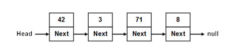
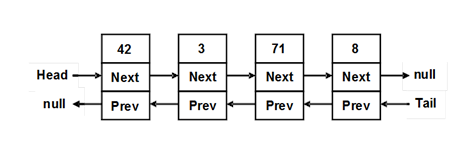
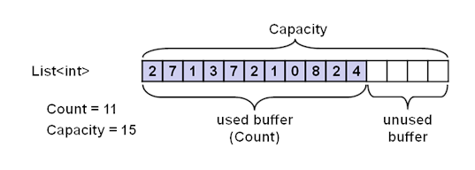
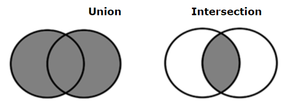
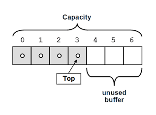
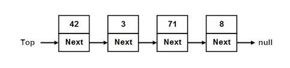
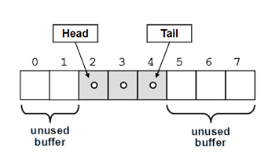
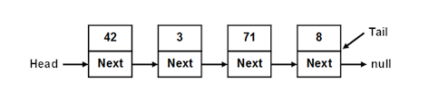
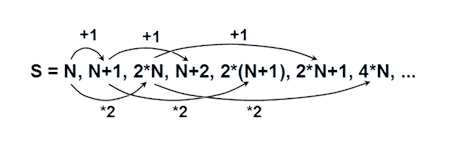

# Chapter 16. Linear Data Structures

## In This Chapter

In this chapter we are going to get familiar with some of the basic presentations of data in programming: **lists and linear data structures.** Very often in order to solve a given problem we need to work with a sequence of elements. For example, to read completely this book we have to read sequentially each page, i.e. to **traverse sequentially** each of the elements of the set of the pages in the book. Depending on the task, we have to apply different operations on this set of data. In this chapter we will introduce the concept of **abstract data types (ADT)** and will explain how a certain ADT can have **multiple different implementations.** After that we shall explore how and when to use lists and their implementations **(linked list, doubly-linked list and array-list).** We are going to see how for a given task one structure may be more convenient than another. We are going to consider the **structures "stack" and "queue",** as well as their applications. We are going to get familiar with some **implementations** of these structures.

## Abstract Data Structures

Before we start considering classes in C#, which implement some of the most frequently, used data structures (such as lists and queues), we are going to consider the concepts of **data structures** and **abstract data structures.**

### What Is a Data Structure?

Very often, when we write programs, we have to work with many objects (data). Sometimes we add and remove elements, other times we would like to order them or to process the data in another specific way. For this reason, different ways of storing data are developed, depending on the task. Most frequently these elements are ordered in some way (for example, object A is before object B).

At this point we come to the aid of **data structures – a set of data** organized on the basis of logical and mathematical laws. Very often the choice of the right data structure makes the program much more efficient – we could save memory and execution time (and sometimes even the amount of code we write).

### What Is an Abstract Data Type?

In general, **abstract data types (ADT)** gives us a definition (abstraction) of the specific structure, i.e. defines the allowed operations and properties, without being interested in the specific implementation. This allows an abstract data type to have several different implementations and respectively different efficiency.

### Basic Data Structures in Programming

We can differentiate several groups of data structures:

- **Linear** – these include lists, stacks and queues
- **Tree-like** – different types of trees like binary trees, B-trees and balanced trees
- **Dictionaries** – key-value pairs organized in hash tables
- **Sets** – unordered bunches of unique elements
- **Others** – multi-sets, bags, multi-bags, priority queues, graphs, ...

In this chapter we are going to explore the **linear (list-like) data structures,** and in the next several chapters we are going to pay attention to more complicated data structures, such as trees, graphs, hash tables and sets, and we are going to explain how and when to use each of them.

**Mastering basic data structures in programming is essential,** as without them we could not program efficiently. They, together with algorithms, are in the basis of programming and in the next several chapters we are going to get familiar with them.

## List Data Structures

Most commonly used data structures are the **linear (list) data structures.** They are an abstraction of all kinds of rows, sequences, series and others from the real world.

### List

We could imagine the **list** as an **ordered sequence (line) of elements.** Let’s take as an example purchases from a shop. In the list we can read each of the elements (the purchases), as well as add new purchases in it. We can also remove (erase) purchases or shuffle them.

### Abstract Data Structure "List"

Let’s now give a more strict definition of the **structure list:**

**List is a linear data structure,** which contains a sequence of elements. The list has the property length (count of elements) and its elements are **arranged consecutively.**

The list allows adding elements on different positions, removing them and incremental crawling. Like we already mentioned, an ADT can have several implementations. An example of such ADT is the interface `System.
Collections.IList`.

Interfaces in C# construct a frame (contract) for their implementations – classes. This contract consists of **a set of methods and properties,** which each class must implement in order to implement the interface. The data type "Interface" in C# we are going to discuss in depth in the chapter "Object-Oriented Programming Principles".

Each ADT defines some interface. Let’s consider the interface `System.
Collections.IList`. The basic methods, which it defines, are:

- `int Add(object)` – adds element in the end of the list
- `void Insert(int, object)` – adds element on a preliminary chosen position in the list
- `void Clear()` – removes all elements in the list
- `bool Contains(object)` – checks whether the list contains the element
- `void Remove(object)` – removes the element from the list
- `void RemoveAt(int)` – removes the element on a given position
- `int IndexOf(object)` – returns the position of the element
- `this[int]` – indexer, allows access to the elements on a set position

Let’s see several from the basic implementations of the ADT list and explain in which situations they should be used.

### Static List (Array-Based Implementation)

**Arrays** perform many of the features of the ADT list, but there is a significant difference – the lists allow adding new elements, while arrays have fixed size.

Despite of that, an implementation of list is possible with an array, which automatically increments its size (similar to the class `StringBuilder`, which we already know from the chapter "Strings"). Such list is called **static list implemented with an extensible array.** Below we shall give a sample implementation of auto-resizable array-based list (array list). It is intended to hold any data type `T` through the concept of **generics** (see the "Generics" section in chapter "Defining Classes"):

```cs
public class CustomArrayList<T>
{
    private T[] arr;
    private int count;

    /// <summary>Returns the actual list length</summary>
    public int Count
    {
        get
        {
            return this.count;
        }
    }

    private const int INITIAL_CAPACITY = 4;

    /// <summary>
    /// Initializes the array-based list – allocate memory
    /// </summary>
    public CustomArrayList(int capacity = INITIAL_CAPACITY)
    {
        this.arr = new T[capacity];
        this.count = 0;
    }
```

Firstly, we define an **array,** in which we are going **to keep the elements,** as well as a counter for the current count of elements. After that we add the constructor, as we initialize our array with some **initial capacity** (when capacity is not specified) in order to avoid resizing it when adding the first few elements. Let’s take a look at some typical operations like **add** (append) an element, **insert** an element at specified position (index) and **clear** the list:

```cs
/// <summary>Adds element to the list</summary>
/// <param name="item">The element you want to add</param>
public void Add(T item)
{
    GrowIfArrIsFull();
    this.arr[this.count] = item;
    this.count++;
}

/// <summary>
/// Inserts the specified element at given position in this list
/// </summary>
/// <param name="index">
/// Index, at which the specified element is to be inserted
/// </param>
/// <param name="item">Element to be inserted</param>
/// <exception cref="System.IndexOutOfRangeException">Index is invalid</exception>
public void Insert(int index, T item)
{
    if (index > this.count || index < 0)
    {
        throw new IndexOutOfRangeException(
            "Invalid index: " + index);
    }
    GrowIfArrIsFull();
    Array.Copy(this.arr, index,
        this.arr, index + 1, this.count - index);
    this.arr[index] = item;
    this.count++;
}

/// <summary>
/// Doubles the size of this.arr (grow) if it is full
/// </summary>
private void GrowIfArrIsFull()
{
    if (this.count + 1 > this.arr.Length)
    {
        T[] extendedArr = new T[this.arr.Length * 2];
        Array.Copy(this.arr, extendedArr, this.count);
        this.arr = extendedArr;
    }
}

/// <summary>Clears the list (remove everything)</summary>
public void Clear()
{
    this.arr = new T[INITIAL_CAPACITY];
    this.count = 0;
}
```

We implemented the operation **adding** a new element, as well as **inserting** a new element which both first ensure that the internal array (buffer) holding the elements has enough capacity. If the internal buffer is full, it is extended (grown) to a double of the current capacity. Since arrays in .NET do not support resizing, the **growing operation** allocated a new array of double size and moves all elements from the old array to the new.

Below we implement **searching** operations (finding the index of given element and checking whether given element exists), as well as **indexer** – the ability to access the elements (for read and change) by their index specified in the `[]` operator:

```cs
/// <summary>
/// Returns the index of the first occurrence of the specified
/// element in this list (or -1 if it does not exist).
/// </summary>
/// <param name="item">The element you are searching</param>
/// <returns>
/// The index of a given element or -1 if it is not found
/// </returns>
public int IndexOf(T item)
{
    for (int i = 0; i < this.arr.Length; i++)
    {
        if (object.Equals(item, this.arr[i]))
        {
            return i;
        }
    }

    return -1;
}

/// <summary>Checks if an element exists</summary>
/// <param name="item">The item to be checked</param>
/// <returns>If the item exists</returns>
public bool Contains(T item)
{
    int index = IndexOf(item);
    bool found = (index != -1);
    return found;
}

/// <summary>Indexer: access to element at given index</summary>
/// <param name="index">Index of the element</param>
/// <returns>The element at the specified position</returns>
public T this[int index]
{
    get
    {
        if (index >= this.count || index < 0)
        {
            throw new ArgumentOutOfRangeException(
                "Invalid index: " + index);
        }
        return this.arr[index];
    }
    set
    {
        if (index >= this.count || index < 0)
        {
            throw new ArgumentOutOfRangeException(
                "Invalid index: " + index);
        }
        this.arr[index] = value;
    }
}
```

We add operations for **removing** items (by index and by value):

```cs
/// <summary>Removes the element at the specified index
/// </summary>
/// <param name="index">The index of the element to remove
/// </param>
/// <returns>The removed element</returns>
public T RemoveAt(int index)
{
    if (index >= this.count || index < 0)
    {
        throw new ArgumentOutOfRangeException(
            "Invalid index: " + index);
    }

    T item = this.arr[index];
    Array.Copy(this.arr, index + 1,
        this.arr, index, this.count - index - 1);
    this.arr[this.count - 1] = default(T);
    this.count--;

    return item;
}

/// <summary>Removes the specified item</summary>
/// <param name="item">The item to be removed</param>
/// <returns>The removed item's index or -1 if the item does not exist</returns>
public int Remove(T item)
{
    int index = IndexOf(item);
    if (index != -1)
    {
        this.RemoveAt(index);
    }
    return index;
}
```

In the methods above we **remove** elements. For this purpose, firstly we find the searched element, remove it and then shift the elements after it by one position to the left, in order to fill the empty position. Finally, we fill the position after the last item in the array with `null` value (the `default(T)`) to allow the garbage collector to release it if it is not needed. Generally, we want to keep all unused elements in the `arr` empty (`null` / zero value).

Let’s consider a sample usage of the recently implemented class. There is a `Main()` method, in which we demonstrate most of the operations. In the enclosed code we create a list of purchases, add, insert and remove few items and print the list on the console. Finally we check whether certain items exist:

```cs
class CustomArrayListTest
{
    static void Main()
    {
        CustomArrayList<string> shoppingList =
            new CustomArrayList<string>();
        shoppingList.Add("Milk");
        shoppingList.Add("Honey");
        shoppingList.Add("Olives");
        shoppingList.Add("Water");
        shoppingList.Add("Beer");
        shoppingList.Remove("Olives");
        shoppingList.Insert(1, "Fruits");
        shoppingList.Insert(0, "Cheese");
        shoppingList.Insert(6, "Vegetables");
        shoppingList.RemoveAt(0);
        shoppingList[3] = "A lot of " + shoppingList[3];
        Console.WriteLine("We need to buy:");
        for (int i = 0; i < shoppingList.Count; i++)
        {
            Console.WriteLine(" - " + shoppingList[i]);
        }
        Console.WriteLine("Position of 'Beer' = {0}",
            shoppingList.IndexOf("Beer"));
        Console.WriteLine("Position of 'Water' = {0}",
            shoppingList.IndexOf("Water"));
        Console.WriteLine("Do we have to buy Bread? " +
            shoppingList.Contains("Bread"));
    }
}
```

Here is how the output of the program execution looks like:

```console
We need to buy:
 - Milk
 - Fruits
 - Honey
 - A lot of Water
 - Beer
 - Vegetables
Position of 'Beer' = 4
Position of 'Water' = -1
Do we have to buy Bread? False
```

### Linked List (Dynamic Implementation)

As we saw, the static list has a serious disadvantage – the operations for inserting and removing items from the inside of the array requires rearrangement of the elements. When frequently inserting and removing items (especially a large number of items), this can lead to low performance. In such cases it is advisable to use the so called **linked lists.** The difference in them is the structure of elements – while in the static list the element contains only the specific object, with the dynamic list the **elements keep information about their next element.**

Here is how a sample linked list looks like in the memory:


 
For the dynamic **implementation of the linked list** we will need two classes: the class `ListNode`, which will hold a single element of the list along with its next element, and the main list class `DynamicList<T>` which will hold a sequence of elements as well as the `head` and the `tail` of the list:

```cs
/// <summary>Dynamic (linked) list class definition</summary>
public class DynamicList<T>
{
    private class ListNode
    {
        public T Element { get; set; }
        public ListNode NextNode { get; set; }

        public ListNode(T element)
        {
            this.Element = element;
            NextNode = null;
        }

        public ListNode(T element, ListNode prevNode)
        {
            this.Element = element;
            prevNode.NextNode = this;
        }
    }

    private ListNode head;
    private ListNode tail;
    private int count;

    // ...
}
```

First, let’s consider the recursive class `ListNode`. It holds a single element and a reference (pointer) to the next element which is of the same class `ListNode`. So `ListNode` is an example of **recursive data structure** that is defined by referencing itself. The class is inner to the class `DynamicList<T>` (it is declared as a private member) and is therefore accessible only to it. For our `DynamicList<T>` we create 3 fields: `head` – pointer to the first element, `tail` – pointer to the last element and `count` – counter of the elements.

After that we declare the **constructor** which creates and empty linked list:

```cs
public DynamicList()
{
    this.head = null;
    this.tail = null;
    this.count = 0;
}
```

Upon the initial construction the list is empty and for this reason we assign `head = tail = null` and `count = 0`.

We are going to implement all basic operations: **adding** and **removing** items, as well as **searching** for an element and **accessing the elements by index.**

Let’s start with the operation **add** (append) which is relatively simple. Two cases are considered: an **empty list** and a **non-empty list.** In both cases we append the element at the end of the list (where `tail` points) and after the operation all fields (`head`, `tail` and `count`) have correct values:

```cs
/// <summary>Add element at the end of the list</summary>
/// <param name="item">The element to be added</param>
public void Add(T item)
{
    if (this.head == null)
    {
        // We have an empty list -> create a new head and tail
        this.head = new ListNode(item);
        this.tail = this.head;
    }
    else
    {
        // We have a non-empty list -> append the item after tail
        ListNode newNode = new ListNode(item, this.tail);
        this.tail = newNode;
    }
    this.count++;
}
```

You can now see the operation **removing** an item at specified index. It is considerably more complicated than adding:

```cs
/// <summary>Removes and returns element on the specified index
/// </summary>
/// <param name="index">The index of the element to be removed
/// </param>
/// <returns>The removed element</returns>
/// <exception cref="System.ArgumentOutOfRangeException">
/// if the index is invalid</exception>
public T RemoveAt(int index)
{
    if (index >= count || index < 0)
    {
        throw new ArgumentOutOfRangeException(
            "Invalid index: " + index);
    }

    // Find the element at the specified index
    int currentIndex = 0;
    ListNode currentNode = this.head;
    ListNode prevNode = null;
    while (currentIndex < index)
    {
        prevNode = currentNode;
        currentNode = currentNode.NextNode;
        currentIndex++;
    }

    // Remove the found element from the list of nodes
    RemoveListNode(currentNode, prevNode);

    // Return the removed element
    return currentNode.Element;
}

/// <summary>
/// Remove the specified node from the list of nodes
/// </summary>
/// <param name="node">the node for removal</param>
/// <param name="prevNode">the predecessor of node</param>
private void RemoveListNode(ListNode node, ListNode prevNode)
{
    count--;
    if (count == 0)
    {
        // The list becomes empty -> remove head and tail
        this.head = null;
        this.tail = null;
    }
    else if (prevNode == null)
    {
        // The head node was removed --> update the head
        this.head = node.NextNode;
    }
    else
    {
        // Redirect the pointers to skip the removed node
        prevNode.NextNode = node.NextNode;
    }

    // Fix the tail in case it was removed
    if (object.ReferenceEquals(this.tail, node))
    {
        this.tail = prevNode;
    }
}
```

Firstly, we **check if the specified index exists,** and if it does not, an appropriate exception is thrown. After that, the element for removal is found by moving forward from the beginning of the list to the next element **exactly `index` times.** After the element for removal has been found (`currentNode`), it is removed by the additional private method `RemoveListNode(...)`, which considers the following 3 possible cases:

1. The **list remains empty after the removal** -> we remove the whole list along with its head and tail (`head = null`, `tail = null`, `count = 0`).
2. The element for removal is **at the start of the list** (there is no previous element) -> we make `head` to point at the element immediately after the removed element (or at `null`, if the removed element was the last one).
3. The element is **in the middle or at the end of the list** -> we direct the element before it to point to the element after it (or at `null`, if there is no next element).

Finally, we make sure `tail` **points to the end of the list** (in case `tail` was pointed to the removed element, it is fixed to point to its predecessor).

The next is the implementation of the **removal** of an element by its value:

```cs
/// <summary>
/// Removes the specified item and return its index.
/// </summary>
/// <param name="item">The item for removal</param>
/// <returns>The index of the element or -1 if it does not exist</returns>
public int Remove(T item)
{
    // Find the element containing the searched item
    int currentIndex = 0;
    ListNode currentNode = this.head;
    ListNode prevNode = null;
    while (currentNode != null)
    {
        if (object.Equals(currentNode.Element, item))
        {
            break;
        }
        prevNode = currentNode;
        currentNode = currentNode.NextNode;
        currentIndex++;
    }

    if (currentNode != null)
    {
        // The element is found in the list -> remove it
        RemoveListNode(currentNode, prevNode);
        return currentIndex;
    }
    else
    {
        // The element is not found in the list -> return -1
        return -1;
    }
}
```

The removal by value of an element works **like the removal of an element by index,** but there are two special considerations: the searched element **may not exist** and for this reason an extra check is necessary; there may be elements with `null` value in the list, which have to be removed and processed correctly. The last is done by comparing the elements through the static method `object.Equals(...)` which works well with `null` values.

In order the removal to work correctly, it is necessary the elements in the array to be comparable, i.e. to have a correct implementation of the method `Equals()` derived from `System.Object`.

Bellow we give implementations of the operations for **searching** and checking whether the list **contains** a specified element:

```cs
/// <summary>Searches for given element in the list</summary>
/// <param name="item">The item to be searched</param>
/// <returns>
/// The index of the first occurrence of the element
/// in the list or -1 when it is not found
/// </returns>
public int IndexOf(T item)
{
    int index = 0;
    ListNode currentNode = this.head;
    while (currentNode != null)
    {
        if (object.Equals(currentNode.Element, item))
        {
            return index;
        }
        currentNode = currentNode.NextNode;
        index++;
    }
    return -1;
}

/// <summary>
/// Checks if the specified element exists in the list
/// </summary>
/// <param name="item">The item to be checked</param>
/// <returns>
/// True if the element exists or false otherwise
/// </returns>
public bool Contains(T item)
{
    int index = IndexOf(item);
    bool found = (index != -1);
    return found;
}
```

The searching for an element works **like in the method for removing:** we start from the beginning of the list and check sequentially the next elements one after another, until we reach the end of the list or find the searched element.

We have two more operations to implement – **accessing elements by index** (using the indexer) and finding the **count of elements** (through a property):

```cs
/// <summary>
/// Gets or sets the element at the specified position
/// </summary>
/// <param name="index">
/// The position of the element [0 ... count-1]
/// </param>
/// <returns>The item at the specified index</returns>
/// <exception cref="System.ArgumentOutOfRangeException">
/// When an invalid index is specified
/// </exception>
public T this[int index]
{
    get
    {
        if (index >= count || index < 0)
        {
            throw new ArgumentOutOfRangeException(
                "Invalid index: " + index);
        }
        ListNode currentNode = this.head;
        for (int i = 0; i < index; i++)
        {
            currentNode = currentNode.NextNode;
        }
        return currentNode.Element;
    }
    set
    {
        if (index >= count || index < 0)
        {
            throw new ArgumentOutOfRangeException(
                "Invalid index: " + index);
        }
        ListNode currentNode = this.head;
        for (int i = 0; i < index; i++)
        {
            currentNode = currentNode.NextNode;
        }
        currentNode.Element = value;
    }
}

/// <summary>
/// Gets the count of elements in the list
/// </summary>
public int Count
{
    get
    {
        return this.count;
    }
}
```

The indexer works pretty straightforward – first checks the validity of the specified index and then starts from the `head` of the list goes to the next node `index` times. Once the node containing the element the specified `index` is found, it is accessed directly.

Let’s finally see a **shopping list example** similar to the example with the static list implementation, this time using with our **linked list:**

```cs
class DynamicListTest
{
    static void Main()
    {
        DynamicList<string> shoppingList =
            new DynamicList<string>();
        shoppingList.Add("Milk");
        shoppingList.Remove("Milk"); // Empty list
        shoppingList.Add("Honey");
        shoppingList.Add("Olives");
        shoppingList.Add("Water");
        shoppingList[2] = "A lot of " + shoppingList[2];
        shoppingList.Add("Fruits");
        shoppingList.RemoveAt(0); // Removes "Honey" (first)
        shoppingList.RemoveAt(2); // Removes "Fruits" (last)
        shoppingList.Add(null);
        shoppingList.Add("Beer");
        shoppingList.Remove(null);
        Console.WriteLine("We need to buy:");
        for (int i = 0; i < shoppingList.Count; i++)
        {
            Console.WriteLine(" - " + shoppingList[i]);
        }
        Console.WriteLine("Position of 'Beer' = {0}",
            shoppingList.IndexOf("Beer"));
        Console.WriteLine("Position of 'Water' = {0}",
            shoppingList.IndexOf("Water"));
        Console.WriteLine("Do we have to buy Bread? " +
            shoppingList.Contains("Bread"));
    }
}
```

The above code **checks all the operations** from our linked list implementation along with their special cases (like removing the first and the last element) and shows that out dynamic list implementation works correctly. The output of the above code is the following:

```console
We need to buy:
 - Olives
 - A lot of Water
 - Beer
Position of 'Beer' = 2
Position of 'Water' = -1
Do we have to buy Bread? False
```

### Comparing the Static and the Dynamic Lists

We implemented the abstract data type (ADT) **list** in two ways: **static (array list)** and **dynamic (linked list).** Once written these two implementations can be used in almost exactly the same way. For example see the following two pieces of code (using our array list and our linked list):

```cs
static void Main()
{
    CustomArrayList<string> arrayList =
        new CustomArrayList<string>();
    arrayList.Add("One");
    arrayList.Add("Two");
    arrayList.Add("Three");
    arrayList[0] = "Zero";
    arrayList.RemoveAt(1);
    Console.WriteLine("Array list: ");
    for (int i = 0; i < arrayList.Count; i++)
    {
        Console.WriteLine(" - " + arrayList[i]);
    }

    DynamicList<string> dynamicList =
        new DynamicList<string>();
    dynamicList.Add("One");
    dynamicList.Add("Two");
    dynamicList.Add("Three");
    dynamicList[0] = "Zero";
    dynamicList.RemoveAt(1);
    Console.WriteLine("Dynamic list: ");
    for (int i = 0; i < dynamicList.Count; i++)
    {
        Console.WriteLine(" - " + dynamicList[i]);
    }
}
```

The result of using the two types of lists is the same:

```console
Array list:
 - Zero
 - Three
Dynamic list:
 - Zero
 - Three
```
The above example demonstrates that certain ADT could be implemented in several conceptually different ways and the users may not notice the difference between them. Still, different implementations could have different performance and could take different amount of memory.

This concept, known as **abstract behavior,** is fundamental for OOP and can be implemented by **abstract classes** or **interfaces** as we shall see in the section "Abstraction" of chapter "Object-Oriented Programming Principles".

### Doubly-Linked List

In the so called **doubly-linked lists** each element contains its **value** and **two pointers – to the previous and to the next element** (or `null`, if there is no such element). This allows us to traverse the list forward and backward and some operations to be implemented more efficiently. Here is how a sample doubly-linked list looks like:


 
### The ArrayList Class

After we got familiar with some of the basic implementations of the lists, we are going to consider the classes in C#, which deliver list data structures "without lifting a finger". The first one is the class `ArrayList`, which is an **untyped dynamically-extendable array.** It is implemented similarly to the static list implementation, which we considered earlier. `ArrayList` gives the opportunity to add, delete and search for elements in it. Some more important class members we may use are:

- `Add(object)` – adding a new element
- `Insert(int, object)` – adding a new element at a specified position (index)
- `Count` – returns the count of elements in the list
- `Remove(object)` – removes a specified element
- `RemoveAt(int)` – removes the element at a specified position
- `Clear()` – removes all elements from the list
- `this[int]` – an indexer, allows accessing the elements by a given position (index)

As we saw, one of the main problems with this implementation is the resizing of the inner array when adding and removing elements. In the `ArrayList` the problem is solved by preliminarily created array (buffer), which gives us the opportunity to add elements without resizing the array at each insertion or removal of elements.

#### The ArrayList Class – Example

The `ArrayList` class is **untyped,** so it can keep all kinds of elements – numbers, strings and other objects. Here is a small example:

```cs
using System;
using System.Collections;

class ProgrArrayListExample
{
    static void Main()
    {
        ArrayList list = new ArrayList();
        list.Add("Hello");
        list.Add(5);
        list.Add(3.14159);
        list.Add(DateTime.Now);

        for (int i = 0; i < list.Count; i++)
        {
            object value = list[i];
            Console.WriteLine("Index={0}; Value={1}", i, value);
        }
    }
}
```

In the example we create `ArrayList` and we add in it several elements from different types: `string`, `int`, `double` and `DateTime`. After that we iterate over the elements and print them. If we execute the example, we are going to get the following result:

```console
Index=0; Value=Hello
Index=1; Value=5
Index=2; Value=3.14159
Index=3; Value=29.12.2009 23:17:01
```

#### ArrayList of Numbers – Example

In case we would like to make an array of numbers and then process them, for example to find their sum, we have to convert the `object` type to a number. This is because `ArrayList` is actually a list of elements of type `object`, and not from some specific type (like `int` or `string`). Here is a sample code, which sums the elements of `ArrayList`:

```cs
ArrayList list = new ArrayList();
list.Add(2);
list.Add(3.5f);
list.Add(25u);
list.Add(" EUR");
dynamic sum = 0;
for (int i = 0; i < list.Count; i++)
{
    dynamic value = list[i];
    sum = sum + value;
}
Console.WriteLine("Sum = " + sum);
// Output: Sum = 30.5 EUR
```

Note that in the array list we hold different types of values (`int`, `float`, `uint` and `string`) and we sum them in a variable of special type called `dynamic`. In C# `dynamic` is a universal data type intended to hold any value (numbers, objects, strings, even functions and methods). Operations over `dynamic` variables (like the + operator used above) are **resolved at runtime** and their action depends on the actual values of their arguments. At compile time almost every operation with `dynamic` variables successfully compiles. At runtime, if the operation can be performed, it is performed, otherwise and exception is thrown. This explains why we apply the operation + over the arguments 2, 3.5f, 25u and " EUR" and we finally obtain as a result the string "30.5 EUR".

### Generic Collections

Before we continue to play with more examples of working with the `ArrayList` class, we shall recall the concept of Generic Data Types in C#, which gives the opportunity to parameterize lists and collections in C#.

When we use the `ArrayList` class and all classes, which implement the interface `System.IList`, we face the problem we saw earlier: when we add a new element from a class, we pass it as a value of type `object`. Later, when we search for a certain element, we get it as `object` and we have to cast it to the expected type (or use `dynamic`). It is not guaranteed, however, that all elements in the list will be of one and the same type. Besides this, the conversion from one type to another takes time, and this drastically slows down the program execution.

To solve the problem we use the **generic (template / parameterized) classes.** They are created to work with one or several types, as when we create them, we indicate what type of objects we are going to keep in them. Let’s recall that we create an instance of a generic class, for example `GenericType`, by indicating the type, of which the elements have to be:

```cs
GenericType<T> instance = new GenericType<T>();
```

This type `T` can be any successor of the class `System.Object`, for example `string` or `DateTime`. Here are few examples:

```cs
List<int> intList = new List<int>();
List<bool> boolList = new List<bool>();
List<double> realNumbersList = new List<double>();
```

Let’s consider some of the **generic collections in .NET Framework.**

### The `List<T>` Class

**`List<T>` is the generic variant of `ArrayList`.** When we create an object of type `List<T>`, we indicate the type of the elements, which will be hold in the list, i.e. we substitute the denoted by `T` type with some real data type (for example number or string).

Let’s consider a case in which we would like to create a list of integer elements. We could do this in the following way:

```cs
List<int> intList = new List<int>();
```

Thus the created list can contain only integer numbers and cannot contain other objects, for example strings. If we try to add to `List<int>` an object of type `string`, we are going to get a compilation error. Via the generic types the C# compiler protects us from mistakes when working with collections.

### The List Class – Array-Based Implementation

`List<T>` works like our class `CustomArrayList<T>`. It keeps its elements in the memory as an **array,** which is **partially in use and partially free** for new elements (blank). Thanks to the reserved blank elements in the array, the operation **append** almost always manages to add the new element without the need to resize the array. Sometimes, of course, the array has to be resized, but as each resize would double the size of the array, resizing happens so seldom that it can be ignored in comparison to the count of append operations. We could imagine a `List<T>` like an **array, which has some capacity and is filled to a certain level:**


 
Thanks to the preliminarily allocated capacity of the array, containing the elements of the class `List<T>`, it can be extremely efficient data structure when it is necessary to **add elements fast,** **extract elements** and **access the elements by index.** Still, it is pretty **slow in inserting and removing elements** unless these elements are at the last position.

We could say that `List<T>` combines the good sides of lists and arrays – fast adding, changeable size and direct access by index.

### When to Use `List<T>`?

We already explained that the `List<T>` class uses an inner array for keeping the elements and the array doubles its size when it gets overfilled. Such implementation causes the following good and bad sides:

- The **search by index is very fast** – we can access with equal speed each of the elements, regardless of the count of elements.
- The **search for an element by value** works with as many comparisons as the count of elements (in the worst case), i.e. it **is slow.**
- **Inserting and removing elements** is a **slow** operation – when we add or remove elements, especially if they are not in the end of the array, we have to shift the rest of the elements and this is a slow operation.
- When **adding a new element,** sometimes we have to increase the capacity of the array, which is a slow operation, but it happens seldom and the average speed of insertion to List does not depend on the count of elements, i.e. it works **very fast.**

| :warning: | Use `List<T>` when you don’t expect frequent insertion and deletion of elements, but you expect to add new elements at the end of the list or to access the elements by index. |
|:--:|:--|

#### Prime Numbers in Given Interval – Example

After we got familiar with the implementation of the structure list and the class `List<T>`, let’s see how to use them. We are going to consider the problem for **finding the prime numbers in a certain interval.** For this purpose we have to use the following algorithm:

```cs
static List<int> GetPrimes(int start, int end)
{
    List<int> primesList = new List<int>();
    for (int num = start; num <= end; num++)
    {
        bool prime = true;
        double numSqrt = Math.Sqrt(num);
        for (int div = 2; div <= numSqrt; div++)
        {
            if (num % div == 0)
            {
                prime = false;
                break;
            }
        }
        if (prime)
        {
            primesList.Add(num);
        }
    }
    return primesList;
}

static void Main()
{
    List<int> primes = GetPrimes(200, 300);
    foreach (var item in primes)
    {
        Console.Write ("{0} ", item);
    }
}
```

From the mathematics we know that if a number is **not prime** it has **at least one divisor** in the interval [2 ... square root from the given number]. This is what we use in the example above. For each number we look for a divisor in this interval. If we find a divisor, then the number is not prime and we could continue with the next number from the interval. Gradually, by adding the prime numbers we fill the list, after which we traverse it and print it on the screen. Here is how the output of the code above looks like:

```console
211 223 227 229 233 239 241 251 257 263 269 271 277 281 283 293
```

#### Union and Intersection of Lists – Example

Let’s consider a more interesting example – let’s write a program, which can find the **union and the intersection of two sets of numbers.**



We could consider that there are two lists of numbers and we would like to take the elements, which are in both sets **(intersection),** or we look for those elements, which are at least in one of the sets **(union).**

Let’s discuss one possible solution to the problem:

```cs
static List<int> Union(
        List<int> firstList, List<int> secondList)
{
    List<int> union = new List<int>();
    union.AddRange(firstList);
    foreach (var item in secondList)
    {
        if (!union.Contains(item))
        {
            union.Add(item);
        }
    }
    return union;
}

static List<int> Intersect(List<int>
        firstList, List<int> secondList)
{
    List<int> intersect = new List<int>();
    foreach (var item in firstList)
    {
        if (secondList.Contains(item))
        {
            intersect.Add(item);
        }
    }

    return intersect;
}

static void PrintList(List<int> list)
{
    Console.Write("{ ");
    foreach (var item in list)
    {
        Console.Write(item);
        Console.Write(" ");
    }
    Console.WriteLine("}");
}

static void Main()
{
    List<int> firstList = new List<int>();
    firstList.Add(1);
    firstList.Add(2);
    firstList.Add(3);
    firstList.Add(4);
    firstList.Add(5);
    Console.Write("firstList = ");
    PrintList(firstList);

    List<int> secondList = new List<int>();
    secondList.Add(2);
    secondList.Add(4);
    secondList.Add(6);
    Console.Write("secondList = ");
    PrintList(secondList);

    List<int> unionList = Union(firstList, secondList);
    Console.Write("union = ");
    PrintList(unionList);

    List<int> intersectList =
        Intersect(firstList, secondList);
    Console.Write("intersect = ");
    PrintList(intersectList);
}
```

The program logic in this solution **directly follows the definitions of union and intersection** of sets. We use the operations for searching for an element in a list and insertion of a new element in a list.

We are going to solve the problem in one more way: by using the method `AddRange<T>(IEnumerable<T> collection)` from the class `List<T>`:

```cs
static void Main()
{
    List<int> firstList = new List<int>();
    firstList.Add(1);
    firstList.Add(2);
    firstList.Add(3);
    firstList.Add(4);
    firstList.Add(5);
    Console.Write("firstList = ");
    PrintList(firstList);

    List<int> secondList = new List<int>();
    secondList.Add(2);
    secondList.Add(4);
    secondList.Add(6);
    Console.Write("secondList = ");
    PrintList(secondList);

    List<int> unionList = new List<int>();
    unionList.AddRange(firstList);
    for (int i = unionList.Count-1; i >= 0; i--)
    {
        if (secondList.Contains(unionList[i]))
        {
            unionList.RemoveAt(i);
        }
    }
    unionList.AddRange(secondList);
    Console.Write("union = ");
    PrintList(unionList);

    List<int> intersectList = new List<int>();
    intersectList.AddRange(firstList);
    for (int i = intersectList.Count-1; i >= 0; i--)
    {
        if (!secondList.Contains(intersectList[i]))
        {
            intersectList.RemoveAt(i);
        }
    }
    Console.Write("intersect = ");
    PrintList(intersectList);
}
```

In order to intersect the sets we do the following: we put all elements from the first list (via `AddRange()`), after which we remove all elements, which are not in the second list.

The problem can also be solved even in an easier way by using the method `RemoveAll(Predicate<T> match)`, but it is related to using programming constructs, called **delegates and lambda expressions,** which are considered in the chapter Lambda Expressions and LINQ. The union we make as we add elements from the first list, after which we remove all elements, which are in the second list, and finally we add all elements of the second list.

The result from the two programs is **exactly the same:**

```console
firstList = { 1 2 3 4 5 }
secondList = { 2 4 6 }
union = { 1 2 3 4 5 6 }
intersect = { 2 4 }
```

### Converting a List to Array and Vice Versa

In C# the **conversion of a list to an array** is easy by using the given method `ToArray()`. For the opposite operation we could use the constructor of `List<T>(System.Array)`. Let’s see an example, demonstrating their usage:

```cs
static void Main()
{
    int[] arr = new int[] { 1, 2, 3 };
    List<int> list = new List<int>(arr);
    int[] convertedArray = list.ToArray();
}
```

### The `LinkedList<T>` Class

This class is a **dynamic implementation of a doubly linked list** built in .NET Framework. Its elements contain a certain value and a pointer to the previous and the next element. The `LinkedList<T>` class in .NET works in similar fashion like our class `DynamicList<T>`.

### When Should We Use `LinkedList<T>`?

We saw that the dynamic and the static implementation have their specifics considering the different operations. With a view to the structure of the linked list, we have to have the following in mind:

- The **append** operation is **very fast,** because the list always knows its last element **(tail).**
- **Inserting** a new element at a random position in the list is **very fast** (unlike `List<T>`) if we have a pointer to this position, e.g. if we insert at the list start or at the list end.
- **Searching** for elements **by index** or **by value** in `LinkedList` is a **slow** operation, as we have to scan all elements consecutively by beginning from the start of the list.
- **Removing** elements is a **slow** operation, because it includes searching.

### Basic Operations in the `LinkedList<T>` Class

`LinkedList<T>` has the same operations as in `List<T>`, which makes the two classes interchangeable, but in fact `List<T>` is used more often. Later we are going to see that `LinkedList<T>` is used when working with queues.

### When Should We Use `LinkedList<T>`?

Using `LinkedList<T>` is preferable when we have to **add / remove elements at both ends of the list** and when the access to the elements is consequential.

However, when we have to **access the elements by index,** then `List<T>` is a more appropriate choice.

Considering memory, `LinkedList<T>` generally takes more space because it holds the value and several additional pointers for each element. `List<T>` also takes additional space because it allocates memory for more elements than it actually uses (it keeps bigger capacity than the number of its elements).

### Stack

Let’s imagine several cubes, which we have put one above other. We could put a new cube on the top, as well as remove the highest cube. Or let’s imagine a chest. In order to take out the clothes on the bottom, first we have to take out the clothes above them.

This is the classical data structure **stack** – we could add elements on the top and remove the element, which has been added last, but no the previous ones (the ones that are below it). In programming the **stack is a commonly used data structure.** The stack is used internally by the .NET virtual machine (CLR) for keeping the variables of the program and the parameters of the called methods (it is called **program execution stack).**

### The Abstract Data Type "Stack"

The **stack** is a data structure, which implements the behavior **"last in – first out" (LIFO).** As we saw with the cubes, the elements could be added and removed only on the top of the stack.

ADT stack provides 3 major operations: **push** (add an element at the top of the stack), **pop** (take the last added element from the top of the stack) and **peek** (get the element form the top of the stack without removing it).

The data structure stack can also have different implementations, but we are going to consider two – **dynamic** and **static implementation.**

### Static Stack (Array-Based Implementation)

Like with the static list we can use an **array to keep the elements** of the stack. We can keep an index or a pointer to the element, which is at the top.

Usually, if the internal array is filled, we have to resize it (to allocate twice more memory), like this happens with the static list (`ArrayList`, `List<T>` and `CustomArrayList<T>`). Unused buffer memory should be hold to ensure fast push and pop operations.

Here is how we could imagine a **static stack:**


 
### Linked Stack (Dynamic Implementation)

For the **dynamic implementation of stack** we use elements, which keep a value and a pointer to the next element. This linked-list based implementation does not require an internal buffer, does not need to grow when the buffer is full and has virtually the same performance for the major operations like the static implementation:


 
When the stack is empty, the `top` has value `null`. When a new item is added, it is inserted on a position where the `top` indicates, after which the `top` is redirected to the new element. Removal is done by deleting the first element, pointed by the `top` pointer.

### The `Stack<T>` Class
In C# we could use the standard implementation of the class in .NET Framework `System.Collections.Generics.Stack<T>`. It is **implemented statically with an array,** as the array is resized when needed.

### The `Stack<T>` Class – Basic Operations

All basic operations for working with a stack are implemented:

- `Push(T)` – adds a new element on the top of the stack
- `Pop()` – returns the highest element and removes it from the stack
- `Peek()` – returns the highest element without removing it
- `Count` – returns the count of elements in the stack
- `Clear()` – retrieves all elements from the stack
- `Contains(T)` – check whether the stack contains the element
- `ToArray()` – returns an array, containing all elements of the stack

#### Stack Usage – Example

Let’s take a look at a simple example on how to use stack. We are going to add several elements, after which we are going to print them on the console.

```cs
static void Main()
{
    Stack<string> stack = new Stack<string>();
    stack.Push("1. John");
    stack.Push("2. Nicolas");
    stack.Push("3. Mary");
    stack.Push("4. George");
    Console.WriteLine("Top = " + stack.Peek());
    while (stack.Count > 0)
    {
        string personName = stack.Pop();
        Console.WriteLine(personName);
    }
}
```

As the stack is a **"last in, first out" (LIFO)** structure, the program is going to print the records in a reversed order. Here is its output:

```console
Top = 4. George
4. George
3. Mary
2. Nicolas
1. John
```

#### Correct Brackets Check – Example

Let’s consider the following task: we have an expression, in which we would like to **check whether the brackets are put correctly.** This means to check if the count of the opening brackets is equal to the count of the closing brackets and all opening brackets match their respective closing brackets. The specification of the **stack** allows us to check whether the bracket we have met has a corresponding closing bracket. When we meet an opening bracket, we add it to the stack. When we meet a closing bracket, we remove an element from the stack. If the stack becomes empty before the end of the program in a moment when we have to remove an element, the brackets are incorrectly placed. The same remains if in the end of the expression there are elements in the stack. Here is a sample implementation:

```cs
static void Main()
{
    string expression = "1 + (3 + 2 - (2+3)*4 - ((3+1)*(4-2)))";
    Stack<int> stack = new Stack<int>();
    bool correctBrackets = true;

    for (int index = 0; index < expression.Length; index++)
    {
        char ch = expression[index];
        if (ch == '(')
        {
            stack.Push(index);
        }
        else if (ch == ')')
        {
            if (stack.Count == 0)
            {
                correctBrackets = false;
                break;
            }
            stack.Pop();
        }
    }
    if (stack.Count != 0)
    {
        correctBrackets = false;
    }
    Console.WriteLine("Are the brackets correct? " +
        correctBrackets);
}
```

Here is how the output of the sample program looks like:

```console
Are the brackets correct? True
```

### Queue

The **"queue" data structure** is created to model queues, for example a queue of waiting for printing documents, waiting processes to access a common resource, and others. Such queues are very convenient and are naturally modeled via the structure "queue". In queues we can add elements only on the back and retrieve elements only at the front.

For instance, we would like to buy a ticket for a concert. If we go earlier, we are going to buy earlier a ticket. If we are late, we will have to **go at the end of the queue and wait for everyone who has come earlier.** This behavior is analogical for the objects in ADT queue.

### Abstract Data Type "Queue"

The **abstract data structure "queue"** satisfies the behavior **"first in – first out" (FIFO).** Elements added to the queue are appended at the end of the queue, and when elements are extracted, they are taken from the beginning of the queue (in the order they were added). Thus the queue behaves like a **list with two ends** (head and tail), just like the queues for tickets.

Like with the lists, the **ADT queue** could be implemented **statically** (as resizable array) and **dynamically** (as pointer-based linked list).

### Static Queue (Array-Based Implementation)

In the **static queue** we could use an **array** for keeping the elements. When adding an element, it is inserted at the index, which follows the end of queue. After that the end points at the newly added element. When removing an element, we take the element, which is pointed by the head of the queue. After that the head starts to point at the next element. Thus **the queue moves to the end of the array.** When it reaches the end of the array, when adding a new element, it is inserted at the beginning of the array. That is why the implementation is called **"looped queue",** as we mentally stick the beginning and the end of the array and the queue orbits it:


 
Static queue keeps an **internal buffer** with bigger capacity than the actual number of elements in the queue. Like in the static list implementation, when the space allocated for the queue elements is finished, the **internal buffer grows** (usually doubles its size).

The **major operations** in the queue ADT are **enqueue** (append at the end of the queue) and **dequeue** (retrieve an element from the start of the queue).

### Linked Queue (Dynamic Implementation)

The **dynamic implementation** of queue ADT looks like the implementation of the **linked list.** Like in the linked list, the elements consist of two parts – **a value and a pointer to the next element:**


 
However, here elements are **added at the end** of the queue (**tail**), and are **retrieved from its beginning** (**head**), while we have no permission to get or add elements at any another position.

### The `Queue<T>` Class

In C# we use the static implementation of queue via the `Queue<T>` class. Here we could indicate the type of the elements we are going to work with, as the queue and the linked list are generic types.

### The `Queue<T>` – Basic Operations

`Queue<T>` class provides the basic operations, specific for the data structure queue. Here are some of the most frequently used:

- `Enqueue(T)` – inserts an element at the end of the queue
- `Dequeue()` – retrieves the element from the beginning of the queue and removes it
- `Peek()` – returns the element from the beginning of the queue without removing it
- `Clear()` – removes all elements from the queue
- `Contains(T)` – checks if the queue contains the element
- `Count` – returns the amount of elements in the queue

#### Queue Usage – Example

Let’s consider a simple example. Let’s create a queue and add several elements to it. After that we are going to retrieve all elements and print them on the console:

```cs
static void Main()
{
    Queue<string> queue = new Queue<string>();
    queue.Enqueue("Message One");
    queue.Enqueue("Message Two");
    queue.Enqueue("Message Three");
    queue.Enqueue("Message Four");

    while (queue.Count > 0)
    {
        string msg = queue.Dequeue();
        Console.WriteLine(msg);
    }
}
```

Here is how the output of the sample program looks like:

```console
Message One
Message Two
Message Three
Message Four
```

You can see that the elements leave the queue in the order, in which they have entered the queue. This is because the queue is **FIFO structure (first-in, first out).**

### Sequence N, N+1, 2*N – Example

Let’s consider a problem in which the usage of the data structure queue would be very useful for the implementation. Let’s take the **sequence of numbers,** the elements of which are derived in the following way: the first element is N; the second element is derived by adding 1 to N; the third element – by multiplying the first element by 2 and thus we successively multiply each element by 2 and insert it at the end of the sequence, after which we add 1 to it and insert it at the end of the sequence. We could **illustrate the process** with the following figure:
 


As you can see, the process lies in retrieving elements from the beginning of the queue and placing others in its end. Let’s see the sample implementation, in which N=3 and we search for the number of the element with value 16:

```cs
static void Main()
{
    int n = 3;
    int p = 16;

    Queue<int> queue = new Queue<int>();
    queue.Enqueue(n);
    int index = 0;
    Console.WriteLine("S =");
    while (queue.Count > 0)
    {
        index++;
        int current = queue.Dequeue();
        Console.WriteLine(" " + current);
        if (current == p)
        {
            Console.WriteLine();
            Console.WriteLine("Index = " + index);
            return;
        }
        queue.Enqueue(current + 1);
        queue.Enqueue(2 * current);
    }
}
```

Here is how the output of the above program looks like:

```console
S = 3 4 6 5 8 7 12 6 10 9 16
Index = 11
```

As you can see, stack and queue are two specific data structures with strictly defined rules for the order of the elements in them. We used queue when we expected to get the elements in the order we inserted them, while we used stack when we needed the elements in reverse order.
