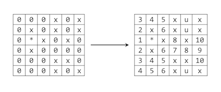

# Chapter 16 Exercises

1. Write a program that reads from the console a sequence of positive integer numbers. The sequence ends when empty line is entered. Calculate and print the **sum** and the **average of the sequence.** Keep the sequence in `List<int>`.
2. Write a program, which reads from the console N integers and prints them in **reversed order.** Use the `Stack<int>` class.
3. Write a program that reads from the console a sequence of positive integer numbers. The sequence ends when an empty line is entered. Print the sequence **sorted in ascending order.**
4. Write a method that finds the **longest subsequence of equal numbers** in a given `List<int>` and returns the result as new `List<int>`. Write a program to test whether the method works correctly.
5. Write a program, which **removes all negative numbers** from a sequence.

    Example: array = {19, -10, 12, -6, -3, 34, -2, 5} -> {19, 12, 34, 5}
6. Write a program that **removes from a given sequence all numbers that appear an odd count of times.**

    Example: array = {4, 2, 2, 5, 2, 3, 2, 3, 1, 5, 2} -> {5, 3, 3, 5}
7. Write a program that finds in a given array of integers (in the range [0...1000]) **how many times each of them occurs.**

    Example: array = {3, 4, 4, 2, 3, 3, 4, 3, 2}  
    2 -> 2 times  
    3 -> 4 times  
    4 -> 3 times  

8. The **majorant** of an array of size N is a value that occurs in it at least N/2 + 1 times. Write a program that **finds the majorant** of given array and prints it. If it does not exist, print "The majorant does not exist!".

    Example: {2, 2, 3, 3, 2, 3, 4, 3, 3} -> 3

9. We are given the following **sequence:**

    S1 = N;  
    S2 = S1 + 1;  
    S3 = 2*S1 + 1;  
    S4 = S1 + 2;  
    S5 = S2 + 1;  
    S6 = 2*S2 + 1;  
    S7 = S2 + 2;  
    ...  

    Using the `Queue<T>` class, write a program which by given **N** prints on the console the first 50 elements of the sequence.
    
    Example: N=2 -> 2, 3, 5, 4, 4, 7, 5, 6, 11, 7, 5, 9, 6, ...

10. We are given N and M and the following operations:

    N = N+1  
    N = N+2  
    N = N*2

    Write a program, which finds the **shortest subsequence** from the operations, which starts with **N** and ends with **M.** Use queue.

    Example: N = 5, M = 16  

    Subsequence: 5 -> 7 -> 8 -> 16

11. Implement the data structure **dynamic doubly linked list** (`DoublyLinkedList<T>`) – list, the elements of which have pointers both to the **next** and the **previous** elements. Implement the operations for adding, removing and searching for an element, as well as inserting an element at a given index, retrieving an element by a given index and a method, which returns an array with the elements of the list.
12. Create a `DynamicStack<T>` class to **implement dynamically a stack** (like a linked list, where each element knows its previous element and the stack knows its last element). Add methods for all commonly used operations like `Push()`, `Pop()`, `Peek()`, `Clear()` and `Count`.
13. **Implement the data structure "Deque".** This is a specific list-like structure, similar to stack and queue, allowing to **add elements at the beginning and at the end of the structure.** Implement the operations for adding and removing elements, as well as clearing the deque. If an operation is invalid, throw an appropriate exception.
14. **Implement the structure "Circular Queue"** with array, which doubles its capacity when its capacity is full. Implement the necessary methods for adding, removing the element in succession and retrieving without removing the element in succession. If an operation is invalid, throw an appropriate exception.
15. Implement numbers **sorting** in a **dynamic linked list** without using an additional array or other data structure.
16. Using queue, implement a complete **traversal of all directories on your hard disk** and print them on the console. Implement the algorithm Breadth-First-Search **(BFS)** – you may find some articles in the internet.
17. Using queue, implement a complete **traversal of all directories on your hard disk** and print them on the console. Implement the algorithm Depth-First-Search **(DFS)** – you may find some articles in the internet.
1. We are given a **labyrinth of size N x N.** Some of the cells of the labyrinth are empty (0), and others are filled (x). We can move from an empty cell to another empty cell, if the cells are separated by a single wall. We are given a start position (*). Calculate and fill the labyrinth as follows: in each empty cell **put the minimal distance from the start position to this cell.** If some cell cannot be reached, fill it with "u".

    Example: 

    
